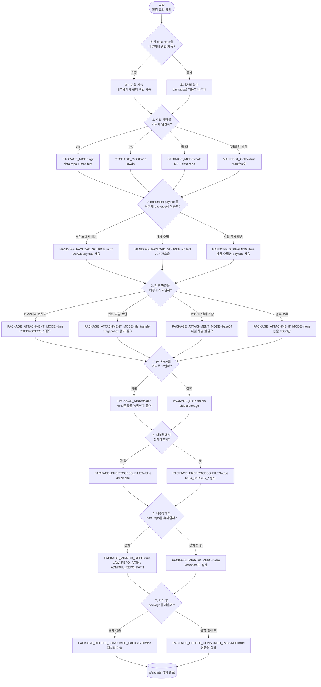
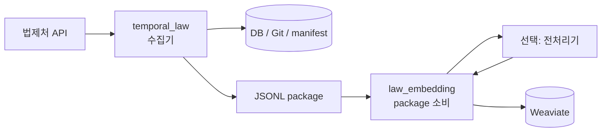

# 법령·행정규칙 수집·적재 매뉴얼

이 매뉴얼은 `temporal_law` 수집기에서 만든 변경분을 `law_embedding`으로 받아 Weaviate에 적재하는 방법을 환경별로 정리한 문서다.

여기서는 Agent/RAG 답변 생성은 다루지 않는다. 범위는 **수집 → package 전달 → 전처리 → 임베딩 → Weaviate 적재**까지다.

## 단계별 조립 흐름

이 구조는 한 가지 고정 실행법이 아니라, 아래 단계를 순서대로 고르면서 조립한다.

먼저 수집기가 변경 상태를 어디에 남길지 정하고, 그 다음 package에 넣을 payload와 첨부 처리 방식을 고른다. package가 내부망으로 넘어오면 임베딩기는 내부 전처리 여부, repo mirror 여부, 삭제 정책을 정한 뒤 Weaviate에 반영한다.



위 흐름에서 가장 먼저 정해야 하는 것은 아래 네 가지다. 나머지는 선택한 케이스 문서에서 값이 거의 정해진다.

| 질문 | 선택 블록 | 관련 env |
|---|---|---|
| 수집기가 변경 상태를 어디에 남길 것인가? | Git / DB / Both / Manifest-only | `STORAGE_MODE`, `MANIFEST_ONLY`, `MANIFEST_DIR` |
| package의 `document.payload`를 어디서 가져올 것인가? | auto / collect / streaming | `HANDOFF_PAYLOAD_SOURCE`, `HANDOFF_STREAMING` |
| 첨부 파일을 어떻게 넘길 것인가? | dmz / file_transfer / base64 / none | `PACKAGE_ATTACHMENT_MODE`, `PREPROCESS_*`, `PACKAGE_FILE_STAGE_DIR` |
| 내부망에서 repo를 계속 유지할 것인가? | mirror on / mirror off | `PACKAGE_MIRROR_REPO`, `LAW_REPO_PATH`, `ADMRUL_REPO_PATH` |

예를 들어 “DMZ에는 저장을 거의 안 하고, DMZ에서 전처리한 뒤, 내부망 repo는 계속 만들고 싶다”면 이렇게 조립한다.

```text
수집기:
  MANIFEST_ONLY=true
  HANDOFF_STREAMING=true
  PACKAGE_ATTACHMENT_MODE=dmz
  PREPROCESS_* 설정

임베딩기:
  PACKAGE_PREPROCESS_FILES=false
  PACKAGE_MIRROR_REPO=true
  LAW_REPO_PATH=/data/law_data
  ADMRUL_REPO_PATH=/data/admrul_data
```

## 읽는 방법

README는 실행 명령을 길게 적는 문서가 아니라, env와 모드 관계를 확인하는 문서다.

실제 clone, data repo 연결, 실행 순서는 아래 케이스 문서 중 하나를 열어서 보면 된다.

| 상황 | 볼 문서 |
|---|---|
| 수집기, 임베딩기, Weaviate, 전처리기가 같은 VM/같은 망에 있다 | [내부망/단일망.md](내부망/단일망.md) |
| 초기 `law_data/admrul_data`를 내부망에 넣을 수 있고, 첨부는 DMZ에서 전처리한다 | [초기반입-가능/a-DMZ전처리.md](초기반입-가능/a-DMZ전처리.md) |
| 초기 `law_data/admrul_data`를 내부망에 넣을 수 있고, 첨부 원본 파일도 내부망으로 보낸다 | [초기반입-가능/b-원본파일.md](초기반입-가능/b-원본파일.md) |
| 초기 `law_data/admrul_data`를 내부망에 넣을 수 있고, 첨부 원본은 base64로 JSONL에 넣는다 | [초기반입-가능/c-base64.md](초기반입-가능/c-base64.md) |
| 초기 `law_data/admrul_data`를 내부망에 넣을 수 있고, 첨부는 일단 색인하지 않는다 | [초기반입-가능/d-json만.md](초기반입-가능/d-json만.md) |
| 초기 `law_data/admrul_data`를 내부망에 넣을 수 없고, 첨부는 DMZ에서 전처리한다 | [초기반입-불가/a-DMZ전처리.md](초기반입-불가/a-DMZ전처리.md) |
| 초기 `law_data/admrul_data`를 내부망에 넣을 수 없고, 첨부 원본 파일을 내부망으로 보낸다 | [초기반입-불가/b-원본파일.md](초기반입-불가/b-원본파일.md) |
| 초기 `law_data/admrul_data`를 내부망에 넣을 수 없고, 첨부 원본은 base64로 JSONL에 넣는다 | [초기반입-불가/c-base64.md](초기반입-불가/c-base64.md) |
| 초기 `law_data/admrul_data`를 내부망에 넣을 수 없고, 첨부는 일단 색인하지 않는다 | [초기반입-불가/d-json만.md](초기반입-불가/d-json만.md) |
| 초기 repo도 내부망에 못 넣고, DMZ에도 payload/DB/Git 산출물을 남기지 않는다 | [초기반입-불가/e-무저장스트리밍.md](초기반입-불가/e-무저장스트리밍.md) |

## 기본 흐름



핵심은 package다. 분리망에서는 수집기 DB나 DMZ 파일 경로를 임베딩기가 직접 보지 않고, `document`, `file`, `preprocessed_chunk`, `delete` record가 들어 있는 JSONL package를 계약으로 삼는다.

## 수집기 ENV

파일 위치는 보통 `temporal_law/.env`다.

| env | 값 | 필요한 모드 | 동작 | 의존관계/주의 |
|---|---|---|---|---|
| `LAW_API_OC` | 법제처 OC 키 | 항상 | 법제처 OpenAPI를 호출한다. | 이미지에 굽지 말고 env/secret으로 넣는다. |
| `TEMPORAL_ADDRESS` | `temporal:7233` 등 | Temporal worker 실행 | 수집 workflow/worker가 붙을 Temporal 주소다. | 단순 CLI만 돌릴 때와 컨테이너 상주 worker에서 값이 달라질 수 있다. |
| `TEMPORAL_NAMESPACE` | `default` 등 | Temporal worker 실행 | Temporal namespace다. | Temporal 서버와 같은 namespace여야 한다. |
| `LAW_TASK_QUEUE` | `law-pipeline` 등 | Temporal worker 실행 | 수집 worker task queue다. | starter와 worker가 같은 queue를 봐야 한다. |
| `STORAGE_MODE` | `git`<br>`db`<br>`both` | 수집 결과 저장 방식 | `git`: DB 없이 `law_data/admrul_data` repo와 `_manifest.json`으로 변경 상태를 관리한다.<br>`db`: 수집 payload와 상태를 lawdb에 저장한다.<br>`both`: DB와 Git repo를 모두 유지한다. | `git`: `GIT_EXPORT_REPO`, `ADMRUL_GIT_EXPORT_REPO` 필요.<br>`db`: `DATABASE_URL` 필요, VM 이전 시 dump/restore 대상.<br>`both`: 가장 무겁지만 DB 기반 기능과 Git mirror를 둘 다 가져갈 수 있다. |
| `DATABASE_URL` | `postgresql+psycopg://...` | `STORAGE_MODE=db|both` | lawdb에 연결한다. | `git` only면 필수 아님. |
| `GIT_EXPORT_REPO` | `/data/law_data` | `STORAGE_MODE=git|both` | 법령류 산출물을 Git repo 구조로 저장한다. | repo로 commit/push하려면 실제 clone된 repo가 좋다. |
| `ADMRUL_GIT_EXPORT_REPO` | `/data/admrul_data` | `STORAGE_MODE=git|both` | 행정규칙류 산출물을 Git repo 구조로 저장한다. | 행정규칙 수집을 끄면 필수 아님. |
| `GIT_EXPORT_ENABLED` | `true|false` | Git export | 법령류 JSON/MD/file export를 수행한다. | `STORAGE_MODE=git|both`면 보통 `true`. |
| `ADMRUL_GIT_EXPORT_ENABLED` | `true|false` | 행정규칙 Git export | 행정규칙류 export를 수행한다. | `ADMRUL_ENABLED=true`와 같이 본다. |
| `GIT_EXPORT_PUSH` | `true|false` | 원격 push | 수집 후 `law_data` origin에 push한다. | SSH key 또는 PAT가 필요하다. |
| `ADMRUL_GIT_EXPORT_PUSH` | `true|false` | 원격 push | 수집 후 `admrul_data` origin에 push한다. | SSH key 또는 PAT가 필요하다. |
| `MANIFEST_ONLY` | `true|false` | DMZ 저장 최소화 | DB/JSON/MD/첨부를 남기지 않고 변경 감지용 manifest만 유지한다. | `MANIFEST_DIR`가 영속 볼륨이어야 한다. 지워지면 다음 sync가 전량처럼 보일 수 있다. |
| `MANIFEST_DIR` | `/data/manifest` | `MANIFEST_ONLY=true` | `_manifest.json`을 둘 위치다. | Git repo일 필요는 없다. 그냥 영속 폴더면 된다. |
| `HANDOFF_ENABLED` | `true|false` | package 전달 | sync/backfill 이후 JSONL package를 만든다. | 꺼져 있으면 임베딩기로 전달되는 변경분이 없다. |
| `HANDOFF_STREAMING` | `true|false` | 무저장/즉시 발송 | 문서 하나를 수집하자마자 package를 만든다. | 방금 수집한 payload를 쓰므로 `HANDOFF_PAYLOAD_SOURCE`에 거의 의존하지 않는다. |
| `HANDOFF_PAYLOAD_SOURCE` | `auto`<br>`collect` | batch handoff payload 원천 | `auto`: 저장된 payload를 읽어 package의 `document.payload`에 넣는다. `git/both`면 Git JSON, `db`면 DB를 읽는다.<br>`collect`: package 생성 시점에 API를 다시 호출해 payload를 만든다. | `auto`: `STORAGE_MODE=git|db|both`처럼 payload 저장소가 있어야 한다.<br>`collect`: payload 저장소가 없는 `MANIFEST_ONLY=true` 배치에서 필요하다. API 재호출 비용이 있다. |
| `PACKAGE_SINK` | `folder`<br>`minio`<br>`none` | package 출력 위치 | `folder`: JSONL package를 폴더에 쓴다. NFS/공유폴더/망연계 landing directory를 모두 이 값으로 본다.<br>`minio`: 공유 폴더가 어려울 때 object storage에 package를 올린다.<br>`none`: package를 만들지 않는다. | `folder`: `PACKAGE_OUT_DIR` 필요, 기본 권장값.<br>`minio`: `PACKAGE_MINIO_*` 필요, 주 방식은 아니다.<br>`none`: 임베딩기로 전달되는 변경분이 없다. |
| `PACKAGE_OUT_DIR` | `/mnt/handoff/packages` | `PACKAGE_SINK=folder` | package JSONL이 생성되는 폴더다. | 내부망 임베딩기가 이 파일을 받을 수 있어야 한다. |
| `PACKAGE_ATTACHMENT_MODE` | `dmz`<br>`file_transfer`<br>`base64`<br>`none` | 첨부 파일 전달 방식 | `dmz`: 수집기가 DMZ 전처리기를 호출하고, package에는 전처리된 청크만 넣는다.<br>`file_transfer`: package에는 파일 메타를 넣고, 원본 파일은 stage 폴더로 따로 보낸다.<br>`base64`: 원본 파일을 base64로 JSONL 안에 넣는다.<br>`none`: 첨부 파일을 package에 넣지 않고 본문 JSON만 보낸다. | `dmz`: `PREPROCESS_*` 필요, 내부망으로 원본 파일을 보내지 않는다.<br>`file_transfer`: 수집기 `PACKAGE_FILE_STAGE_DIR`, 임베딩기 `PACKAGE_FILE_INBOX_DIR` 필요.<br>`base64`: 별도 파일 채널은 필요 없지만 package가 커진다.<br>`none`: 별표/서식/파일 본문 검색은 빠질 수 있다. |
| `PACKAGE_FILE_STAGE_DIR` | `/mnt/handoff/files` | `file_transfer` | 원본 파일을 넘길 stage 폴더다. | 내부망의 inbox와 망연계로 이어져야 한다. |
| `PREPROCESS_API_URL` | `http://preprocessor:8080` | `PACKAGE_ATTACHMENT_MODE=dmz` | 수집기가 호출할 DMZ 전처리기 주소다. | 임베딩기 전처리 env인 `DOC_PARSER_*`와 다르다. |
| `PREPROCESS_ENDPOINT_PATH` | `/preprocess_attachment_upload` | `PACKAGE_ATTACHMENT_MODE=dmz` | DMZ 첨부 전처리 endpoint다. | 첨부용/지능형 endpoint를 구분해야 한다. |
| `PREPROCESS_API_KEY` | Bearer token | `PACKAGE_ATTACHMENT_MODE=dmz` | DMZ 전처리기 인증값이다. | secret으로 주입한다. |
| `INDEX_TASK_QUEUE` | queue 이름 또는 빈 값 | 같은 Temporal에서 자동 색인 | 수집 후 임베딩 workflow를 바로 호출한다. | 분리망이면 보통 비운다. package 폴더 소비로 넘긴다. |

## 임베딩기 ENV

파일 위치는 보통 `law_embedding/.env`다.

| env | 값 | 필요한 모드 | 동작 | 의존관계/주의 |
|---|---|---|---|---|
| `WEAVIATE_HTTP_HOST` | `weaviate` 등 | 항상 | Weaviate HTTP host다. | 컨테이너 내부에서는 서비스명, 로컬에서는 localhost일 수 있다. |
| `WEAVIATE_HTTP_PORT` | `8080` | 항상 | Weaviate HTTP port다. |  |
| `WEAVIATE_GRPC_HOST` | `weaviate` 등 | 항상 | Weaviate gRPC host다. | Weaviate client v4는 gRPC도 필요하다. |
| `WEAVIATE_GRPC_PORT` | `50051` | 항상 | Weaviate gRPC port다. |  |
| `WEAVIATE_API_KEY` | key | 인증 사용 시 | 법령 컬렉션 write/search key다. | 인증 없는 로컬이면 비울 수 있다. |
| `ADMRUL_WEAVIATE_API_KEY` | key | 행정규칙 key 분리 시 | 행정규칙 컬렉션 key다. | 없으면 보통 `WEAVIATE_API_KEY`로 폴백한다. |
| `LAW_COLLECTION` | `LegalProvisionIndex` | 항상 | 법령류 컬렉션 이름이다. | schema와 실제 collection 이름이 같아야 한다. |
| `ADMRUL_COLLECTION` | `AdmrulProvisionIndex` | 항상 | 행정규칙류 컬렉션 이름이다. | 행정규칙을 안 넣으면 비중은 낮지만 값은 맞춰둔다. |
| `EMBEDDING_BACKEND` | `local`<br>`remote` | 임베딩 실행 위치 | `local`: law_embedding 프로세스 안에서 모델을 로드한다.<br>`remote`: OpenAI 호환 embedding API를 호출한다. | `local`: 모델 캐시와 메모리/GPU 사용량을 본다.<br>`remote`: `EMBEDDING_API_URL` 필요, 운영에서는 보통 이쪽이 분리하기 쉽다. |
| `EMBEDDING_API_URL` | `/v1/embeddings` URL | `EMBEDDING_BACKEND=remote` | remote embedding endpoint다. | 모델 서버 URL과 네트워크 접근을 확인한다. |
| `EMBEDDING_API_KEY` | key | remote 인증 필요 시 | embedding API 인증값이다. | 인증 없으면 비울 수 있다. |
| `EMBEDDING_MODEL` | `Snowflake/...` | 항상 | 색인에 사용할 임베딩 모델명이다. | 기존 Weaviate 벡터와 모델이 바뀌면 재색인이 필요하다. |
| `INPUT_DATA_PATH` | `/data` | 전체 repo 색인 | `law_data/admrul_data`를 찾는 루트다. | 초기 전체 색인을 할 때 필요하다. package만 소비하면 필수는 아니다. |
| `LAW_REPO_URL` | `https://github.com/genonai/law_data.git` | repo clone/sync | 법령 data repo 주소다. | 내부망에서 직접 clone 가능할 때 사용한다. |
| `LAW_REPO_PATH` | `/data/law_data` | 전체 색인 또는 repo mirror | 법령 data repo 경로다. | `PACKAGE_MIRROR_REPO=true`면 필요하다. |
| `ADMRUL_REPO_URL` | `https://github.com/genonai/admrul_data.git` | repo clone/sync | 행정규칙 data repo 주소다. | 내부망에서 직접 clone 가능할 때 사용한다. |
| `ADMRUL_REPO_PATH` | `/data/admrul_data` | 전체 색인 또는 repo mirror | 행정규칙 data repo 경로다. | `PACKAGE_MIRROR_REPO=true`면 필요하다. |
| `PACKAGE_PREPROCESS_FILES` | `true`<br>`false` | 내부망 전처리 여부 | `true`: package의 file record를 내부망 전처리기로 보낸다.<br>`false`: 내부망 전처리를 하지 않는다. | `true`: `file_transfer`, `base64`에서 사용하며 `DOC_PARSER_*` 필요.<br>`false`: `dmz`, `none`에서 사용한다. DMZ에서 이미 전처리됐거나 첨부가 없는 케이스다. |
| `PACKAGE_FILE_INBOX_DIR` | `/mnt/handoff/files` | `file_transfer` | 수집기가 stage한 원본 파일을 읽는 내부망 폴더다. | 수집기의 `PACKAGE_FILE_STAGE_DIR`와 망연계되어야 한다. |
| `DOC_PARSER_BASE_URL` | `http://preprocessor:8080` | 내부망 전처리 | 임베딩기가 호출할 내부망 전처리기 주소다. | 수집기 `PREPROCESS_API_URL`과 다르다. |
| `DOC_PARSER_ENDPOINT_PATH` | `/preprocess_attachment_upload` | 내부망 첨부 전처리 | 첨부용 전처리 endpoint다. |  |
| `DOC_PARSER_IMAGE_ENDPOINT_PATH` | `/preprocess_intelligent_upload` | 지능형 전처리 | 이미지/지능형 전처리 endpoint다. | 사용하는 전처리기 spec에 맞춘다. |
| `DOC_PARSER_API_KEY` | Bearer token | 내부망 전처리 인증 | 내부망 전처리기 인증값이다. | secret으로 주입한다. |
| `PACKAGE_MIRROR_REPO` | `true`<br>`false` | 내부망 repo 유지 여부 | `true`: package 소비와 동시에 `law_data/admrul_data` repo 구조로 JSON을 저장한다.<br>`false`: 내부망에 repo 구조를 만들지 않고 Weaviate만 갱신한다. | `true`: `LAW_REPO_PATH`, `ADMRUL_REPO_PATH` 필요. 어느 첨부 모드에서도 켤 수 있다.<br>`false`: Git history나 내부망 원문 repo가 필요하면 부적합하다. |
| `PACKAGE_STORE_ORIGINAL` | `true|false` | 원본 별도 보관 | repo와 별도로 원본 파일 저장소를 둘지 정한다. | `PACKAGE_ORIGINAL_DIR` 필요. file/base64처럼 원본이 내부망에 올 때 의미가 크다. |
| `PACKAGE_DELETE_CONSUMED_PACKAGE` | `true|false` | package 정리 | 성공한 package JSONL을 삭제할지 정한다. | 초기 검증 중에는 `false`가 안전하다. |
| `PACKAGE_DELETE_CONSUMED_FILES` | `true|false` | file_transfer 정리 | 전처리 성공한 전달 파일을 삭제할지 정한다. | 원본 파일 재처리가 필요하면 `false`. |

## 모드 조합

| 하고 싶은 것 | 수집기 선택 | 임베딩기 선택 |
|---|---|---|
| DMZ에 DB 없이 repo만 유지 | `STORAGE_MODE=git` | 전체 색인은 `INPUT_DATA_PATH`, package mirror는 선택 |
| DMZ에 DB와 repo를 모두 유지 | `STORAGE_MODE=both`, `DATABASE_URL` | DB를 직접 보지 않고 package 또는 repo를 소비 |
| DMZ에 payload를 남기지 않음 | `MANIFEST_ONLY=true`, `HANDOFF_STREAMING=true` | package 소비. 내부망 repo가 필요하면 `PACKAGE_MIRROR_REPO=true` |
| DMZ에서 첨부 전처리 | `PACKAGE_ATTACHMENT_MODE=dmz`, `PREPROCESS_*` | `PACKAGE_PREPROCESS_FILES=false` |
| 내부망에서 첨부 전처리 | `PACKAGE_ATTACHMENT_MODE=file_transfer` 또는 `base64` | `PACKAGE_PREPROCESS_FILES=true`, `DOC_PARSER_*` |
| 첨부를 일단 제외 | `PACKAGE_ATTACHMENT_MODE=none` | `PACKAGE_PREPROCESS_FILES=false` |
| 내부망에도 `law_data/admrul_data` 유지 | package는 어떤 모드든 가능 | `PACKAGE_MIRROR_REPO=true`, `LAW_REPO_PATH`, `ADMRUL_REPO_PATH` |
| Weaviate만 갱신 | package는 어떤 모드든 가능 | `PACKAGE_MIRROR_REPO=false`, `PACKAGE_STORE_ORIGINAL=false` |

## 같이 봐야 하는 의존관계

| 조건 | 반드시 같이 필요한 값 | 이유 |
|---|---|---|
| `STORAGE_MODE=db|both` | `DATABASE_URL`, lawdb 영속 볼륨, 필요 시 `pg_dump/pg_restore` | DB 상태가 증분 sync의 기준이 될 수 있다. VM 이전 시 빈 DB로 시작하면 기존 상태가 끊길 수 있다. |
| `STORAGE_MODE=git|both` | `GIT_EXPORT_REPO`, `ADMRUL_GIT_EXPORT_REPO` | Git mode는 repo의 manifest와 파일 구조를 기준으로 산출물을 남긴다. |
| `MANIFEST_ONLY=true` | `MANIFEST_DIR` | payload 저장 없이 변경 감지 상태만 남기므로 이 폴더가 유일한 상태다. |
| `MANIFEST_ONLY=true` + batch package | `HANDOFF_PAYLOAD_SOURCE=collect` | 저장된 payload가 없어서 package 생성 시 API 재수집이 필요하다. |
| `MANIFEST_ONLY=true` + streaming package | `HANDOFF_STREAMING=true` | 방금 수집한 payload를 바로 보내므로 batch payload lookup이 필요 없다. |
| `HANDOFF_ENABLED=true` | `PACKAGE_SINK`, `PACKAGE_OUT_DIR` 또는 `PACKAGE_MINIO_*` | package를 어디로 쓸지 정해야 한다. |
| `PACKAGE_ATTACHMENT_MODE=dmz` | 수집기 `PREPROCESS_*` | 수집기 쪽에서 전처리 API를 호출한다. |
| `PACKAGE_ATTACHMENT_MODE=file_transfer` | 수집기 `PACKAGE_FILE_STAGE_DIR`, 임베딩기 `PACKAGE_FILE_INBOX_DIR` | JSONL과 원본 파일이 별도 경로로 같이 전달되어야 한다. |
| `PACKAGE_ATTACHMENT_MODE=base64` | 임베딩기 `PACKAGE_PREPROCESS_FILES=true`, `DOC_PARSER_*` | JSONL 안의 base64 파일을 내부망 전처리기로 보내야 한다. |
| `PACKAGE_MIRROR_REPO=true` | `LAW_REPO_PATH`, `ADMRUL_REPO_PATH` | package의 `git_path` 기준으로 내부망 repo 구조에 JSON을 저장한다. |

## 전처리 env 구분

전처리 env는 이름이 비슷하지만 실행 위치가 다르다.

| 묶음 | 쓰는 위치 | 쓰는 케이스 |
|---|---|---|
| `PREPROCESS_*` | `temporal_law` 수집기 | DMZ에서 첨부를 전처리하고 결과 청크만 보낼 때 |
| `DOC_PARSER_*` | `law_embedding` 임베딩기 | 원본 파일 또는 base64를 내부망에서 전처리할 때 |

정리하면 `dmz`는 수집기 전처리, `file_transfer/base64`는 임베딩기 전처리, `none`은 둘 다 사용하지 않는다.

## 주의사항

- 분리망에서는 내부망 임베딩기가 DMZ의 DB/Git/파일 경로를 직접 읽는 구조로 잡지 않는다. package를 계약으로 본다.
- package에는 `document` record가 있어야 한다. 그래야 기존 청크 삭제 후 새 청크 upsert가 가능하다.
- `MANIFEST_DIR`를 지우면 다음 sync가 전량 변경처럼 보일 수 있다.
- `PACKAGE_MIRROR_REPO=true`는 어느 케이스에서도 켤 수 있다. 수집기가 DMZ에서 저장하지 않아도, package에 `document.payload`와 `git_path`가 있으면 내부망 repo를 만들어 갈 수 있다.
- 초기 구축 중에는 `PACKAGE_DELETE_CONSUMED_PACKAGE=false`가 안전하다. package를 남겨야 실패 재현과 재처리가 쉽다.
