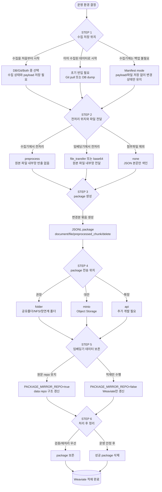

# 법령/행정규칙 수집·적재 운영 매뉴얼

이 문서는 `temporal_law` 수집기와 `law_embedding` 임베딩기를 어떻게 조립해서 운영할지 설명한다.

범위는 **법제처 수집 → 변경분 package 생성 → 파일 전처리 → 임베딩 → Weaviate 적재**까지다. Agent/RAG 답변 생성은 다루지 않는다.

처음 보는 사람이 헷갈리기 쉬운 지점은 “데이터를 어디에 저장하는가”, “파일을 어디서 전처리하는가”, “내부망에 원문 repo를 남길 것인가”다. 이 문서는 그 선택을 STEP 순서로 정리한다.

## 전체 그림



## 먼저 정해야 하는 것

아래 질문에 답하면 대부분의 env가 결정된다.

| 질문 | 선택지 | 결정되는 것 |
| --- | --- | --- |
| 수집 결과를 수집기 쪽에 남길 것인가? | DB, Git, Both, Manifest | `STORAGE_MODE` |
| 내부망에 초기 데이터를 넣을 수 있는가? | 가능, 불가능 | 전체 색인을 먼저 할지, package로만 적재할지 |
| 첨부파일을 어디서 전처리할 것인가? | 수집기, 임베딩기, 안 함 | `PACKAGE_ATTACHMENT_MODE`, `PREPROCESS_*`, `DOC_PARSER_*` |
| package를 어디에 둘 것인가? | folder, minio, api | `PACKAGE_SINK` |
| 내부망에도 data repo를 유지할 것인가? | 유지, 미유지 | `PACKAGE_MIRROR_REPO` |
| 성공한 package를 남길 것인가? | 남김, 삭제 | `PACKAGE_DELETE_CONSUMED_PACKAGE` |

## STEP 1. 수집 저장 위치

수집기는 법제처 API에서 payload를 만들고, 다음 sync 때 무엇이 바뀌었는지 판단해야 한다. 그래서 어떤 방식이든 **변경 감지 상태**는 필요하다.

### 1.1 수집을 처음부터 시작해야 하는 경우

처음부터 전체 수집을 돌린다면 수집 상태와 payload를 저장할 곳이 필요하다.

가능한 선택:

| 모드 | 설정 | 설명 |
| --- | --- | --- |
| DB | `STORAGE_MODE=db` | payload와 수집 상태를 Postgres에 저장한다. |
| Git | `STORAGE_MODE=git` | `law_data/admrul_data` repo에 JSON/MD/file과 `_manifest.json`을 저장한다. |
| Both | `STORAGE_MODE=both` | DB와 Git을 둘 다 유지한다. 운영에서 가장 많은 선택지를 남긴다. |

권장:

- 사람이 볼 산출물, Git 이력, 내부망 초기 반입을 고려하면 `git` 또는 `both`가 편하다.
- DB 기반 관리 API, 수집 상태 조회, 향후 DB history를 고려하면 `db` 또는 `both`가 필요하다.

### 1.2 증분처리만 진행하면 되는 경우

이미 수집이 어느 정도 끝난 상태라면 내부망에 초기 데이터를 먼저 넣고, 이후 변경분만 package로 소비한다.

방법:

| 초기 반입 방식 | 현재 상태 |
| --- | --- |
| Git pull | 구현되어 있고 가장 단순하다. 내부망에서 `law_data/admrul_data`를 pull한 뒤 전체 색인한다. |
| DB dump | 아직 완성된 경로가 아니다. 구현하려면 수집기 DB dump, 파일 asset 저장, 임베딩기 DB 기반 초기 색인 로직이 추가로 필요하다. |

DB dump 방식이 필요한 이유는 “Git repo를 내부망에 반입할 수 없고 DB만 기준으로 운영해야 하는 경우”다. 다만 지금 구조에서는 파일 본문과 첨부 처리까지 고려하면 추가 구현 범위가 있다.

DB dump 방식 구현 시 필요한 것:

- 수집기 DB의 `document`, `document_version`, `file_asset` 이관
- 수집 시 `file_asset`에 원본 파일 위치 또는 별도 스토리지 위치 채우기
- 임베딩기에서 DB payload를 읽어 초기 색인하는 경로
- 첨부파일 원본을 어디서 읽을지 결정
- 증분 처리 시 내부망 데이터 유지 옵션과 연결
- 필요하면 MinIO 또는 NFS 같은 파일 저장소

### 1.3 수집기 쪽에도 백업 파일이 필요한 경우

수집기 쪽에 JSON/MD/첨부파일 산출물을 남기려면 Git 모드가 필요하다.

```dotenv
STORAGE_MODE=git
GIT_EXPORT_ENABLED=true
GIT_EXPORT_REPO=/data/law_data
ADMRUL_GIT_EXPORT_ENABLED=true
ADMRUL_GIT_EXPORT_REPO=/data/admrul_data
```

DB도 같이 유지하려면:

```dotenv
STORAGE_MODE=both
DATABASE_URL=postgresql+psycopg://...
```

### 1.4 수집기 쪽에 payload/파일 백업이 필요 없는 경우

이 경우 `manifest` 모드를 쓴다.

```dotenv
STORAGE_MODE=manifest
MANIFEST_DIR=/data/manifest
```

manifest 모드는 DB에 payload를 저장하지 않고, Git repo에 JSON/MD/첨부파일도 쓰지 않는다. 대신 `_manifest.json`만 남긴다. 이 파일은 “지난번에 어떤 문서가 어떤 버전이었는지”를 기억하는 변경 감지 상태다.

#### Manifest mode에서 package는 어떻게 만들어지나?

`STORAGE_MODE=manifest`이고 일반 package 방식이면, 변경 감지는 manifest로 하고 payload는 package 생성 시점에 API로 다시 수집한다.

```text
목록 sync
  -> _manifest.json으로 변경 문서 판단
  -> 변경 문서 이름/law_id/doc_target만 확보
  -> package 생성 시 해당 문서를 API로 다시 수집
  -> package JSONL에 document.payload로 넣음
  -> 수집기 저장소에는 payload JSON/첨부파일을 남기지 않음
```

즉 “변경분 payload를 저장했다가 보내고 다시 지우는 방식”이 아니다. 저장 자체를 하지 않는다. 변경 대상만 manifest로 알고 있다가, package를 만들 때 다시 수집해서 JSONL에 담는다.

package 파일은 `PACKAGE_OUT_DIR` 또는 MinIO 등에 남는다. 이 package를 처리 후 삭제할지는 임베딩기 `PACKAGE_DELETE_CONSUMED_PACKAGE`가 결정한다.

#### Manifest mode에서 죽으면 어떻게 되나?

manifest mode도 완전히 메모리만 믿고 동작하지 않는다. 변경 감지 상태는 `_manifest.json`에 남고, handoff는 “아직 발송 완료로 표시되지 않은 문서”를 다시 조회해서 package를 만든다.

예를 들어 sync 대상 100개가 변경되었다면 흐름은 다음과 같다.

```text
100개 수집
  -> 각 문서의 현재 signature를 _manifest.json에 기록
  -> 아직 emitted로 표시되지 않은 100개를 list_unemitted로 조회
  -> package 생성 시 100개 payload를 API로 다시 수집
  -> 하나의 JSONL package에 document/file/delete record를 조립
  -> package sink(folder/minio 등)에 전달
  -> 전달이 성공하면 100개를 emitted로 표시
```

중간에 꺼지는 경우:

- package 생성 전에 꺼지면 emitted 표시가 없으므로 다음 sync에서 다시 package 생성 대상이 된다.
- package를 만들다가 꺼져도 emitted 표시가 없으므로 다음 sync에서 다시 만든다.
- JSONL 파일은 `.tmp`에 먼저 쓴 뒤 `os.replace()`로 최종 파일명으로 바꾼다. 따라서 쓰는 중 꺼져도 소비자가 반쯤 작성된 `*.jsonl`을 읽을 가능성은 낮다. 남은 `.tmp` 파일은 다음 emit에서 새 package를 만들기 때문에 운영자가 정리하면 된다.
- package 전달까지 됐지만 emitted 표시 전에 꺼지면 다음 sync에서 같은 변경분을 다시 보낼 수 있다. 이 경우 중복 전송은 생길 수 있지만, 임베딩기는 같은 문서를 delete 후 upsert하는 방향으로 처리하므로 데이터 유실보다는 중복 재처리 쪽으로 안전하게 동작한다.
- emitted 표시까지 끝난 뒤 임베딩기 소비가 실패하면 수집기는 이미 보낸 것으로 본다. 그래서 초기 운영에서는 성공 package를 바로 삭제하지 않고 보존하는 편이 좋다.

생산자 package 생성 기준:

- 100개 중 payload 생성이 100개 모두 성공하면 package에 100개 `document` record가 들어가고, 전달 성공 후 100개 모두 emitted로 표시된다.
- payload 생성 중 예외가 나서 package 생성 자체가 실패하면 emitted 표시를 하지 않는다. 다음 sync에서 같은 변경분을 다시 package 생성 대상으로 잡는다.
- payload 생성이 일부만 실패해 `None`으로 반환된 경우, 성공한 문서만 package에 넣고 성공한 문서만 emitted로 표시한다.
- package에 들어가지 못한 문서는 emitted로 표시하지 않으므로 다음 sync에서 다시 시도된다.
- 첨부파일 전처리/전송 실패는 문서 자체를 실패시키기보다 `pending_attachment`로 남길 수 있다. 이 경우 본문 document는 package에 들어가고, 첨부만 보류 상태로 전달된다.

임베딩기 소비 기준:

- package 안에 100개 문서가 있고 그중 99개가 성공, 1개가 실패하면 package 전체는 성공 처리되지 않는다.
- 성공한 99개는 이미 Weaviate에 반영될 수 있다. 실패했다고 99개를 되돌리지는 않는다.
- package 파일은 재시도 대상으로 남거나, 반복 실패하면 `failed/`로 격리된다.
- 재시도 시 같은 package를 다시 읽기 때문에 성공했던 문서도 다시 처리될 수 있다. 이 처리는 멱등 upsert/delete 기준이라 데이터가 중복으로 망가지는 구조는 아니다.
- 다만 대량 package에서 한 문서만 계속 실패해도 package 전체가 성공 archive/delete되지 않으므로, 운영상 너무 큰 package는 작은 단위로 나누는 batch 옵션이 필요할 수 있다.

메모리 사용:

- 변경 여부 자체는 manifest 상태로 남는다.
- 다만 현재 package 작성 구현은 한 package에 들어갈 record 목록을 메모리에 만든 뒤 JSONL로 쓴다.
- 100개 수준의 증분 package는 문제가 되기 어렵지만, 대량 변경이나 base64 파일 인라인이 많으면 package를 여러 개로 나누는 batch 옵션을 추가하는 것이 좋다.

주의:

- `_manifest.json`은 지우면 안 된다. 지워지면 다음 sync가 기존 상태를 몰라 전량 변경처럼 보일 수 있다.
- package 생성 시 API 재호출이 필요하므로, 대량 변경이 있으면 수집 API 부하가 생긴다.
- 수집기 쪽에서 원본 파일을 오래 보존하지 않는 정책에 맞지만, 나중에 수집기 쪽에서 원문 재확인은 어렵다.

## STEP 2. 전처리 위치와 파일 전송 방식

본문 payload는 항상 JSONL의 `document` record로 전달한다. 여기서 고르는 것은 **별표/별지/서식/원문 파일을 어떻게 텍스트화할지**다.

### 2.1 수집기에서 전처리

```dotenv
PACKAGE_ATTACHMENT_MODE=preprocess
PACKAGE_PREPROCESS_PARSER_URL=http://preprocessor:8080
PREPROCESS_ENDPOINT_PATH=/preprocess_attachment_upload
PREPROCESS_API_MODE=multipart
PREPROCESS_API_KEY=...
```

동작:

```text
수집기
  -> 첨부 원본 파일 확인
  -> 전처리 API 호출
  -> 결과 청크를 preprocessed_chunk record로 package에 넣음
  -> 원본 파일은 내부망으로 보내지 않음
```

임베딩기:

```dotenv
DOC_PARSER_BASE_URL=
```

장점:

- 내부망으로 원본 파일을 보내지 않아도 된다.
- 임베딩기는 전처리기 없이 청크를 바로 임베딩할 수 있다.

주의:

- 수집기 환경에 전처리 API가 붙어 있어야 한다.
- 전처리 실패 시 해당 첨부는 `pending_attachment`가 될 수 있다.
- 내부망에서 원본 파일 재전처리가 필요하면 이 방식은 부족하다.

### 2.2 임베딩기에서 전처리: 원본 파일 전송

```dotenv
PACKAGE_ATTACHMENT_MODE=file_transfer
PACKAGE_FILE_STAGE_DIR=/mnt/handoff/files
```

임베딩기:

```dotenv
PACKAGE_FILE_INBOX_DIR=/mnt/handoff/files
DOC_PARSER_BASE_URL=http://preprocessor:8080
DOC_PARSER_ENDPOINT_PATH=/preprocess_attachment_upload
DOC_PARSER_UPLOAD=true
```

동작:

```text
수집기
  -> package에는 file record와 transfer_name 기록
  -> 원본 파일은 PACKAGE_FILE_STAGE_DIR에 복사

임베딩기
  -> PACKAGE_FILE_INBOX_DIR에서 transfer_name 파일 조회
  -> 내부망 전처리 API 호출
  -> FILE 청크를 Weaviate에 적재
```

장점:

- package가 base64보다 작다.
- 내부망에서 원본 파일을 보존하거나 재전처리할 수 있다.

주의:

- `PACKAGE_FILE_STAGE_DIR`와 `PACKAGE_FILE_INBOX_DIR`는 망연계/NFS 등으로 같은 파일을 볼 수 있어야 한다.
- 전송 파일이 누락되면 해당 첨부는 pending 처리된다.

### 2.3 임베딩기에서 전처리: base64 인라인

```dotenv
PACKAGE_ATTACHMENT_MODE=base64
```

임베딩기:

```dotenv
DOC_PARSER_BASE_URL=http://preprocessor:8080
DOC_PARSER_ENDPOINT_PATH=/preprocess_attachment_upload
DOC_PARSER_UPLOAD=true
```

동작:

```text
수집기
  -> 원본 파일 bytes를 base64로 인코딩
  -> package file record의 content_b64에 넣음

임베딩기
  -> content_b64 decode
  -> 임시 파일 생성
  -> 내부망 전처리 API 호출
  -> 처리 후 임시 파일 삭제
```

장점:

- package 하나만 전달하면 된다.
- 별도 파일 전달 폴더가 없어도 된다.

주의:

- base64는 원본보다 용량이 약 33% 커진다.
- 대량 초기 적재보다는 작은 증분 변경분에 적합하다.

### 2.4 파일을 전송하지 않음

```dotenv
PACKAGE_ATTACHMENT_MODE=none
```

동작:

```text
document payload만 package에 넣음
첨부 원본/전처리 청크는 넣지 않음
```

장점:

- 가장 단순하고 빠르다.
- 조문/부칙/텍스트 별표 중심으로 먼저 검색 품질을 확인할 수 있다.

주의:

- 파일-only 별표, 별지, 서식, 행정규칙 원문 파일 내용은 검색되지 않는다.
- 첨부파일 내용까지 필요한 업무에는 부족하다.

## STEP 3. package 생성

이 매뉴얼의 기본 전송 단위는 package다.

```text
package_header
document
file 또는 preprocessed_chunk 또는 pending_attachment
delete
package_footer
```

중요한 계약:

- 변경 문서는 `document` record가 있어야 한다.
- `document.payload`에는 현재 payload 전체가 들어간다.
- 폐지 문서는 `delete` record로 보낸다.
- 첨부 처리 방식은 `PACKAGE_ATTACHMENT_MODE`가 결정한다.

package 방식에서는 sync가 끝난 뒤 아직 발송되지 않은 변경분을 모아 하나의 JSONL 파일로 만든다. 법령과 행정규칙은 source가 다르므로 보통 source별 package가 생성된다.

```text
수집 sync
  -> 변경/폐지 상태 기록
  -> 미발송 변경분 조회
  -> JSONL package 생성
  -> folder/minio/api sink로 전달
  -> 전달 성공 시 emitted 표시
```

코드에는 `HANDOFF_STREAMING` 옵션도 남아 있다. 이 값을 켜면 수집 직후 문서 단위로 package를 만들어 보내는 방식이지만, 현재 운영 매뉴얼에서는 기본 케이스로 다루지 않는다. 일반적으로는 sync 결과를 묶어서 보내는 package 방식이 재시도와 검증이 쉽다.

## STEP 4. package 전송 위치

### 4.1 folder

```dotenv
PACKAGE_SINK=folder
PACKAGE_OUT_DIR=/mnt/handoff/packages
```

권장 기본값이다.

여기서 folder는 꼭 같은 서버 로컬 디렉터리라는 뜻이 아니다. 공유 폴더, NFS, 망연계 landing directory처럼 “수집기가 쓰고 임베딩기가 읽을 수 있는 디렉터리”를 통칭한다.

임베딩기:

```bash
cd law_embedding
uv run python -m law_indexer consume-folder --dir /mnt/handoff/packages
```

### 4.2 minio

```dotenv
PACKAGE_SINK=minio
PACKAGE_MINIO_ENDPOINT=...
PACKAGE_MINIO_ACCESS_KEY=...
PACKAGE_MINIO_SECRET_KEY=...
PACKAGE_MINIO_BUCKET=law-packages
PACKAGE_MINIO_PREFIX=sync
PACKAGE_MINIO_SECURE=false
```

Object Storage를 써야 하는 경우의 대안이다. 다만 현재 운영 기본은 folder다.

주의:

- MinIO가 주 전달 방식은 아니다.
- 내부망 임베딩기가 MinIO object를 pull하는 소비 루프까지 운영 방식으로 정해야 한다.

### 4.3 api

```dotenv
PACKAGE_SINK=api
PACKAGE_API_URL=...
```

확장 자리다. 실제 인증, 재시도, 중복 처리, 실패 복구 정책이 확정되어야 운영 가능하다. 지금은 folder/minio보다 덜 확정된 선택지로 본다.

## STEP 5. 임베딩기 데이터 보존

package를 소비한 뒤 내부망에 원문 repo를 유지할지 정한다.

### 5.1 Weaviate만 갱신

```dotenv
PACKAGE_MIRROR_REPO=false
PACKAGE_STORE_ORIGINAL=false
```

동작:

```text
package 소비
  -> 청크 생성
  -> Weaviate upsert/delete
  -> 내부망 data repo는 만들지 않음
```

장점:

- 단순하다.
- 저장공간을 덜 쓴다.

주의:

- 내부망에서 원문 JSON이나 Git history를 직접 볼 수 없다.
- relation 대상 파일 경로, 원문 확인, 재전처리 같은 기능이 제한된다.

### 5.2 내부망 data repo 유지

```dotenv
PACKAGE_MIRROR_REPO=true
LAW_REPO_PATH=/data/law_data
ADMRUL_REPO_PATH=/data/admrul_data
PACKAGE_MIRROR_PUSH=false
```

동작:

```text
document record
  -> git_path 위치에 payload JSON 저장

file record
  -> 문서 디렉터리 아래 별표/별지/원문/본문이미지 위치에 원본 파일 저장
```

수집기가 `manifest` 모드라서 payload/파일을 저장하지 않아도, package에 payload와 `git_path`가 들어오면 내부망 repo는 만들 수 있다.

### 5.3 내부 Git 서버로 push

```dotenv
PACKAGE_MIRROR_REPO=true
PACKAGE_MIRROR_PUSH=true
LAW_REPO_PATH=/data/law_data
ADMRUL_REPO_PATH=/data/admrul_data
```

전제:

- `/data/law_data`, `/data/admrul_data`가 Git repo여야 한다.
- origin이 내부망 Git 서버를 가리켜야 한다.
- push 권한이 있어야 한다.

주의:

- 커밋 메시지는 package의 `commit_message`를 사용한다. 수집기 Git export와 같은 메시지를 맞추기 위한 값이다.
- 원본 파일명이 길어 리눅스 파일시스템 제한에 걸리는 경우, 코드가 git plumbing으로 원본 경로를 커밋 트리에 넣는다.

## STEP 6. 적재 후 package 삭제

임베딩기 package 소비 후 성공 package를 남길지 지울지 정한다.

### 6.1 초기 검증 중

```dotenv
PACKAGE_DELETE_CONSUMED_PACKAGE=false
```

권장한다. 실패 분석과 재처리가 쉽다.

### 6.2 운영 안정 후

```dotenv
PACKAGE_DELETE_CONSUMED_PACKAGE=true
```

성공한 package만 삭제한다. 오류가 있으면 재시도를 위해 남긴다.

file_transfer로 온 파일도 정리하고 싶으면:

```dotenv
PACKAGE_DELETE_CONSUMED_FILES=true
```

이 값은 전처리까지 성공한 inbox 파일만 삭제한다. 실패 파일은 원인 확인과 재시도를 위해 남긴다.

## 대표 조합

### A. Git 초기 반입 + 증분 package

가장 단순한 시작 방식이다.

수집기:

```dotenv
STORAGE_MODE=git
GIT_EXPORT_ENABLED=true
GIT_EXPORT_REPO=/data/law_data
ADMRUL_GIT_EXPORT_ENABLED=true
ADMRUL_GIT_EXPORT_REPO=/data/admrul_data

HANDOFF_ENABLED=true
PACKAGE_SINK=folder
PACKAGE_OUT_DIR=/mnt/handoff/packages
PACKAGE_ATTACHMENT_MODE=base64
```

임베딩기:

```dotenv
INPUT_DATA_PATH=/data
LAW_REPO_PATH=/data/law_data
ADMRUL_REPO_PATH=/data/admrul_data

DOC_PARSER_BASE_URL=http://preprocessor:8080
PACKAGE_MIRROR_REPO=true
PACKAGE_DELETE_CONSUMED_PACKAGE=false
```

실행:

```bash
cd law_embedding
uv run python -m law_indexer sync --source both
uv run python -m law_indexer create-collection --source both
uv run python -m law_indexer index --source both --skip-existing
uv run python -m law_indexer consume-folder --dir /mnt/handoff/packages
```

### B. Manifest mode + 수집기 전처리

수집기에는 payload/파일 백업을 남기지 않고, 첨부 원본도 내부망으로 보내지 않는 방식이다.

수집기:

```dotenv
STORAGE_MODE=manifest
MANIFEST_DIR=/data/manifest

HANDOFF_ENABLED=true
PACKAGE_SINK=folder
PACKAGE_OUT_DIR=/mnt/handoff/packages
PACKAGE_ATTACHMENT_MODE=preprocess
PACKAGE_PREPROCESS_PARSER_URL=http://preprocessor:8080
PREPROCESS_ENDPOINT_PATH=/preprocess_attachment_upload
PREPROCESS_API_MODE=multipart
PREPROCESS_API_KEY=...
```

임베딩기:

```dotenv
DOC_PARSER_BASE_URL=
PACKAGE_MIRROR_REPO=true
LAW_REPO_PATH=/data/law_data
ADMRUL_REPO_PATH=/data/admrul_data
PACKAGE_DELETE_CONSUMED_PACKAGE=false
```

설명:

- 수집기는 manifest만 남긴다.
- 변경 대상 payload는 package 생성 시 다시 수집해서 JSONL에 넣는다.
- 첨부는 수집기 전처리 결과만 보낸다.
- 내부망 repo mirror를 켜면 package를 기준으로 내부망 repo 구조를 만들 수 있다.

### C. Manifest mode + 내부망 전처리(base64)

별도 파일 전달 채널 없이 package 하나로 전달하고, 내부망에서 전처리한다.

수집기:

```dotenv
STORAGE_MODE=manifest
MANIFEST_DIR=/data/manifest

HANDOFF_ENABLED=true
PACKAGE_SINK=folder
PACKAGE_OUT_DIR=/mnt/handoff/packages
PACKAGE_ATTACHMENT_MODE=base64
```

임베딩기:

```dotenv
DOC_PARSER_BASE_URL=http://preprocessor:8080
DOC_PARSER_ENDPOINT_PATH=/preprocess_attachment_upload
DOC_PARSER_UPLOAD=true

PACKAGE_MIRROR_REPO=false
PACKAGE_DELETE_CONSUMED_PACKAGE=false
```

설명:

- package 크기는 커진다.
- 변경분이 작고 파일 전달 폴더를 만들기 어려울 때 적합하다.
- 내부망 repo가 필요하면 `PACKAGE_MIRROR_REPO=true`를 추가한다.

### D. 원본 파일 옆채널 전송 + 내부망 전처리

파일을 내부망에서 보존/재전처리해야 할 때 쓴다.

수집기:

```dotenv
STORAGE_MODE=git
HANDOFF_ENABLED=true
PACKAGE_SINK=folder
PACKAGE_OUT_DIR=/mnt/handoff/packages
PACKAGE_ATTACHMENT_MODE=file_transfer
PACKAGE_FILE_STAGE_DIR=/mnt/handoff/files
```

임베딩기:

```dotenv
PACKAGE_FILE_INBOX_DIR=/mnt/handoff/files
DOC_PARSER_BASE_URL=http://preprocessor:8080
DOC_PARSER_ENDPOINT_PATH=/preprocess_attachment_upload
DOC_PARSER_UPLOAD=true

PACKAGE_MIRROR_REPO=true
PACKAGE_DELETE_CONSUMED_FILES=false
PACKAGE_DELETE_CONSUMED_PACKAGE=false
```

설명:

- package에는 파일 bytes가 들어가지 않는다.
- 원본 파일은 stage/inbox 폴더로 전달된다.
- package와 파일 전달 폴더가 같은 변경분을 가리키도록 운영해야 한다.

## 수집기 ENV 표

| env | 값 | 의미 | 같이 필요한 값 |
| --- | --- | --- | --- |
| `STORAGE_MODE` | `db`, `git`, `both`, `manifest` | 수집 저장 위치 | 선택값에 따라 DB/Git/manifest 설정 필요 |
| `DATABASE_URL` | Postgres URL | DB 저장소 | `db`, `both` |
| `GIT_EXPORT_REPO` | 경로 | 법령 data repo | `git`, `both` |
| `ADMRUL_GIT_EXPORT_REPO` | 경로 | 행정규칙 data repo | `git`, `both` |
| `MANIFEST_DIR` | 경로 | manifest 저장 폴더 | `manifest` |
| `HANDOFF_ENABLED` | `true/false` | package 생성 여부 | package를 쓰려면 `true` |
| `PACKAGE_ATTACHMENT_MODE` | `preprocess`, `file_transfer`, `base64`, `none` | 첨부 처리 방식 | 선택값에 따라 전처리/파일 env 필요 |
| `PACKAGE_FILE_STAGE_DIR` | 경로 | 원본 파일 stage | `file_transfer` |
| `PACKAGE_PREPROCESS_PARSER_URL` 또는 `PREPROCESS_API_URL` | URL | 수집기 전처리기 | `preprocess` |
| `PREPROCESS_ENDPOINT_PATH` | endpoint | 수집기 전처리 API 경로 | `preprocess` |
| `PREPROCESS_API_MODE` | `path`, `multipart` | 전처리 호출 방식 | 전처리기 배포 방식에 맞춤 |
| `PREPROCESS_API_KEY` | token | 전처리 인증 | 인증이 있을 때 |
| `PACKAGE_SINK` | `folder`, `minio`, `api`, `none` | package 출력 위치 | 선택값에 따라 sink env 필요 |
| `PACKAGE_OUT_DIR` | 경로 | package 폴더 | `folder` |
| `PACKAGE_MINIO_*` | endpoint/key/bucket | Object Storage | `minio` |
| `PACKAGE_API_URL` | URL | API sink | `api`, 추가 개발 필요 |

## 임베딩기 ENV 표

| env | 값 | 의미 | 같이 필요한 값 |
| --- | --- | --- | --- |
| `WEAVIATE_HTTP_HOST`, `WEAVIATE_HTTP_PORT` | host/port | Weaviate HTTP | 항상 |
| `WEAVIATE_GRPC_HOST`, `WEAVIATE_GRPC_PORT` | host/port | Weaviate gRPC | 항상 |
| `LAW_COLLECTION` | 컬렉션명 | 법령 컬렉션 | 항상 |
| `ADMRUL_COLLECTION` | 컬렉션명 | 행정규칙 컬렉션 | 항상 |
| `EMBEDDING_BACKEND` | `local`, `remote` | 임베딩 실행 위치 | `remote`면 `EMBEDDING_API_URL` |
| `EMBEDDING_API_URL` | URL | remote embedding endpoint | `EMBEDDING_BACKEND=remote` |
| `INPUT_DATA_PATH` | 경로 | 초기 전체 색인 data root | 전체 색인 |
| `LAW_REPO_PATH`, `ADMRUL_REPO_PATH` | 경로 | 내부망 data repo | 전체 색인 또는 mirror |
| `DOC_PARSER_BASE_URL` | URL | 내부망 전처리기 | `file_transfer`, `base64` |
| `DOC_PARSER_ENDPOINT_PATH` | endpoint | 첨부 전처리 API | 내부망 전처리 |
| `DOC_PARSER_IMAGE_ENDPOINT_PATH` | endpoint | 이미지/지능형 전처리 API | 이미지 전처리 필요 시 |
| `DOC_PARSER_UPLOAD` | `true/false` | multipart 업로드 여부 | 전처리기 spec에 맞춤 |
| `DOC_PARSER_API_KEY` | token | 내부망 전처리 인증 | 인증이 있을 때 |
| `PACKAGE_FILE_INBOX_DIR` | 경로 | file_transfer 파일 수신 폴더 | `file_transfer` |
| `PACKAGE_MIRROR_REPO` | `true/false` | 내부망 repo 구조 유지 | 켜면 repo path 필요 |
| `PACKAGE_MIRROR_PUSH` | `true/false` | 내부 Git push | 켜면 repo origin/권한 필요 |
| `PACKAGE_STORE_ORIGINAL` | `true/false` | 별도 원본 저장 | 켜면 `PACKAGE_ORIGINAL_DIR` |
| `PACKAGE_DELETE_CONSUMED_FILES` | `true/false` | 전처리 성공 파일 삭제 | `file_transfer` |
| `PACKAGE_DELETE_CONSUMED_PACKAGE` | `true/false` | 성공 package 삭제 | 운영 안정 후 고려 |

## 자주 헷갈리는 질문

### manifest mode는 완전 무저장인가?

아니다. payload와 파일은 저장하지 않지만 `_manifest.json`은 저장한다. 이 파일이 변경 감지 상태다.

### manifest mode에서 package를 만들면 payload를 어디서 가져오나?

저장소에서 읽지 않는다. 변경 대상 문서를 API로 다시 수집해서 package에 넣는다.

### manifest mode에서 package 생성 후 payload를 지우나?

아니다. 애초에 payload JSON을 저장하지 않는다. package JSONL만 출력 위치에 남는다.

### 수집기가 저장하지 않아도 내부망 repo를 만들 수 있나?

가능하다. package의 `document.payload`와 `git_path`를 이용해 임베딩기가 내부망 repo 구조를 갱신한다. 이때 `PACKAGE_MIRROR_REPO=true`가 필요하다.

### 첨부파일 원본이 내부망에 필요한가?

내부망에서 재전처리하거나 원본 표시가 필요하면 필요하다. 이 경우 `file_transfer` 또는 `base64`를 써야 한다. 수집기에서 `preprocess`를 쓰면 원본 파일은 내부망으로 오지 않는다.

### folder와 local은 다른가?

이 문서에서는 `local`이라는 표현을 쓰지 않는다. 같은 서버 폴더, NFS, 망연계 landing directory를 모두 `folder`로 본다. 코드에는 하위호환 별칭이 있을 수 있지만 새 설정은 `PACKAGE_SINK=folder`를 쓴다.

### MinIO를 꼭 써야 하나?

아니다. 기본은 folder다. MinIO는 공유 폴더 구성이 어려운 경우의 대안이다.

### 성공 package는 바로 지워도 되나?

초기에는 지우지 않는 편이 좋다. 장애 재현과 재처리가 필요하다. 운영이 안정되면 `PACKAGE_DELETE_CONSUMED_PACKAGE=true`로 바꿀 수 있다.
