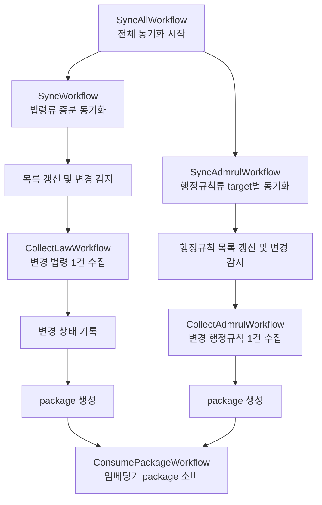

# Temporal Workflow 운영 가이드

이 문서는 Temporal Web에서 보이는 Workflow 목록을 읽는 방법과, 수집부터 임베딩까지 각 Workflow가 어떤 역할을 하는지 설명한다.

수집 시스템은 한 번의 작업을 하나의 Workflow로 처리하지 않는다. 전체 실행을 조정하는 부모 Workflow가 있고, 법령 또는 행정규칙 하나를 수집하는 자식 Workflow가 있으며, 마지막에 변경 package를 임베딩기로 넘기는 Workflow가 따로 있다.

## 전체 흐름



`ADMRUL_ENABLED=false`이면 행정규칙류 가지는 실행되지 않는다. 같은 Temporal 환경에 임베딩 Worker가 연결되지 않은 경우에도 수집과 package 생성은 가능하며, `ConsumePackageWorkflow`만 실행되지 않을 수 있다.

## 화면에서 자주 보이는 Workflow

### `SyncAllWorkflow`

예시:

```text
Workflow ID: law-sync-scheduled-2026-08-14T03:00:00Z
Type: SyncAllWorkflow
```

법령류와 행정규칙류의 전체 동기화를 시작하는 상위 Workflow다. 실제 문서를 직접 수집하지 않고, 설정된 도메인별 동기화 Workflow를 자식으로 실행한다.

일일 Schedule로 실행되는 경우 Workflow ID에 실행 예정 시각이 들어간다.

```text
SyncAllWorkflow
├─ SyncWorkflow
├─ SyncAdmrulWorkflow(admrul)
├─ SyncAdmrulWorkflow(school)
└─ ...
```

법령류만 활성화되어 있으면 `SyncWorkflow`만 보이고, 행정규칙류가 활성화되어 있으면 target별 `SyncAdmrulWorkflow`도 함께 생성된다.

### `SyncWorkflow`

예시:

```text
Workflow ID: sync-law-019ffe36
Type: SyncWorkflow
```

법령류의 증분 동기화를 담당한다. 실행 순서는 다음과 같다.

```text
전체 법령 목록 조회
  -> catalog 갱신
  -> 신규·변경·미완료·실패 문서 확인
  -> 변경 법령별 CollectLawWorkflow 실행
  -> 성공한 변경 이력 기록
  -> 변경 package 생성
  -> 연결되어 있으면 ConsumePackageWorkflow 호출
```

전체 법령을 매번 다시 수집하는 것이 아니라 catalog의 최신 지문과 마지막 수집 지문을 비교해 변경된 문서만 수집한다. 폐지 문서는 즉시 비활성 상태로 표시하고, Git에서 실제 파일을 제거하는 작업은 별도의 정리 Workflow에서 수행할 수 있다.

### `CollectLawWorkflow`

예시:

```text
Workflow ID: sync-collect-012592-019ffe36
Type: CollectLawWorkflow
```

변경된 법령 한 건을 실제로 수집하고 저장하는 단위 Workflow다. `012592`처럼 보이는 값은 개별 법령을 식별하는 ID이며, 뒤의 `019ffe36`은 상위 동기화 실행과 연결하기 위한 실행 식별자다.

한 건을 처리할 때는 대략 다음 작업이 수행된다.

```text
수집 시도 상태 기록
  -> 법제처 API 호출
  -> 본문·조문·부칙·별표·별지·링크 정보 수집
  -> 필요한 경우 팝업/렌더링 정보 확인
  -> DB/Git/manifest 설정에 따라 저장
  -> 수집 상태 및 지문 갱신
```

여러 문서는 `BACKFILL_BATCH` 단위로 나누어 처리된다. 한 문서가 실패해도 다른 문서까지 모두 중단하지 않고 실패 문서를 별도로 기록한 뒤 다음 문서를 계속 처리한다.

### `ConsumePackageWorkflow`

예시:

```text
Workflow ID: index-law-019ffe36
Type: ConsumePackageWorkflow
```

수집기가 만든 변경 package를 `law_embedding`이 소비하도록 연결하는 Workflow다. 실제 임베딩 코드는 수집기 안에서 실행하지 않고, 임베딩 Worker의 Task Queue로 전달한다.

```text
SyncWorkflow
  -> 변경 package 생성
  -> package 경로와 source 전달
  -> ConsumePackageWorkflow 실행
  -> package JSONL 읽기
  -> 청킹 및 임베딩
  -> Weaviate upsert/delete
```

수집기와 임베딩기가 같은 Temporal namespace를 사용해야 자동 연결된다. 망분리 등으로 Temporal이 서로 다른 경우에는 자동 Workflow 호출 대신 package를 folder, NFS, object storage 등의 전달 경로로 넘기는 방식으로 운영한다.

색인 실패가 수집 전체의 실패로 전파되지 않도록 최선 노력 방식으로 연결되어 있다. 따라서 수집 Workflow가 `Completed`여도 `ConsumePackageWorkflow`의 결과에 `error` 또는 `skipped`가 있는지 별도로 확인해야 한다.

## 화면에는 자주 보이지 않을 수 있는 Workflow

### `DiscoverCatalogWorkflow`

법령류의 전체 목록을 조회해 catalog를 갱신한다. 신규 문서는 수집 대기 상태로 만들고, 폐지 문서는 상태를 갱신하며, 변경 감지에 사용할 지문을 저장한다.

이 Workflow는 `SyncWorkflow` 내부에서 직접 호출되기도 하고, 초기 환경 점검이나 목록만 먼저 갱신할 때 별도로 실행할 수도 있다.

### `BackfillWorkflow`

초기 적재 또는 실패 문서 재처리에 사용한다. 아직 완료되지 않은 법령을 찾아 배치별로 `CollectLawWorkflow`를 실행한다.

이미 처리된 문서는 건너뛰므로 중간에 중단되더라도 다시 실행해 이어받을 수 있다. 초기 적재에서는 Git 연혁 export를 함께 수행할 수 있고, 배치가 끝날 때마다 Git push하도록 설정할 수도 있다.

### `DiscoverAllWorkflow`

법령류와 행정규칙류의 목록을 모두 갱신하는 상위 Workflow다. 법령류에는 `DiscoverCatalogWorkflow`, 행정규칙류에는 target별 `DiscoverAdmrulWorkflow`를 자식으로 실행한다.

### `BackfillAllWorkflow`

전체 도메인의 초기 적재를 조정한다.

```text
BackfillAllWorkflow
├─ BackfillWorkflow
├─ BackfillAdmrulWorkflow(admrul)
├─ BackfillAdmrulWorkflow(school)
└─ ...
```

### 행정규칙류 Workflow

행정규칙류는 `admrul`, `school`, `pi`, `public` 같은 target을 각각 독립적으로 처리한다.

주요 Workflow는 다음과 같다.

| Workflow | 역할 |
| --- | --- |
| `DiscoverAdmrulWorkflow` | 하나의 target 목록을 조회하고 catalog를 갱신한다. |
| `BackfillAdmrulWorkflow` | 하나의 target에서 미처리·실패 문서를 초기 적재한다. |
| `SyncAdmrulWorkflow` | 하나의 target에서 변경된 문서만 증분 수집한다. |
| `CollectAdmrulWorkflow` | 행정규칙 문서 한 건을 수집하고 저장한다. |

법령류와 구조는 유사하지만, 행정규칙류는 target별로 catalog와 수집 대상이 나뉜다는 점이 다르다.

### `CleanupRepealedWorkflow`

폐지 즉시 데이터를 지우는 Workflow가 아니다. 폐지 문서는 우선 DB에서 비활성화하고 Git 산출물에 폐지 표시를 남긴다. 일정 기간이 지난 뒤 `CleanupRepealedWorkflow`가 Git 산출물에서 오래된 폐지 문서를 정리한다.

DB의 비활성 상태는 감사와 이력 확인을 위해 유지할 수 있다.

## Workflow ID 읽는 방법

예시:

```text
sync-collect-012592-019ffe36
```

| 구간 | 의미 |
| --- | --- |
| `sync-collect` | 증분 동기화 중 개별 법령 수집 Workflow |
| `012592` | 개별 법령 ID |
| `019ffe36` | 상위 동기화 실행과 연결하기 위한 짧은 실행 식별자 |

다른 예시는 다음과 같다.

```text
law-sync-scheduled-2026-08-14T03:00:00Z
```

매일 Schedule이 시작한 전체 동기화 실행이다.

```text
sync-law-019ffe36
```

같은 실행 식별자 `019ffe36`에 속한 법령류 증분 동기화다.

```text
index-law-019ffe36
```

같은 동기화 실행에서 생성된 법령류 package를 임베딩기로 넘긴 실행이다.

## Workflow ID와 Run ID의 차이

Temporal 화면에는 `Workflow ID`와 `Run ID`가 함께 표시된다.

- `Workflow ID`: 사람이 보는 논리적인 작업 이름이다.
- `Run ID`: Temporal이 실제 실행마다 부여하는 고유 실행 ID다.

같은 종류의 작업을 다시 실행하면 논리적으로는 같은 작업이라도 Run ID는 새로 만들어진다. 재시도, 재실행, Continue-As-New가 있었는지 확인할 때는 Run ID를 함께 본다.

같은 접미사를 가진 Workflow가 여러 개 있다면 보통 하나의 부모 동기화 실행에서 파생된 자식들이다.

```text
law-sync-scheduled-2026-08-14T03:00:00Z
  └─ sync-law-019ffe36
       ├─ sync-collect-012592-019ffe36
       ├─ sync-collect-007858-019ffe36
       └─ index-law-019ffe36
```

## `Completed`를 해석하는 방법

Temporal Web에서 `Completed`는 해당 Workflow의 오케스트레이션이 정상적으로 종료되었다는 의미다. 다음 항목까지 모두 성공했다는 뜻은 아니다.

- 모든 법령 수집 성공
- 모든 변경 package 생성 성공
- package 임베딩 성공
- Weaviate 적재 성공

특히 수집 Workflow는 개별 문서 실패를 `failed` 목록에 기록하고 전체 실행을 완료할 수 있다. 또한 임베딩 연결은 최선 노력 방식이므로 색인 Worker가 없거나 색인에 실패해도 수집 Workflow가 완료될 수 있다.

따라서 실행 결과를 확인할 때는 다음 값을 함께 확인한다.

```text
SyncWorkflow 결과
├─ to_collect: 수집 대상 수
├─ done: 수집 성공 수
├─ failed: 수집 실패 목록
├─ handoff: package 생성·전달 결과
└─ index: 임베딩 Workflow 호출 결과
```

`failed`가 비어 있는지 확인하고, `index`에 `error` 또는 `skipped`가 있는지 확인해야 수집과 임베딩을 모두 정상 완료했는지 판단할 수 있다.

## 화면의 일일 실행 예시

다음과 같은 화면은 하나의 일일 증분 동기화가 부모·자식 Workflow로 나뉘어 실행된 상황이다.

```text
12:00:00  SyncAllWorkflow
          law-sync-scheduled-2026-08-14T03:00:00Z

12:00:00  SyncWorkflow
          sync-law-019ffe36

12:01~   CollectLawWorkflow 여러 개
          sync-collect-007858-019ffe36
          sync-collect-007619-019ffe36
          sync-collect-010151-019ffe36
          sync-collect-012592-019ffe36

12:07    ConsumePackageWorkflow
          index-law-019ffe36
```

화면에 여러 줄이 표시되더라도 모두 독립적인 무관한 작업이라고 볼 필요는 없다. 같은 실행 식별자를 공유하면 하나의 동기화 실행에서 파생된 Workflow일 가능성이 높다.

## 문제가 생겼을 때 확인 순서

1. 부모 `SyncAllWorkflow`의 결과를 연다.
2. 자식 `SyncWorkflow` 또는 `SyncAdmrulWorkflow`의 `failed` 목록을 확인한다.
3. 실패한 문서의 `CollectLawWorkflow` 또는 `CollectAdmrulWorkflow`를 연다.
4. package 전달이 필요한 경우 `handoff` 결과의 경로와 상태를 확인한다.
5. 임베딩이 연결된 경우 `ConsumePackageWorkflow`의 `error`, `skipped`, 처리 통계를 확인한다.
6. 수집은 완료됐지만 색인만 실패했다면 package를 보존한 상태에서 임베딩 Workflow를 재실행한다.

이 순서로 보면 “수집 실패”와 “package 전달 실패”, “임베딩 실패”를 구분해서 확인할 수 있다.
