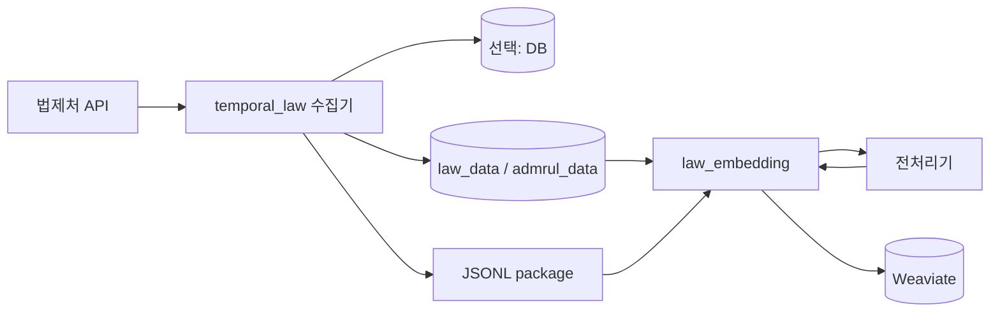

# 전부 같은 망

수집기, 임베딩기, Weaviate, 전처리기가 같은 VM 또는 같은 네트워크에 있는 구성이다.

이 케이스는 가장 단순하다. DMZ/내부망 전달을 고민하지 않아도 되고, 수집기가 만든 데이터 repo를 임베딩기가 바로 읽을 수 있다. 처음 검증할 때는 이 케이스로 시작하는 것이 좋다.

## 레포와 data 준비

같은 VM에서 전부 돌릴 때는 `law_ai`를 받고, 그 아래 `data/`에 수집 산출물 repo를 연결한다.

```bash
git clone --recursive https://github.com/genonai/law_ai.git
cd law_ai
git submodule update --init --recursive

mkdir -p data
git clone https://github.com/genonai/law_data.git data/law_data
git clone https://github.com/genonai/admrul_data.git data/admrul_data
```

이 케이스에서는 수집기와 임베딩기가 같은 repo를 본다.

- 수집기 `GIT_EXPORT_REPO=/workspace/law_ai/data/law_data`
- 수집기 `ADMRUL_GIT_EXPORT_REPO=/workspace/law_ai/data/admrul_data`
- 임베딩기 `INPUT_DATA_PATH=/workspace/law_ai/data`
- 임베딩기 `LAW_REPO_PATH=/workspace/law_ai/data/law_data`
- 임베딩기 `ADMRUL_REPO_PATH=/workspace/law_ai/data/admrul_data`

수집기가 이미 `data/`를 갱신하므로 임베딩기 `PACKAGE_MIRROR_REPO`는 보통 `false`로 둔다.

## 흐름



## 이 케이스에서 선택하는 값

| 항목 | 선택한 값 | 다른 옵션 | 왜 이 케이스는 이 값인가 |
|---|---|---|---|
| 저장 모드 | `STORAGE_MODE=git` | `both`, `db` | 같은 망이라 Git repo를 바로 유지할 수 있고, DB dump/restore 부담 없이 `_manifest.json` 기준 증분 추적이 가능하다. DB 상태까지 남겨야 하면 `both`로 바꾼다. |
| payload 원천 | `HANDOFF_PAYLOAD_SOURCE=auto` | `collect` | 수집기가 이미 저장한 Git/DB payload를 package에 넣으면 된다. `collect`는 package 생성 시 API를 다시 호출하므로 이 케이스에서는 불필요하다. |
| 첨부 전달 | `PACKAGE_ATTACHMENT_MODE=file_transfer` | `dmz`, `base64`, `none` | 같은 VM 경로 또는 공유 경로로 원본 파일을 넘길 수 있어 JSONL을 키우는 `base64`보다 가볍다. 첨부를 포기하는 `none`도 맞지 않다. |
| 전처리 위치 | 임베딩기 전처리 | 수집기 DMZ 전처리, 전처리 없음 | 같은 망에서 임베딩기가 `DOC_PARSER_*`로 전처리 API를 바로 호출한다. 수집기 전처리용 `PREPROCESS_*`는 쓰지 않는다. |
| 전송 채널 | 공유 폴더 방식 (`PACKAGE_SINK=folder`) | `minio`, `none` | 같은 VM 또는 같은 망의 공유 경로에 package를 둘 수 있으므로 folder가 가장 단순하다. MinIO는 공유 폴더가 어려울 때만 쓴다. |
| 자동 색인 | `INDEX_TASK_QUEUE=law-embedding` | 빈 값 + package 폴링 | 수집기와 임베딩기가 같은 Temporal을 볼 수 있으므로 sync 직후 색인 workflow를 바로 호출한다. Temporal이 분리되면 비우고 폴링한다. |
| 내부망 repo 미러 | `PACKAGE_MIRROR_REPO=false` | `true` | 수집기가 이미 같은 repo를 직접 갱신하므로 임베딩기가 다시 mirror하면 중복 갱신이 된다. |

## 수집기 env

파일: `temporal_law/.env`

```dotenv
LAW_API_OC=<법제처 OC 키>

TEMPORAL_ADDRESS=<Temporal 주소>
TEMPORAL_NAMESPACE=<네임스페이스>
LAW_TASK_QUEUE=law-pipeline

# DB를 안 쓰면 git, DB까지 같이 쓰면 both.
# Git mode면 DB 없이 _manifest.json 기준으로 변경분을 추적한다.
# DB도 같이 가져갈 거면 STORAGE_MODE=both로 바꾸고 DATABASE_URL/lawdb 이관을 추가한다.
STORAGE_MODE=git

LAW_ENABLED=true
LAW_CATALOG_LAW_ONLY=false
LAW_INCLUDE_LIST=
ADMRUL_ENABLED=true
ADMRUL_TARGETS=admrul,school,pi,public

# 수집 결과를 data repo에 저장한다.
GIT_EXPORT_ENABLED=true
GIT_EXPORT_REPO=/workspace/law_ai/data/law_data
GIT_EXPORT_HISTORY=true
GIT_EXPORT_PUSH=true

ADMRUL_GIT_EXPORT_ENABLED=true
ADMRUL_GIT_EXPORT_REPO=/workspace/law_ai/data/admrul_data
ADMRUL_GIT_EXPORT_HISTORY=true
ADMRUL_GIT_EXPORT_PUSH=true

# sync 후 변경분 package를 만든다.
HANDOFF_ENABLED=true
HANDOFF_PAYLOAD_SOURCE=auto

# 같은 VM/같은 망에서 접근 가능한 경로이므로 원본 파일을 옆 폴더로 넘긴다.
PACKAGE_ATTACHMENT_MODE=file_transfer
PACKAGE_FILE_STAGE_DIR=/workspace/law_ai/handoff/files

# 공유 폴더 방식. 실제 env 값은 folder다.
# 같은 VM 경로, NFS, 공유폴더, 망연계 landing directory 모두 가능하다.
PACKAGE_SINK=folder
PACKAGE_OUT_DIR=/workspace/law_ai/handoff/packages

# 같은 Temporal이면 자동 색인 트리거를 켠다.
INDEX_TASK_QUEUE=law-embedding

LAW_VERIFY_BACKFILL=off
LAW_VERIFY_SYNC=off
```

왜 이렇게 넣는가:

- `STORAGE_MODE=git`: `_manifest.json`이 변경 감지 기준이 된다. DB dump 없이 운영할 수 있다.
- `STORAGE_MODE=both`: DB 상태도 같이 남긴다. 이 경우 `DATABASE_URL`과 lawdb 영속 볼륨/백업이 필요하다.
- `GIT_EXPORT_PUSH=true`: data repo를 최신 상태로 유지한다. 원격 push가 싫으면 `false`.
- `HANDOFF_PAYLOAD_SOURCE=auto`: Git repo JSON을 읽어 package의 `document` record에 넣는다.
- `file_transfer`: 같은 VM 경로 또는 공유 경로로 파일을 넘기면 되므로 base64보다 가볍다.
- `INDEX_TASK_QUEUE`: 수집 완료 후 임베딩 workflow를 바로 호출한다. 폴링이 필요 없다.

## 임베딩기 env

파일: `law_embedding/.env`

```dotenv
WEAVIATE_HTTP_HOST=<Weaviate HTTP host>
WEAVIATE_HTTP_PORT=8080
WEAVIATE_GRPC_HOST=<Weaviate gRPC host>
WEAVIATE_GRPC_PORT=50051
WEAVIATE_API_KEY=<법령 컬렉션 write 키>
ADMRUL_WEAVIATE_API_KEY=<행정규칙 컬렉션 write 키>
WEAVIATE_SECURE=false

LAW_COLLECTION=<법령 컬렉션>
ADMRUL_COLLECTION=<행정규칙 컬렉션>

EMBEDDING_BACKEND=remote
EMBEDDING_API_URL=<임베딩 /v1/embeddings 주소>
EMBEDDING_API_KEY=
EMBEDDING_MODEL=<모델명>
EMBEDDING_BATCH_SIZE=16
NORMALIZE_EMBEDDINGS=true

INPUT_DATA_PATH=/workspace/law_ai/data
LAW_REPO_PATH=/workspace/law_ai/data/law_data
ADMRUL_REPO_PATH=/workspace/law_ai/data/admrul_data

DOC_PARSER_BASE_URL=<전처리기 주소>
DOC_PARSER_ENDPOINT_PATH=/preprocess_attachment_upload
DOC_PARSER_IMAGE_ENDPOINT_PATH=/preprocess_intelligent_upload
DOC_PARSER_API_KEY=<Doc Parser Bearer>
DOC_PARSER_UPLOAD=true

# file_transfer로 온 원본 파일을 내부 전처리한다.
PACKAGE_PREPROCESS_FILES=true
PACKAGE_FILE_INBOX_DIR=/workspace/law_ai/handoff/files

# 전처리 성공한 전달 파일을 지운다. 실패 파일은 재시도용으로 남는다.
PACKAGE_DELETE_CONSUMED_FILES=true

# 단일망에서는 수집기가 repo를 갱신하므로 보통 끈다.
PACKAGE_MIRROR_REPO=false

# 원문을 별도 저장소에 복사하고 싶을 때만 true.
PACKAGE_STORE_ORIGINAL=false
PACKAGE_ORIGINAL_DIR=

# 소비 성공 후 package JSONL을 지울지 선택.
PACKAGE_DELETE_CONSUMED_PACKAGE=false

TEMPORAL_ADDRESS=<Temporal 주소>
TEMPORAL_NAMESPACE=<네임스페이스>
INDEX_TASK_QUEUE=law-embedding
```

왜 이렇게 넣는가:

- `PACKAGE_PREPROCESS_FILES=true`: package 안의 `file` record를 전처리기로 보낸다.
- `PACKAGE_FILE_INBOX_DIR`: 수집기의 `PACKAGE_FILE_STAGE_DIR`와 같은 경로여야 한다.
- `PACKAGE_DELETE_CONSUMED_FILES=true`: 전처리 성공한 파일만 지워 전달 폴더가 쌓이지 않게 한다.
- `PACKAGE_MIRROR_REPO=false`: repo는 이미 수집기가 갱신하고 있다.
- `PACKAGE_DELETE_CONSUMED_PACKAGE=false`: 처음에는 package를 남겨서 디버깅한다. 안정화 후 `true`.

## 이 케이스의 env 의존관계

| env | 같이 필요한 값 | 주의 |
|---|---|---|
| `PACKAGE_ATTACHMENT_MODE=file_transfer` | `PACKAGE_FILE_STAGE_DIR`, `PACKAGE_FILE_INBOX_DIR` | 수집기가 둔 파일을 임베딩기가 같은 경로에서 읽어야 한다. |
| `PACKAGE_PREPROCESS_FILES=true` | `DOC_PARSER_BASE_URL`, `DOC_PARSER_*`, `DOC_PARSER_API_KEY` | 같은 망에서 전처리 API를 바로 호출한다. |
| `PACKAGE_MIRROR_REPO=false` | 없음 | repo는 수집기가 직접 갱신하므로 임베딩기가 또 mirror하지 않는다. |
| `INDEX_TASK_QUEUE=law-embedding` | 수집기와 임베딩기가 같은 Temporal을 봄 | Temporal이 분리되면 비우고 package 폴링으로 바꾼다. |

같이 쓰면 헷갈리는 조합:

- `PACKAGE_MIRROR_REPO=true`: 같은 망에서 수집기가 이미 repo를 쓰는 구조면 중복 갱신이 될 수 있다.
- `INDEX_TASK_QUEUE=law-embedding` + 서로 다른 Temporal: 수집기가 내부망 worker를 호출하지 못한다.

## 실행 순서

수집 worker:

```bash
cd temporal_law
uv sync
uv run python -m pipeline.worker
```

임베딩 worker:

```bash
cd law_embedding
uv sync
uv run python -m law_indexer worker
```

초기 전체 색인:

```bash
cd law_embedding
uv run python -m law_indexer health
uv run python -m law_indexer create-collection
uv run python -m law_indexer index --source both
```

증분 sync:

```bash
cd temporal_law
uv run python -m pipeline.starter sync-now
```

같은 Temporal이면 `sync-now`가 끝난 뒤 package 소비 workflow가 자동으로 이어진다.

## 확인

```bash
git -C /workspace/law_ai/data/law_data log --oneline -3
git -C /workspace/law_ai/data/admrul_data log --oneline -3
ls -t /workspace/law_ai/handoff/packages | head
```

```bash
cd law_embedding
uv run python -m law_indexer search --source law --query "출생신고는 언제까지 해야 하나요?"
```

## 주의

- Chrome 없이 수집하면 relation이 비거나 수집이 실패한다. 수집기가 도는 곳에는 Chrome이 필요하다.
- `.env`를 바꾸면 worker를 재시작해야 한다.
- `LAW_INCLUDE_LIST`는 운영 전체 sync에서는 비운다.
- `GIT_EXPORT_PUSH=true`는 원격 repo에 push하므로 권한과 branch를 확인한다.
