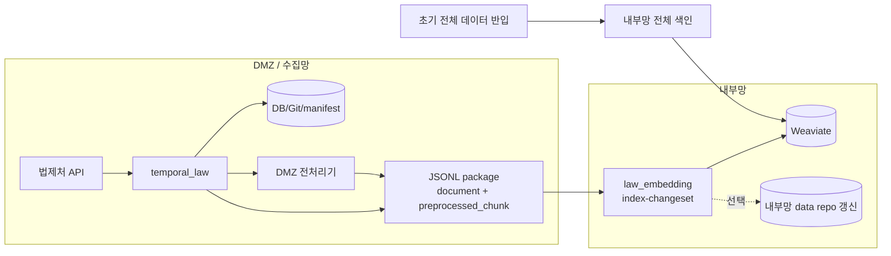

# 초기 반입 가능 + DMZ 전처리

초기 전체 `law_data/admrul_data`는 내부망으로 반입할 수 있지만, 이후 증분 첨부 원본 파일은 내부망으로 보내지 않고 **DMZ에서 전처리한 텍스트 청크만** 보내는 구성이다.

원본 파일 반출이 어렵고, DMZ에서 전처리기를 운영할 수 있을 때 쓴다.

## 레포와 data 준비

초기 전체 repo를 내부망에 반입할 수 있으므로, 내부망에는 `law_ai`와 `data/law_data`, `data/admrul_data`를 먼저 준비한다.

```bash
git clone --recursive https://github.com/genonai/law_ai.git
cd law_ai
git submodule update --init --recursive

mkdir -p data
git clone https://github.com/genonai/law_data.git data/law_data
git clone https://github.com/genonai/admrul_data.git data/admrul_data
```

내부망 초기 색인은 이 `data/`를 기준으로 돌린다.

- 임베딩기 `INPUT_DATA_PATH=/data` 또는 `/workspace/law_ai/data`
- 임베딩기 `LAW_REPO_PATH=/data/law_data`
- 임베딩기 `ADMRUL_REPO_PATH=/data/admrul_data`

DMZ 수집기도 Git 저장형으로 운영한다면 DMZ에도 같은 data repo clone이 필요하다.

```bash
mkdir -p data
git clone https://github.com/genonai/law_data.git data/law_data
git clone https://github.com/genonai/admrul_data.git data/admrul_data
```

DMZ 전처리 케이스는 내부망으로 원본 파일을 보내지 않는다. 내부망 repo를 계속 최신화하려면 임베딩기에서 `PACKAGE_MIRROR_REPO=true`를 켜고 package의 `document.payload`를 `LAW_REPO_PATH`, `ADMRUL_REPO_PATH`에 다시 쓴다.

## 흐름



## 이 케이스에서 선택하는 값

| 항목 | 선택한 값 | 다른 옵션 | 왜 이 케이스는 이 값인가 |
|---|---|---|---|
| 초기 적재 | 내부망 `law_indexer index --source both` | package만으로 첫 적재 | 초기 전체 repo를 내부망에 반입할 수 있으므로 최초 색인은 전체 repo 기준으로 한 번 돌린다. |
| payload 원천 | `HANDOFF_PAYLOAD_SOURCE=auto` | `collect` | DMZ에 Git/DB 저장소가 있으므로 저장된 최신 payload를 package에 담는다. `collect`는 API 재호출이 필요해 기본 운영에는 부담이다. |
| 첨부 처리 | `PACKAGE_ATTACHMENT_MODE=dmz` | `file_transfer`, `base64`, `none` | 원본 파일을 내부망으로 보내지 않는 케이스다. 대신 수집기가 DMZ 전처리기를 호출하고 `preprocessed_chunk`만 보낸다. |
| 수집기 전처리 env | `PREPROCESS_*` 사용 | `DOC_PARSER_*` | 전처리가 수집기/DMZ 쪽에서 일어나므로 `PREPROCESS_API_URL`, `PREPROCESS_ENDPOINT_PATH`, `PREPROCESS_API_KEY`가 필요하다. |
| 임베딩기 전처리 | `PACKAGE_PREPROCESS_FILES=false` | `true` | package에 이미 전처리 청크가 들어오므로 내부망 전처리기를 다시 태우지 않는다. |
| 내부 repo 갱신 | `PACKAGE_MIRROR_REPO=true` 또는 `false` | - | 내부망 repo를 계속 최신화하려면 `true`, VDB만 갱신하면 `false`다. 이 방식은 원본 파일 없이 document JSON만 mirror된다. |
| package 전달 | 공유 폴더 방식 (`PACKAGE_SINK=folder`) | `minio`, `none` | JSONL만 전달하면 되므로 folder가 기본이다. MinIO는 공유 폴더가 어려울 때의 보조 선택지다. |

## 수집기 env

파일: `temporal_law/.env`

```dotenv
LAW_API_OC=<법제처 OC 키>

TEMPORAL_ADDRESS=<DMZ Temporal 주소>
TEMPORAL_NAMESPACE=<네임스페이스>
LAW_TASK_QUEUE=law-pipeline

# DMZ에서 변경 감지를 하려면 저장소가 필요하다.
# git이면 _manifest.json 기준, both면 DB+Git 기준.
# DB도 같이 가져갈 거면 STORAGE_MODE=both로 바꾸고 DATABASE_URL/lawdb 이관을 추가한다.
STORAGE_MODE=git

LAW_ENABLED=true
LAW_CATALOG_LAW_ONLY=false
LAW_INCLUDE_LIST=
ADMRUL_ENABLED=true
ADMRUL_TARGETS=admrul,school,pi,public

GIT_EXPORT_ENABLED=true
GIT_EXPORT_REPO=/data/law_data
GIT_EXPORT_HISTORY=true
GIT_EXPORT_PUSH=true

ADMRUL_GIT_EXPORT_ENABLED=true
ADMRUL_GIT_EXPORT_REPO=/data/admrul_data
ADMRUL_GIT_EXPORT_HISTORY=true
ADMRUL_GIT_EXPORT_PUSH=true

HANDOFF_ENABLED=true
HANDOFF_PAYLOAD_SOURCE=auto

# 핵심: DMZ에서 첨부 파일을 전처리하고 청크만 package에 넣는다.
PACKAGE_ATTACHMENT_MODE=dmz
PACKAGE_DMZ_PARSER_URL=<DMZ 전처리기 base URL>
PREPROCESS_API_URL=<DMZ 전처리기 base URL>
PREPROCESS_ENDPOINT_PATH=/preprocess_attachment_upload
PREPROCESS_API_KEY=<Doc Parser Bearer>
PREPROCESS_API_MODE=multipart
PREPROCESS_FILE_FIELD=file

# 공유 폴더 방식. 실제 env 값은 folder다.
# NFS/공유폴더/망연계 landing directory에 JSONL을 둔다.
PACKAGE_SINK=folder
PACKAGE_OUT_DIR=/mnt/handoff/packages

# 분리망이면 내부망 Temporal을 못 보므로 비운다.
INDEX_TASK_QUEUE=
```

왜 이렇게 넣는가:

- `HANDOFF_PAYLOAD_SOURCE=auto`: DMZ 저장소에 저장된 최신 JSON을 package에 담는다.
- `PACKAGE_ATTACHMENT_MODE=dmz`: `file` record 대신 `preprocessed_chunk` record가 생긴다.
- `PREPROCESS_API_MODE=multipart`: 파일 경로 공유 없이 bytes 업로드로 전처리한다.
- `INDEX_TASK_QUEUE=`: DMZ Temporal과 내부망 Temporal이 다르면 자동 호출이 불가능하다. 내부망이 package를 읽어간다.
- DB까지 같이 운영하려면 `STORAGE_MODE=both`, `DATABASE_URL=<lawdb>`, VM 이전 시 `lawdb` dump/restore를 추가한다.

## 임베딩기 env

파일: `law_embedding/.env`

```dotenv
WEAVIATE_HTTP_HOST=<내부망 Weaviate HTTP host>
WEAVIATE_HTTP_PORT=8080
WEAVIATE_GRPC_HOST=<내부망 Weaviate gRPC host>
WEAVIATE_GRPC_PORT=50051
WEAVIATE_API_KEY=<법령 컬렉션 write 키>
ADMRUL_WEAVIATE_API_KEY=<행정규칙 컬렉션 write 키>
WEAVIATE_SECURE=false

LAW_COLLECTION=<법령 컬렉션>
ADMRUL_COLLECTION=<행정규칙 컬렉션>

EMBEDDING_BACKEND=remote
EMBEDDING_API_URL=<내부망 임베딩 /v1/embeddings>
EMBEDDING_MODEL=<모델명>
EMBEDDING_BATCH_SIZE=16
NORMALIZE_EMBEDDINGS=true

INPUT_DATA_PATH=/data
LAW_REPO_PATH=/data/law_data
ADMRUL_REPO_PATH=/data/admrul_data

# DMZ에서 이미 전처리된 청크가 오므로 내부 전처리 off.
PACKAGE_PREPROCESS_FILES=false
PACKAGE_FILE_INBOX_DIR=

# true면 package 소비 시 내부망 repo의 JSON도 최신화한다.
# dmz 모드는 원본 파일이 없으므로 파일 미러는 안 되고 document JSON만 갱신된다.
PACKAGE_MIRROR_REPO=true

# 별도 원문 저장소가 필요할 때만 켠다. 보통 repo mirror로 충분하면 false.
PACKAGE_STORE_ORIGINAL=false
PACKAGE_ORIGINAL_DIR=

# 성공한 package를 지울지. 처음에는 false로 두고 검증 후 true.
PACKAGE_DELETE_CONSUMED_PACKAGE=false
PACKAGE_DELETE_CONSUMED_FILES=false
```

## 이 케이스의 env 의존관계

| env | 같이 필요한 값 | 주의 |
|---|---|---|
| `PACKAGE_ATTACHMENT_MODE=dmz` | `PREPROCESS_API_URL`, `PREPROCESS_ENDPOINT_PATH`, `PREPROCESS_API_KEY` | DMZ에서 전처리해야 하므로 수집기 쪽 전처리 API가 필수다. |
| `PACKAGE_PREPROCESS_FILES=false` | package 안의 `preprocessed_chunk` | 내부망 전처리기를 다시 태우지 않는다. |
| `PACKAGE_MIRROR_REPO=true` | `LAW_REPO_PATH`, `ADMRUL_REPO_PATH` | 내부망 repo JSON을 최신화한다. 단, DMZ 전처리 케이스는 원본 파일이 내부망에 남지 않는다. |
| `PACKAGE_DELETE_CONSUMED_PACKAGE=false` | 재처리 정책 확정 전까지 유지 | 처음에는 package를 남겨 장애 분석과 재실행이 가능하게 둔다. |

같이 쓰면 헷갈리는 조합:

- `PACKAGE_ATTACHMENT_MODE=dmz` + `PACKAGE_PREPROCESS_FILES=true`: 이미 전처리된 청크가 왔는데 내부망에서 또 파일 전처리를 시도하는 꼴이 된다.
- `PACKAGE_ATTACHMENT_MODE=dmz` + 원본 파일 보관 기대: 이 방식은 원본 파일을 내부망으로 보내지 않는다.

## 실행 순서

초기 반입 후 내부망 전체 색인:

```bash
cd law_embedding
uv sync
uv run python -m law_indexer health
uv run python -m law_indexer create-collection
uv run python -m law_indexer index --source both
```

DMZ에서 증분 생성:

```bash
cd temporal_law
uv run python -m pipeline.worker
uv run python -m pipeline.starter sync-now
```

내부망에서 package 소비:

```bash
cd law_embedding
uv run python -m law_indexer index-changeset --input /mnt/handoff/packages/PACKAGE.jsonl
```

여러 package를 폴링 소비:

```bash
for f in /mnt/handoff/packages/*.jsonl; do
  uv run python -m law_indexer index-changeset --input "$f"
done
```

## 확인

- package에 `document`와 `preprocessed_chunk`가 있어야 한다.
- package에 `file.content_b64`나 `file.transfer_name`이 없어야 정상이다.
- `PACKAGE_MIRROR_REPO=true`면 내부망 `LAW_REPO_PATH`, `ADMRUL_REPO_PATH`의 JSON 파일이 갱신된다.

## 주의

- 원본 파일은 내부망에 남지 않는다. 원본 파일 미리보기/다운로드가 필요하면 `원본파일` 또는 `base64` 케이스를 써야 한다.
- DMZ 전처리기 장애 시 첨부 청크가 빠진다.
- 내부망 전처리기를 쓰지 않으므로 `DOC_PARSER_BASE_URL`은 임베딩기에서 필수가 아니다.
