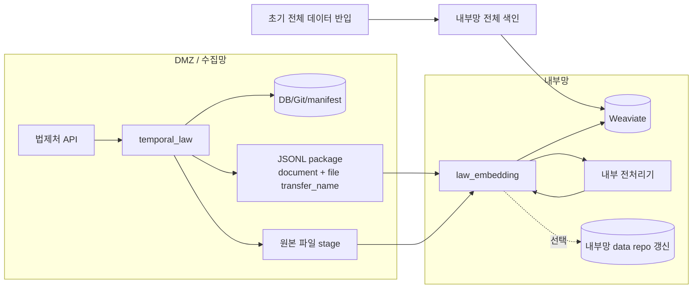

# 초기 반입 가능 + 원본 파일 전달

초기 전체 데이터는 내부망에 반입하고, 이후 증분 첨부 원본 파일은 별도 파일 채널로 내부망에 보낸 뒤 내부망 전처리기가 처리하는 구성이다.

DMZ에서 전처리기를 운영하기 어렵거나, 내부망에 원본 파일을 남겨야 할 때 쓴다.

## 레포와 data 준비

초기 전체 repo를 내부망에 반입할 수 있으므로, 내부망에는 `law_ai`와 `data/law_data`, `data/admrul_data`를 먼저 준비한다.

```bash
git clone --recursive https://github.com/genonai/law_ai.git
cd law_ai
git submodule update --init --recursive

mkdir -p data
git clone https://github.com/genonai/law_data.git data/law_data
git clone https://github.com/genonai/admrul_data.git data/admrul_data
```

내부망 초기 색인은 이 `data/`를 기준으로 돌린다. 이후 증분에서는 JSONL package와 원본 파일 stage 폴더를 같이 받는다.

- 임베딩기 `INPUT_DATA_PATH=/data`
- 임베딩기 `LAW_REPO_PATH=/data/law_data`
- 임베딩기 `ADMRUL_REPO_PATH=/data/admrul_data`
- 수집기 `PACKAGE_FILE_STAGE_DIR=/mnt/handoff/files`
- 임베딩기 `PACKAGE_FILE_INBOX_DIR=/mnt/handoff/files`

DMZ 수집기도 Git 저장형으로 운영한다면 DMZ에도 같은 data repo clone이 필요하다.

## 흐름



## 이 케이스에서 선택하는 값

| 항목 | 선택한 값 | 다른 옵션 | 왜 이 케이스는 이 값인가 |
|---|---|---|---|
| 초기 적재 | 내부망 `law_indexer index --source both` | package만으로 첫 적재 | 초기 전체 repo를 내부망에 반입할 수 있으므로 최초 색인은 전체 repo 기준으로 한다. |
| payload 원천 | `HANDOFF_PAYLOAD_SOURCE=auto` | `collect` | DMZ Git/DB에 저장된 최신 document payload를 package에 넣는다. `collect`는 API 재호출이 생겨 기본값으로 두지 않는다. |
| 첨부 처리 | `PACKAGE_ATTACHMENT_MODE=file_transfer` | `dmz`, `base64`, `none` | DMZ에서 전처리하지 않고 내부망에서 원본 파일을 전처리한다. 큰 파일이 많으면 base64보다 파일 채널이 낫다. |
| 수집기 파일 stage | `PACKAGE_FILE_STAGE_DIR` | 비움 | `file_transfer`는 JSONL에 파일 bytes를 넣지 않으므로, 수집기가 원본 파일을 stage 폴더에 둬야 한다. |
| 임베딩기 파일 inbox | `PACKAGE_FILE_INBOX_DIR` | 비움 | 임베딩기가 `transfer_name`으로 실제 파일을 찾아야 하므로 inbox가 필요하다. |
| 임베딩기 전처리 env | `DOC_PARSER_*` 사용 | `PREPROCESS_*` | 전처리가 내부망 임베딩기 쪽에서 일어나므로 `DOC_PARSER_BASE_URL`, endpoint, API key가 필요하다. |
| 파일 삭제 | `PACKAGE_DELETE_CONSUMED_FILES=true` | `false` | 전처리 성공한 전달 파일을 정리한다. 원본 보관이 필요하면 `false` 또는 `PACKAGE_STORE_ORIGINAL=true`로 바꾼다. |
| 내부 repo 갱신 | `PACKAGE_MIRROR_REPO=true` 또는 `false` | - | 내부망 repo를 최신화하려면 `true`, VDB만 갱신하면 `false`다. |
| package 전달 | 공유 폴더 방식 (`PACKAGE_SINK=folder`) | `minio`, `none` | JSONL과 파일 stage가 함께 전달되어야 하므로 공유 폴더 방식이 기본이다. |

## 수집기 env

```dotenv
LAW_API_OC=<법제처 OC 키>
TEMPORAL_ADDRESS=<DMZ Temporal 주소>
TEMPORAL_NAMESPACE=<네임스페이스>
LAW_TASK_QUEUE=law-pipeline

# Git mode면 DB 없이 _manifest.json 기준으로 변경분을 추적한다.
# DB도 같이 가져갈 거면 STORAGE_MODE=both로 바꾸고 DATABASE_URL/lawdb 이관을 추가한다.
STORAGE_MODE=git

LAW_ENABLED=true
LAW_CATALOG_LAW_ONLY=false
LAW_INCLUDE_LIST=
ADMRUL_ENABLED=true
ADMRUL_TARGETS=admrul,school,pi,public

GIT_EXPORT_ENABLED=true
GIT_EXPORT_REPO=/data/law_data
GIT_EXPORT_PUSH=true
ADMRUL_GIT_EXPORT_ENABLED=true
ADMRUL_GIT_EXPORT_REPO=/data/admrul_data
ADMRUL_GIT_EXPORT_PUSH=true

HANDOFF_ENABLED=true
HANDOFF_PAYLOAD_SOURCE=auto

# 핵심: 원본 파일을 별도 디렉터리에 저장하고 JSONL에는 transfer_name만 넣는다.
PACKAGE_ATTACHMENT_MODE=file_transfer
PACKAGE_FILE_STAGE_DIR=/mnt/handoff/files

# 공유 폴더 방식. 실제 env 값은 folder다.
PACKAGE_SINK=folder
PACKAGE_OUT_DIR=/mnt/handoff/packages
INDEX_TASK_QUEUE=
```

## 임베딩기 env

```dotenv
WEAVIATE_HTTP_HOST=<내부망 Weaviate HTTP host>
WEAVIATE_HTTP_PORT=8080
WEAVIATE_GRPC_HOST=<내부망 Weaviate gRPC host>
WEAVIATE_GRPC_PORT=50051
WEAVIATE_API_KEY=<법령 컬렉션 write 키>
ADMRUL_WEAVIATE_API_KEY=<행정규칙 컬렉션 write 키>
WEAVIATE_SECURE=false

LAW_COLLECTION=<법령 컬렉션>
ADMRUL_COLLECTION=<행정규칙 컬렉션>

EMBEDDING_BACKEND=remote
EMBEDDING_API_URL=<내부망 임베딩 /v1/embeddings>
EMBEDDING_MODEL=<모델명>
NORMALIZE_EMBEDDINGS=true

INPUT_DATA_PATH=/data
LAW_REPO_PATH=/data/law_data
ADMRUL_REPO_PATH=/data/admrul_data

DOC_PARSER_BASE_URL=<내부망 전처리기 base URL>
DOC_PARSER_ENDPOINT_PATH=/preprocess_attachment_upload
DOC_PARSER_IMAGE_ENDPOINT_PATH=/preprocess_intelligent_upload
DOC_PARSER_API_KEY=<Doc Parser Bearer>
DOC_PARSER_UPLOAD=true

# 핵심: file record를 내부 전처리한다.
PACKAGE_PREPROCESS_FILES=true
PACKAGE_FILE_INBOX_DIR=/mnt/handoff/files
PACKAGE_DELETE_CONSUMED_FILES=true

# true면 내부망 data repo도 최신화한다.
PACKAGE_MIRROR_REPO=true

# repo가 아니라 별도 원문 저장소도 필요하면 true.
PACKAGE_STORE_ORIGINAL=false
PACKAGE_ORIGINAL_DIR=

PACKAGE_DELETE_CONSUMED_PACKAGE=false
```

왜 이렇게 넣는가:

- `STORAGE_MODE=git`: 수집기 쪽 Git manifest로 변경분을 판단한다. DB까지 같이 쓰려면 `both`로 바꾸고 `DATABASE_URL`을 추가한다.
- `PACKAGE_ATTACHMENT_MODE=file_transfer`: JSONL에는 파일의 `transfer_name`만 넣고, 원본 파일은 별도 채널로 넘긴다.
- `PACKAGE_FILE_INBOX_DIR`: 내부망에서 실제 파일을 찾는 위치다. 수집기 `PACKAGE_FILE_STAGE_DIR`와 전달 결과가 맞아야 한다.
- `PACKAGE_DELETE_CONSUMED_FILES=true`: 전처리 성공한 파일을 정리한다. 원본 보관이 필요하면 `false` 또는 `PACKAGE_STORE_ORIGINAL=true`를 쓴다.
- `PACKAGE_MIRROR_REPO=true`: package 소비와 동시에 내부망 repo도 최신화한다.

## 이 케이스의 env 의존관계

| env | 같이 필요한 값 | 주의 |
|---|---|---|
| `PACKAGE_ATTACHMENT_MODE=file_transfer` | `PACKAGE_FILE_STAGE_DIR`, `PACKAGE_FILE_INBOX_DIR` | JSONL에는 파일 내용이 없고 `transfer_name`만 있으므로 실제 파일 전달이 필수다. |
| `PACKAGE_PREPROCESS_FILES=true` | `DOC_PARSER_BASE_URL`, `DOC_PARSER_*`, `DOC_PARSER_API_KEY` | 내부망에서 원본 파일을 전처리한다. |
| `PACKAGE_DELETE_CONSUMED_FILES=true` | 파일 보관 정책 확인 | 성공 후 전달 파일을 지운다. 원본을 남겨야 하면 `false`나 `PACKAGE_STORE_ORIGINAL=true`. |
| `PACKAGE_MIRROR_REPO=true` | `LAW_REPO_PATH`, `ADMRUL_REPO_PATH` | 내부망 repo 구조에 document와 파일을 맞춰 저장한다. |

같이 쓰면 헷갈리는 조합:

- `file_transfer` + `PACKAGE_FILE_INBOX_DIR=`: package는 도착해도 파일을 찾지 못한다.
- `file_transfer` + 파일 채널 없음: 이 경우는 [c-base64.md](c-base64.md)로 가야 한다.

## 실행 순서

초기 전체 색인:

```bash
cd law_embedding
uv run python -m law_indexer create-collection
uv run python -m law_indexer index --source both
```

증분 생성:

```bash
cd temporal_law
uv run python -m pipeline.starter sync-now
```

파일과 package 전달 후 소비:

```bash
cd law_embedding
uv run python -m law_indexer index-changeset --input /mnt/handoff/packages/PACKAGE.jsonl
```

## 확인

- package에는 `file.transfer_name`과 `sha256`이 있어야 한다.
- `/mnt/handoff/files`에 해당 파일이 있어야 한다.
- 성공 후 `PACKAGE_DELETE_CONSUMED_FILES=true`면 전처리된 파일은 삭제된다.
- `PACKAGE_MIRROR_REPO=true`면 repo 안에 document JSON과 원본 파일 미러가 생긴다.

## 주의

- JSONL과 파일 채널이 둘 다 필요하다. 둘 중 하나만 도착하면 첨부는 pending 처리된다.
- 파일명이 맞지 않으면 `file_missing_in_inbox`로 보류된다.
- 파일 채널을 만들기 어렵다면 `base64` 케이스가 더 단순하다.
- DB까지 같이 운영하려면 수집기 `STORAGE_MODE=both`, `DATABASE_URL=<lawdb>`, VM 이전 시 `lawdb` dump/restore를 추가한다.
