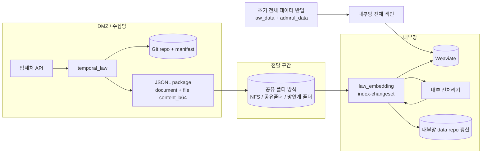

# 초기 반입 가능 + Git mode + 내부 repo 유지 + base64

이 문서는 아래처럼 말하는 환경을 위한 실행 매뉴얼이다.

> “수집기는 DMZ/외부망에서 돌고, 내부망에는 초기 `law_data/admrul_data`를 한 번 반입할 수 있다.  
> 수집기는 Git mode로 변경분을 추적하고, 내부망에도 repo 형식 데이터를 계속 유지하고 싶다.  
> 증분 첨부 파일은 별도 파일 채널 없이 base64로 JSONL 안에 넣어서 보내겠다.”

이 케이스의 핵심은 **초기 적재는 내부망 repo로 한 번 크게 하고**, 이후부터는 **JSONL package만 받아 변경된 문서만 다시 적재**하는 것이다. 첨부 원본은 `content_b64`로 package 안에 들어오므로, 내부망 전처리기가 디코딩해서 처리한다.

## 흐름



## 이 문서에서 확정하는 선택

| 항목 | 선택한 값 | 다른 옵션 | 왜 이 케이스는 이 값인가 |
|---|---|---|---|
| 초기 반입 | 가능 | 불가 | 내부망에 `law_data/admrul_data` 전체 repo를 먼저 넣을 수 있으므로 최초 색인은 전체 repo 기준으로 한다. |
| 수집기 저장 방식 | `STORAGE_MODE=git` | `both`, `db` | DB 없이 Git manifest 기준으로 변경분을 추적한다. DB까지 가져가면 dump/restore가 필요하므로 이 케이스 기본값은 `git`이다. |
| payload 원천 | `HANDOFF_PAYLOAD_SOURCE=auto` | `collect` | DMZ Git repo에 저장된 최신 payload를 package에 넣는다. `collect`는 API를 다시 호출하므로 저장소가 있는 이 케이스에서는 기본으로 쓰지 않는다. |
| 증분 전달 방식 | JSONL package | Git pull만 사용, DB 직접 조회 | 분리망에서는 내부망이 DMZ 저장소를 직접 보지 않는 전제로 package를 계약으로 삼는다. |
| 첨부 처리 | `PACKAGE_ATTACHMENT_MODE=base64` | `dmz`, `file_transfer`, `none` | 파일 채널 없이 JSONL 하나만 넘기려는 케이스다. `dmz`는 DMZ 전처리, `file_transfer`는 별도 파일 채널, `none`은 첨부 보류라서 제외한다. |
| 임베딩기 전처리 | `PACKAGE_PREPROCESS_FILES=true` | `false` | base64로 온 파일을 내부망에서 디코딩하고 전처리해야 하므로 켠다. 끄면 첨부 청크가 빠진다. |
| 전처리 env | `DOC_PARSER_*` 사용 | `PREPROCESS_*` | 전처리가 내부망 임베딩기 쪽에서 일어나므로 `DOC_PARSER_BASE_URL`, endpoint, API key가 필요하다. `PREPROCESS_*`는 수집기/DMZ 전처리용이다. |
| 파일 inbox | 비움 | `PACKAGE_FILE_INBOX_DIR=/...` | base64는 파일이 JSONL 안에 있으므로 폴더에서 찾지 않는다. inbox는 `file_transfer`용이다. |
| package 전달 | 공유 폴더 방식 (`PACKAGE_SINK=folder`) | `minio`, `none` | JSONL package를 NFS/공유폴더/망연계 폴더에 두는 기본 방식이다. MinIO는 공유 폴더가 어려울 때만 쓴다. |
| 내부망 repo 유지 | `PACKAGE_MIRROR_REPO=true` | `false` | 이 케이스는 내부망 repo도 계속 최신화하는 전제다. VDB만 갱신하면 되면 `false`로 바꾼다. |
| 원문 별도 저장 | `PACKAGE_STORE_ORIGINAL=false` | `true` | repo mirror가 원본 보관 역할을 하므로 기본은 끈다. repo와 별도 보관소가 필요하면 `true`로 바꾼다. |
| package 삭제 | `PACKAGE_DELETE_CONSUMED_PACKAGE=false` | `true` | 처음에는 실패 분석과 재처리를 위해 남긴다. 운영 안정 후 성공 package 자동 삭제가 필요하면 `true`로 바꾼다. |

## 준비해야 하는 것

내부망에는 초기 반입 시점에 아래가 있어야 한다.

```bash
git clone --recursive https://github.com/genonai/law_ai.git
cd law_ai
git submodule update --init --recursive

mkdir -p data
git clone https://github.com/genonai/law_data.git data/law_data
git clone https://github.com/genonai/admrul_data.git data/admrul_data
```

```text
/data/
├── law_data/       # Git repo 그대로 반입
└── admrul_data/    # Git repo 그대로 반입
```

중요한 점:

- 내부망 repo를 Git history 용도로도 쓸 수 있으므로 가능하면 `.git`까지 포함해 반입한다.
- 이 문서는 내부망 repo를 계속 최신화하는 전제로 쓴다. 그래서 `PACKAGE_MIRROR_REPO=true`다.
- base64 방식은 JSONL 하나만 옮기면 되지만, 원본보다 용량이 커진다. 첨부가 매우 크면 [b-원본파일.md](b-원본파일.md)가 낫다.
- 전달 경로는 `/mnt/handoff/packages`처럼 수집기와 내부망이 약속한 폴더로 본다. 실제 구현은 NFS, 공유폴더, 망연계로 들어온 landing directory 모두 가능하다.

## 수집기 env

파일: `temporal_law/.env`

```dotenv
LAW_API_OC=<법제처 OC 키>
TEMPORAL_ADDRESS=<DMZ Temporal 주소>
TEMPORAL_NAMESPACE=<네임스페이스>
LAW_TASK_QUEUE=law-pipeline

# Git mode: _manifest.json과 Git export를 기준으로 변경분을 추적한다.
# DB도 같이 가져갈 거면 STORAGE_MODE=both로 바꾸고 DATABASE_URL/lawdb 이관을 추가한다.
STORAGE_MODE=git

LAW_ENABLED=true
LAW_CATALOG_LAW_ONLY=false
LAW_INCLUDE_LIST=
ADMRUL_ENABLED=true
ADMRUL_TARGETS=admrul,school,pi,public

# DMZ 쪽 수집 산출물 repo. Git mode에서는 이 repo와 manifest가 증분 기준이다.
GIT_EXPORT_ENABLED=true
GIT_EXPORT_REPO=/data/law_data
GIT_EXPORT_PUSH=true
ADMRUL_GIT_EXPORT_ENABLED=true
ADMRUL_GIT_EXPORT_REPO=/data/admrul_data
ADMRUL_GIT_EXPORT_PUSH=true

# sync 후 변경된 document/file record를 JSONL package로 만든다.
HANDOFF_ENABLED=true
HANDOFF_PAYLOAD_SOURCE=auto

# 핵심: 원본 파일 bytes를 JSONL 안에 content_b64로 넣는다.
PACKAGE_ATTACHMENT_MODE=base64

# 공유 폴더 방식. 실제 env 값은 folder다.
# NFS/공유폴더/망연계 landing directory에 JSONL을 둔다.
PACKAGE_SINK=folder
PACKAGE_OUT_DIR=/mnt/handoff/packages

# 분리망이면 내부망 Temporal queue를 직접 호출할 수 없으므로 비운다.
# 같은 Temporal을 공유하는 구조라면 law-embedding으로 지정할 수 있다.
INDEX_TASK_QUEUE=
```

왜 이렇게 넣는가:

- `STORAGE_MODE=git`: 수집기가 이전 수집 상태를 Git manifest로 기억한다. 그래야 다음 sync에서 바뀐 문서만 package로 만들 수 있다.
- `GIT_EXPORT_ENABLED=true`: Git mode의 기준 repo를 유지한다. 원격 push가 필요 없으면 `GIT_EXPORT_PUSH=false`로 내려도 된다.
- `HANDOFF_PAYLOAD_SOURCE=auto`: Git에 저장된 최신 payload를 package에 담는다.
- `PACKAGE_ATTACHMENT_MODE=base64`: 파일 원본을 별도 폴더로 보내지 않고 JSONL 안에 넣는다.
- `INDEX_TASK_QUEUE=`: DMZ Temporal과 내부망 Temporal이 분리된 일반 망분리 구조에서는 자동 호출 대신 내부망이 package를 소비한다.

공유 폴더를 만들기 어렵고 양쪽에서 접근 가능한 object storage가 있을 때만 MinIO를 쓴다. 이 경우 아래처럼 바꾼다.

```dotenv
PACKAGE_SINK=minio
PACKAGE_MINIO_ENDPOINT=<minio endpoint>
PACKAGE_MINIO_ACCESS_KEY=<access key>
PACKAGE_MINIO_SECRET_KEY=<secret key>
PACKAGE_MINIO_BUCKET=law-packages
PACKAGE_MINIO_PREFIX=sync
PACKAGE_MINIO_CLEAR_PREFIX=false
```

초기 대량 package를 만들 때 `PACKAGE_MINIO_CLEAR_PREFIX=true`로 두면 아직 소비하지 않은 package를 지울 수 있으니 처음에는 `false`가 안전하다.

## 이 케이스의 env 의존관계

| env | 같이 필요한 값 | 이 케이스에서 왜 이렇게 쓰나 |
|---|---|---|
| `STORAGE_MODE=git` | `GIT_EXPORT_ENABLED=true`, `GIT_EXPORT_REPO`, `ADMRUL_GIT_EXPORT_REPO` | 수집기가 Git manifest로 변경분을 알아야 한다. DB 없이 가는 기본안이다. |
| `HANDOFF_ENABLED=true` | 공유 폴더 방식 env: `PACKAGE_SINK=folder`, `PACKAGE_OUT_DIR=/mnt/handoff/packages` | sync 결과를 내부망에 넘길 JSONL package로 만든다. |
| `HANDOFF_PAYLOAD_SOURCE=auto` | DMZ Git repo에 최신 JSON payload 존재 | 이미 수집된 최신 JSON을 package에 넣는다. API를 다시 치는 `collect`보다 기본 운영에 맞다. |
| `PACKAGE_ATTACHMENT_MODE=base64` | 첨부 파일을 JSONL에 넣을 수 있는 용량 제한 확인 | 별도 파일 채널 없이 package 하나로 넘기기 위해 선택한다. |
| `PACKAGE_PREPROCESS_FILES=true` | `DOC_PARSER_BASE_URL`, `DOC_PARSER_*`, `DOC_PARSER_API_KEY` | 내부망에서 base64 파일을 디코딩한 뒤 전처리해야 한다. |
| `PACKAGE_FILE_INBOX_DIR=` | 없음 | base64는 파일을 폴더에서 찾지 않는다. 이 값을 채우면 file_transfer처럼 오해하기 쉽다. |
| `PACKAGE_MIRROR_REPO=true` | `LAW_REPO_PATH=/data/law_data`, `ADMRUL_REPO_PATH=/data/admrul_data` | 내부망 repo를 계속 최신 상태로 맞추는 케이스이므로 켠다. |
| `PACKAGE_STORE_ORIGINAL=false` | 없음 | repo mirror가 원본 보관 역할을 하므로 별도 보관소는 기본적으로 중복이다. |
| `PACKAGE_DELETE_CONSUMED_FILES=false` | 없음 | 별도 파일 전달이 없으므로 지울 파일이 없다. |
| `PACKAGE_DELETE_CONSUMED_PACKAGE=false` | 재처리 정책 확정 전까지 유지 | 처음에는 실패한 package를 다시 돌려야 하므로 남긴다. |

같이 쓰면 헷갈리는 조합:

- `PACKAGE_ATTACHMENT_MODE=base64` + `PACKAGE_FILE_INBOX_DIR=/...`: base64는 inbox를 쓰지 않는다. inbox는 `file_transfer`용이다.
- `PACKAGE_ATTACHMENT_MODE=base64` + `PACKAGE_PREPROCESS_FILES=false`: 파일 record를 받아도 내부 전처리를 하지 않아 첨부 청크가 빠질 수 있다.
- `PACKAGE_MIRROR_REPO=true` + `LAW_REPO_PATH/ADMRUL_REPO_PATH` 비움: repo 갱신 위치가 없어서 mirror 목적을 달성할 수 없다.
- `STORAGE_MODE=git` + “DB dump 필수”: Git mode는 DB dump가 필수가 아니다. DB도 가져갈 때만 `both`로 바꾼다.

## 임베딩기 env

파일: `law_embedding/.env`

```dotenv
WEAVIATE_HTTP_HOST=<내부망 Weaviate HTTP host>
WEAVIATE_HTTP_PORT=8080
WEAVIATE_GRPC_HOST=<내부망 Weaviate gRPC host>
WEAVIATE_GRPC_PORT=50051
WEAVIATE_API_KEY=<법령 컬렉션 write 키>
ADMRUL_WEAVIATE_API_KEY=<행정규칙 컬렉션 write 키>

LAW_COLLECTION=<법령 컬렉션>
ADMRUL_COLLECTION=<행정규칙 컬렉션>

EMBEDDING_BACKEND=remote
EMBEDDING_API_URL=<내부망 임베딩 /v1/embeddings>
EMBEDDING_MODEL=<모델명>

# 내부망 초기 반입 repo 위치.
INPUT_DATA_PATH=/data
LAW_REPO_PATH=/data/law_data
ADMRUL_REPO_PATH=/data/admrul_data

# base64 file record를 내부망 전처리기로 보낸다.
DOC_PARSER_BASE_URL=<내부망 전처리기 base URL>
DOC_PARSER_ENDPOINT_PATH=/preprocess_attachment_upload
DOC_PARSER_IMAGE_ENDPOINT_PATH=/preprocess_intelligent_upload
DOC_PARSER_API_KEY=<Doc Parser Bearer>
DOC_PARSER_UPLOAD=true

# content_b64를 디코딩해 내부 전처리한다.
PACKAGE_PREPROCESS_FILES=true

# base64는 파일이 JSONL 안에 있으므로 inbox 폴더가 필요 없다.
PACKAGE_FILE_INBOX_DIR=
PACKAGE_DELETE_CONSUMED_FILES=false

# 핵심: package를 소비하면서 내부망 repo를 수집기 repo 구조에 맞춰 갱신한다.
PACKAGE_MIRROR_REPO=true

# repo mirror가 있으므로 별도 원본 저장소는 보통 끈다.
PACKAGE_STORE_ORIGINAL=false
PACKAGE_ORIGINAL_DIR=

# 처음 검증할 때는 false. 성공 package 자동 삭제가 필요해지면 true.
PACKAGE_DELETE_CONSUMED_PACKAGE=false
```

왜 이렇게 넣는가:

- `LAW_REPO_PATH`, `ADMRUL_REPO_PATH`: 내부망 repo mirror를 갱신할 위치다. `PACKAGE_MIRROR_REPO=true`면 반드시 필요하다.
- `PACKAGE_PREPROCESS_FILES=true`: `file` record를 무시하지 않고 내부망 전처리기로 보낸다.
- `PACKAGE_FILE_INBOX_DIR=`: base64 방식에서는 파일을 폴더에서 찾지 않는다.
- `PACKAGE_DELETE_CONSUMED_FILES=false`: 별도 파일이 없으므로 삭제할 대상도 없다.
- `PACKAGE_DELETE_CONSUMED_PACKAGE=false`: 첫 운영에서는 package를 남겨 재처리와 장애 분석이 가능하게 한다.

## 실행 순서

### 1. 내부망 초기 repo 반입

내부망에 `law_data`, `admrul_data`를 repo 형식 그대로 둔다.

```bash
mkdir -p /data
cd /data
git clone <law_data repo url> law_data
git clone <admrul_data repo url> admrul_data
```

망분리로 clone이 안 되면 외부에서 압축해 반입한다. Git history까지 필요하면 `.git` 디렉터리도 포함해야 한다.

### 2. 내부망 전체 색인

```bash
cd law_embedding
uv run python -m law_indexer create-collection
uv run python -m law_indexer index --source both
```

### 3. DMZ 수집기 sync로 증분 package 생성

```bash
cd temporal_law
uv run python -m pipeline.starter sync-now
```

생성 결과는 `/mnt/handoff/packages/*.jsonl`에 생긴다. 이 경로를 NFS/공유폴더/망연계 landing directory로 내부망에 전달한다. `PACKAGE_SINK=minio`는 공유 폴더가 어려울 때의 보조 선택지다.

### 4. 내부망에서 package 소비

```bash
cd law_embedding
uv run python -m law_indexer index-changeset --input /mnt/handoff/packages/PACKAGE.jsonl
```

여러 package를 순서대로 소비하려면:

```bash
cd law_embedding
for f in /mnt/handoff/packages/*.jsonl; do
  uv run python -m law_indexer index-changeset --input "$f"
done
```

운영 자동화는 위 명령을 주기적으로 돌리거나, 별도 worker/스케줄러가 package 도착을 감시하도록 구성한다.

## 확인

- package의 `file` record에 `content_b64`가 있어야 한다.
- `PACKAGE_FILE_INBOX_DIR`는 비어 있어야 한다.
- `PACKAGE_MIRROR_REPO=true`면 내부망 repo의 JSON과 파일이 repo 구조에 맞춰 갱신된다.
- 같은 `law_id` 문서가 다시 들어오면 기존 청크를 지우고 새 청크를 upsert한다.
- package 소비가 성공하기 전에는 `PACKAGE_DELETE_CONSUMED_PACKAGE=false`로 두면 같은 package를 재실행할 수 있다.

## 변형

| 바꾸고 싶은 것 | 바꿀 값 |
|---|---|
| 내부망 repo를 유지하지 않고 VDB만 갱신 | `PACKAGE_MIRROR_REPO=false`, `LAW_REPO_PATH/ADMRUL_REPO_PATH` 생략 가능 |
| Git뿐 아니라 DB 상태도 가져감 | 수집기 `STORAGE_MODE=both`, `DATABASE_URL` 설정, VM 이전 시 `lawdb` dump/restore |
| package 소비 성공 후 자동 삭제 | 임베딩기 `PACKAGE_DELETE_CONSUMED_PACKAGE=true` |
| 첨부가 너무 커서 JSONL이 무거움 | [b-원본파일.md](b-원본파일.md) 사용 |
| 파일을 내부망으로 보낼 수 없음 | [a-DMZ전처리.md](a-DMZ전처리.md) 또는 [d-json만.md](d-json만.md) 사용 |

## 주의

- base64는 원본보다 용량이 커진다. 첨부가 크거나 많으면 `file_transfer`가 낫다.
- package 하나로 끝나는 장점이 있으므로 망연계가 JSONL 하나만 허용될 때 편하다.
- `STORAGE_MODE=both`로 바꾸면 Git뿐 아니라 DB 상태도 증분 기준에 들어가므로 VM 이전 시 `lawdb` dump/restore를 같이 해야 한다.
