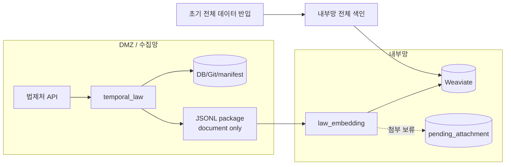

# 초기 반입 가능 + JSON만

초기 전체 데이터는 내부망에 반입하지만, 이후 증분에서는 첨부 파일을 보내지도 전처리하지도 않고 **본문 JSON만** 색인하는 구성이다.

파일 전달도 어렵고 DMZ 전처리도 어려울 때 쓴다. 첨부 내용은 보류된다.

## 레포와 data 준비

초기 전체 repo를 내부망에 반입할 수 있으므로, 내부망에는 `law_ai`와 `data/law_data`, `data/admrul_data`를 먼저 준비한다.

```bash
git clone --recursive https://github.com/genonai/law_ai.git
cd law_ai
git submodule update --init --recursive

mkdir -p data
git clone https://github.com/genonai/law_data.git data/law_data
git clone https://github.com/genonai/admrul_data.git data/admrul_data
```

첨부를 보내지 않는 케이스라 원본 파일용 inbox나 전처리기 연결은 필요 없다.

- 수집기 `PACKAGE_ATTACHMENT_MODE=none`
- 임베딩기 `PACKAGE_PREPROCESS_FILES=false`
- 내부망 repo를 계속 갱신하려면 `PACKAGE_MIRROR_REPO=true`

## 흐름



## 이 케이스에서 선택하는 값

| 항목 | 선택한 값 | 다른 옵션 | 왜 이 케이스는 이 값인가 |
|---|---|---|---|
| 초기 적재 | 내부망 `law_indexer index --source both` | package만으로 첫 적재 | 초기 전체 repo를 내부망에 반입할 수 있으므로 최초 색인은 전체 repo 기준으로 한다. |
| payload 원천 | `HANDOFF_PAYLOAD_SOURCE=auto` | `collect` | DMZ Git/DB에 저장된 최신 document payload를 package에 넣는다. `collect`는 API 재호출이 필요해 기본으로 두지 않는다. |
| 첨부 처리 | `PACKAGE_ATTACHMENT_MODE=none` | `dmz`, `file_transfer`, `base64` | 파일 전처리와 파일 전달을 모두 보류하고 본문 JSON만 전달한다. 첨부 검색 품질보다 단순한 본문 적재를 우선하는 케이스다. |
| 임베딩기 전처리 | `PACKAGE_PREPROCESS_FILES=false` | `true` | package에 `file` record가 없으므로 전처리할 대상이 없다. |
| 전처리 env | 사용 안 함 | `PREPROCESS_*`, `DOC_PARSER_*` | 첨부 처리를 보류하므로 수집기 전처리 env와 임베딩기 전처리 env가 모두 필요 없다. |
| 내부 repo 갱신 | `PACKAGE_MIRROR_REPO=true` 또는 `false` | - | 내부망 repo의 JSON만 최신화하려면 `true`, VDB만 갱신하면 `false`다. 파일 원본은 생기지 않는다. |
| 보류 상태 | `pending_attachment` | 첨부 청크 생성 | 첨부가 필요한 항목은 나중에 처리할 수 있도록 보류 상태로 남긴다. |
| package 전달 | 공유 폴더 방식 (`PACKAGE_SINK=folder`) | `minio`, `none` | 본문 JSONL만 전달하면 되므로 folder가 기본이다. |

## 수집기 env

```dotenv
LAW_API_OC=<법제처 OC 키>
TEMPORAL_ADDRESS=<DMZ Temporal 주소>
TEMPORAL_NAMESPACE=<네임스페이스>
LAW_TASK_QUEUE=law-pipeline

STORAGE_MODE=git
LAW_ENABLED=true
LAW_CATALOG_LAW_ONLY=false
LAW_INCLUDE_LIST=
ADMRUL_ENABLED=true
ADMRUL_TARGETS=admrul,school,pi,public

GIT_EXPORT_ENABLED=true
GIT_EXPORT_REPO=/data/law_data
GIT_EXPORT_PUSH=true
ADMRUL_GIT_EXPORT_ENABLED=true
ADMRUL_GIT_EXPORT_REPO=/data/admrul_data
ADMRUL_GIT_EXPORT_PUSH=true

HANDOFF_ENABLED=true
HANDOFF_PAYLOAD_SOURCE=auto

# 핵심: 첨부는 보내지 않는다.
PACKAGE_ATTACHMENT_MODE=none

PACKAGE_SINK=folder
PACKAGE_OUT_DIR=/mnt/handoff/packages
INDEX_TASK_QUEUE=
```

## 임베딩기 env

```dotenv
WEAVIATE_HTTP_HOST=<내부망 Weaviate HTTP host>
WEAVIATE_HTTP_PORT=8080
WEAVIATE_GRPC_HOST=<내부망 Weaviate gRPC host>
WEAVIATE_GRPC_PORT=50051
WEAVIATE_API_KEY=<법령 컬렉션 write 키>
ADMRUL_WEAVIATE_API_KEY=<행정규칙 컬렉션 write 키>

LAW_COLLECTION=<법령 컬렉션>
ADMRUL_COLLECTION=<행정규칙 컬렉션>

EMBEDDING_BACKEND=remote
EMBEDDING_API_URL=<내부망 임베딩 /v1/embeddings>
EMBEDDING_MODEL=<모델명>

INPUT_DATA_PATH=/data
LAW_REPO_PATH=/data/law_data
ADMRUL_REPO_PATH=/data/admrul_data

# 처리할 파일이 없으므로 전처리 off.
PACKAGE_PREPROCESS_FILES=false
PACKAGE_FILE_INBOX_DIR=

# true면 document JSON만 내부망 repo에 반영된다.
PACKAGE_MIRROR_REPO=true
PACKAGE_STORE_ORIGINAL=false
PACKAGE_ORIGINAL_DIR=
PACKAGE_DELETE_CONSUMED_PACKAGE=false
```

## 이 케이스의 env 의존관계

| env | 같이 필요한 값 | 주의 |
|---|---|---|
| `PACKAGE_ATTACHMENT_MODE=none` | `PACKAGE_PREPROCESS_FILES=false` | 첨부 파일 record가 없으므로 전처리기를 태울 대상도 없다. |
| `PACKAGE_MIRROR_REPO=true` | `LAW_REPO_PATH`, `ADMRUL_REPO_PATH` | 내부망 repo의 JSON만 최신화된다. 파일 원본은 생기지 않는다. |
| `PACKAGE_DELETE_CONSUMED_PACKAGE=false` | 재처리 정책 확정 전까지 유지 | 첨부 보류 상태를 확인하기 전에는 package를 남긴다. |

같이 쓰면 헷갈리는 조합:

- `PACKAGE_ATTACHMENT_MODE=none` + `PACKAGE_PREPROCESS_FILES=true`: 처리할 파일 record가 없으므로 의미가 없다.
- `PACKAGE_ATTACHMENT_MODE=none` + 첨부 검색 품질 기대: 파일 기반 별표/서식은 검색에서 빠질 수 있다.

## 실행 순서

초기 전체 색인:

```bash
cd law_embedding
uv run python -m law_indexer create-collection
uv run python -m law_indexer index --source both
```

증분:

```bash
cd temporal_law
uv run python -m pipeline.starter sync-now
```

```bash
cd law_embedding
uv run python -m law_indexer index-changeset --input /mnt/handoff/packages/PACKAGE.jsonl
```

## 확인

- package에는 `document`와 `delete` 중심으로 들어온다.
- `file`, `preprocessed_chunk`가 없거나 매우 적은 것이 정상이다.
- 첨부가 필요한 항목은 pending으로 남는다.

## 주의

- 행정규칙류는 파일 기반 내용이 많으므로 검색 품질이 크게 떨어질 수 있다.
- 나중에 첨부를 살릴 수 있으면 `dmz`, `file_transfer`, `base64` 중 하나로 전환한다.
