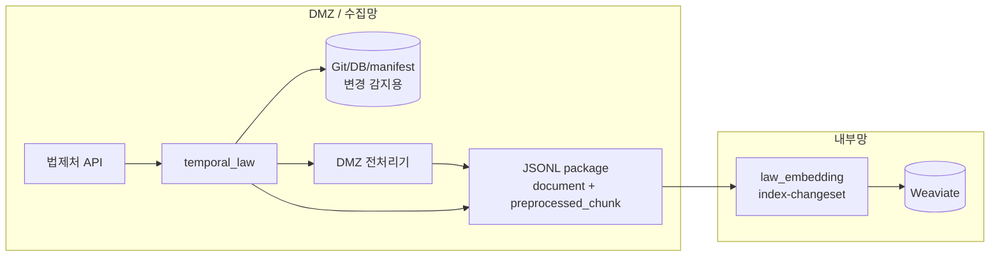

# 초기 반입 불가 + DMZ 전처리

이 문서는 아래처럼 말하는 환경을 위한 실행 매뉴얼이다.

> “내부망에 `law_data/admrul_data` 전체 repo를 처음부터 넣을 수 없다.  
> 수집은 DMZ에서 돌리고, 첨부 파일도 DMZ에서 전처리할 수 있다.  
> 내부망에는 원본 파일 없이 JSONL package만 보내서 Weaviate를 채우겠다.”

이 케이스에서는 내부망에서 `law_indexer index --source both`를 돌리지 않는다. 내부망에 전체 repo가 없기 때문이다. 첫 sync부터 package를 만들고, 내부망은 그 package를 하나씩 소비하면서 VDB를 채운다.

## 레포와 data 준비

내부망에는 초기 `law_data/admrul_data` 전체 repo가 없다. 그래서 내부망은 먼저 `law_ai` 또는 `law_embedding`만 준비하고, package를 소비하면서 Weaviate를 채운다.

```bash
git clone --recursive https://github.com/genonai/law_ai.git
cd law_ai
git submodule update --init --recursive
```

내부망에도 repo 형식으로 데이터를 쌓아가려면 빈 폴더나 clone된 repo를 준비하고 임베딩기에서 mirror를 켠다.

```bash
mkdir -p data/law_data data/admrul_data
```

```dotenv
PACKAGE_MIRROR_REPO=true
LAW_REPO_PATH=/data/law_data
ADMRUL_REPO_PATH=/data/admrul_data
```

DMZ 수집기가 `STORAGE_MODE=git|both`로 변경 감지를 한다면 DMZ 쪽에는 data repo가 필요하다.

```bash
mkdir -p data
git clone https://github.com/genonai/law_data.git data/law_data
git clone https://github.com/genonai/admrul_data.git data/admrul_data
```

DMZ에 payload를 남기지 않는 `MANIFEST_ONLY=true`로 갈 경우에는 data repo 대신 영속 `MANIFEST_DIR`만 준비한다.

## 흐름



## 이 문서에서 확정하는 선택

| 항목 | 선택한 값 | 다른 옵션 | 왜 이 케이스는 이 값인가 |
|---|---|---|---|
| 초기 반입 | 불가 | 가능 | 내부망에 전체 repo가 없으므로 `index --source both`를 돌리지 않고 첫 package부터 VDB를 채운다. |
| 수집기 상태 | `STORAGE_MODE=git|both` 또는 `MANIFEST_ONLY=true` | 완전 무상태 | 증분 판단에는 이전 상태가 필요하다. 데이터를 DMZ에 보존하려면 `git/both`, 상태만 남기려면 `manifest-only`다. |
| payload 원천 | 저장형은 `auto`, manifest-only 배치는 `collect`, manifest-only 스트리밍은 방금 수집한 payload | - | 저장형은 DB/Git payload를 읽고, manifest-only는 저장된 payload가 없으므로 재수집하거나 수집 즉시 발송해야 한다. |
| 첨부 처리 | `PACKAGE_ATTACHMENT_MODE=dmz` | `file_transfer`, `base64`, `none` | 파일 원본을 내부망으로 보내지 않고, DMZ에서 전처리한 `preprocessed_chunk`만 넘기는 케이스다. |
| 수집기 전처리 env | `PREPROCESS_*` 사용 | `DOC_PARSER_*` | 전처리가 수집기/DMZ 쪽에서 일어나므로 `PREPROCESS_API_URL`, endpoint, API key가 필요하다. |
| 임베딩기 전처리 | `PACKAGE_PREPROCESS_FILES=false` | `true` | 내부망에는 이미 전처리된 청크가 오므로 전처리기를 다시 호출하지 않는다. |
| 내부망 repo 유지 | `PACKAGE_MIRROR_REPO=false` 또는 `true` | - | VDB만 적재하면 `false`, 내부망에도 repo 형식으로 남기려면 `true`다. DMZ 저장 방식과 독립적으로 선택할 수 있다. |
| package 삭제 | `PACKAGE_DELETE_CONSUMED_PACKAGE=false` | `true` | 첫 적재 실패 시 재처리해야 하므로 처음에는 package를 남긴다. 운영 안정 후 성공 package 삭제를 켠다. |
| package 전달 | 공유 폴더 방식 (`PACKAGE_SINK=folder`) | `minio`, `none` | JSONL만 내부망으로 보내면 되므로 folder가 기본이다. MinIO는 공유 폴더가 어려울 때만 쓴다. |

## 수집기 상태를 어떻게 둘 것인가

권장값은 운영 목적에 따라 갈린다.

- `git`: DMZ의 `law_data/admrul_data` repo와 `_manifest.json`으로 변경분을 판단한다.
- `both`: DB와 Git export를 둘 다 유지한다. 나중에 DB 기반 기능을 붙이기 쉽지만 `lawdb` 백업/복원이 필요하다.
- `MANIFEST_ONLY=true`: DMZ에 DB/Git 산출물 없이 `_manifest.json`만 둔다. 이 경우 batch handoff는 `HANDOFF_PAYLOAD_SOURCE=collect`가 필요하고, 저장을 더 줄이려면 `HANDOFF_STREAMING=true`가 맞다.

## 수집기 env

파일: `temporal_law/.env`

```dotenv
LAW_API_OC=<법제처 OC 키>
TEMPORAL_ADDRESS=<DMZ Temporal 주소>
TEMPORAL_NAMESPACE=<네임스페이스>
LAW_TASK_QUEUE=law-pipeline

# 증분 기준. Git만 쓸 거면 git, DB도 같이 가져갈 거면 both.
# DMZ에 payload/DB/Git 산출물을 남기지 않으려면 아래 STORAGE_MODE 대신
# MANIFEST_ONLY=true + MANIFEST_DIR=/data/manifest 를 쓴다.
STORAGE_MODE=git

LAW_ENABLED=true
LAW_CATALOG_LAW_ONLY=false
LAW_INCLUDE_LIST=
ADMRUL_ENABLED=true
ADMRUL_TARGETS=admrul,school,pi,public

# DMZ에 수집 결과 repo를 유지한다. 내부망에 전체 repo를 주지는 않더라도 증분 판단에는 필요하다.
GIT_EXPORT_ENABLED=true
GIT_EXPORT_REPO=/data/law_data
GIT_EXPORT_PUSH=false
ADMRUL_GIT_EXPORT_ENABLED=true
ADMRUL_GIT_EXPORT_REPO=/data/admrul_data
ADMRUL_GIT_EXPORT_PUSH=false

HANDOFF_ENABLED=true
HANDOFF_PAYLOAD_SOURCE=auto
# MANIFEST_ONLY=true에서 배치로 package를 만들면 저장된 payload가 없으므로 collect로 바꾼다.
# 수집 즉시 건별 발송이면 HANDOFF_STREAMING=true 를 켠다.
# HANDOFF_PAYLOAD_SOURCE=collect
# HANDOFF_STREAMING=true

# 핵심: DMZ에서 첨부 파일을 전처리하고 결과 청크만 package에 넣는다.
PACKAGE_ATTACHMENT_MODE=dmz
PACKAGE_DMZ_PARSER_URL=<DMZ 전처리기 base URL>
PREPROCESS_API_URL=<DMZ 전처리기 base URL>
PREPROCESS_ENDPOINT_PATH=/preprocess_attachment_upload
PREPROCESS_API_KEY=<Doc Parser Bearer>
PREPROCESS_API_MODE=multipart
PREPROCESS_FILE_FIELD=file

# JSONL package만 내부망으로 보낸다.
PACKAGE_SINK=folder
PACKAGE_OUT_DIR=/mnt/handoff/packages

# 분리망이면 내부망 queue 직접 호출 불가. 내부망에서 package를 소비한다.
INDEX_TASK_QUEUE=
```

공유 폴더를 만들기 어렵고 양쪽에서 접근 가능한 object storage가 있을 때만 MinIO를 쓴다. 이 경우 아래처럼 바꾼다.

```dotenv
PACKAGE_SINK=minio
PACKAGE_MINIO_ENDPOINT=<minio endpoint>
PACKAGE_MINIO_ACCESS_KEY=<access key>
PACKAGE_MINIO_SECRET_KEY=<secret key>
PACKAGE_MINIO_BUCKET=law-packages
PACKAGE_MINIO_PREFIX=sync
PACKAGE_MINIO_CLEAR_PREFIX=false
```

## 임베딩기 env

파일: `law_embedding/.env`

```dotenv
WEAVIATE_HTTP_HOST=<내부망 Weaviate HTTP host>
WEAVIATE_HTTP_PORT=8080
WEAVIATE_GRPC_HOST=<내부망 Weaviate gRPC host>
WEAVIATE_GRPC_PORT=50051
WEAVIATE_API_KEY=<법령 컬렉션 write 키>
ADMRUL_WEAVIATE_API_KEY=<행정규칙 컬렉션 write 키>

LAW_COLLECTION=<법령 컬렉션>
ADMRUL_COLLECTION=<행정규칙 컬렉션>

EMBEDDING_BACKEND=remote
EMBEDDING_API_URL=<내부망 임베딩 /v1/embeddings>
EMBEDDING_MODEL=<모델명>

# 내부망에 전체 repo가 없으므로 index --source both를 돌리지 않는다.
INPUT_DATA_PATH=
LAW_REPO_PATH=
ADMRUL_REPO_PATH=

# DMZ에서 이미 전처리된 청크가 들어오므로 내부 전처리기는 쓰지 않는다.
PACKAGE_PREPROCESS_FILES=false
PACKAGE_FILE_INBOX_DIR=
PACKAGE_DELETE_CONSUMED_FILES=false

# VDB만 갱신하면 false.
# 내부망에도 data repo 형식으로 보존하려면 true + 아래 path 지정.
PACKAGE_MIRROR_REPO=false
LAW_REPO_PATH=/data/law_data
ADMRUL_REPO_PATH=/data/admrul_data
PACKAGE_STORE_ORIGINAL=false
PACKAGE_ORIGINAL_DIR=

# 첫 운영에서는 false. 성공 package 자동 삭제가 필요해지면 true.
PACKAGE_DELETE_CONSUMED_PACKAGE=false
```

## 이 케이스의 env 의존관계

| env | 같이 필요한 값 | 주의 |
|---|---|---|
| `PACKAGE_ATTACHMENT_MODE=dmz` | `PREPROCESS_API_URL`, `PREPROCESS_ENDPOINT_PATH`, `PREPROCESS_API_KEY` | 수집기 쪽에서 파일 전처리가 끝나야 내부망에 원본 없이 보낼 수 있다. |
| `PACKAGE_PREPROCESS_FILES=false` | package 안의 `preprocessed_chunk` | 내부망 전처리기는 쓰지 않는다. |
| `MANIFEST_ONLY=true` + batch handoff | `HANDOFF_PAYLOAD_SOURCE=collect` | 저장된 payload JSON이 없으므로 package 생성 시 API 재수집이 필요하다. |
| `MANIFEST_ONLY=true` + streaming | `HANDOFF_STREAMING=true` | 방금 수집한 payload를 그대로 보내므로 재수집이 없다. |
| `PACKAGE_MIRROR_REPO=true` | `LAW_REPO_PATH`, `ADMRUL_REPO_PATH` | 내부망 repo를 유지할 때만 켠다. DMZ 저장 방식과 독립적으로 선택할 수 있다. |
| `INPUT_DATA_PATH=` | 없음 | 내부망 전체 repo가 없으므로 `index --source both`를 돌리지 않는다. |

같이 쓰면 헷갈리는 조합:

- `초기 반입 불가` + `index --source both`: 내부망에 전체 repo가 없으므로 실행 대상이 없다.
- `PACKAGE_ATTACHMENT_MODE=dmz` + 내부망 원본 파일 보관 기대: 이 방식은 원본 파일을 보내지 않는다.

## 실행 순서

### 1. Weaviate 컬렉션만 먼저 생성

```bash
cd law_embedding
uv run python -m law_indexer create-collection
```

### 2. DMZ에서 첫 sync 실행

```bash
cd temporal_law
uv run python -m pipeline.starter sync-now
```

초기 반입이 없으므로 이 첫 sync가 사실상 초기 적재 package를 만든다.

### 3. 내부망에서 package 소비

```bash
cd law_embedding
uv run python -m law_indexer index-changeset --input /mnt/handoff/packages/PACKAGE.jsonl
```

여러 package를 순서대로 소비하려면:

```bash
cd law_embedding
for f in /mnt/handoff/packages/*.jsonl; do
  uv run python -m law_indexer index-changeset --input "$f"
done
```

## 확인

- package에 `document` record가 있어야 한다.
- 첨부가 있는 문서는 `preprocessed_chunk` record가 있어야 한다.
- `file.content_b64`나 `file.transfer_name`이 없어야 정상이다.
- 내부망에는 원본 파일이 남지 않는다.

## 변형

| 바꾸고 싶은 것 | 바꿀 값 |
|---|---|
| 내부망에도 repo를 만들고 싶음 | `PACKAGE_MIRROR_REPO=true`, `LAW_REPO_PATH/ADMRUL_REPO_PATH` 지정 |
| DMZ에 payload/DB/Git 산출물을 남기지 않음 | `MANIFEST_ONLY=true`, `MANIFEST_DIR=/data/manifest`, batch면 `HANDOFF_PAYLOAD_SOURCE=collect`, 건별이면 `HANDOFF_STREAMING=true` |
| DB 상태도 같이 유지 | 수집기 `STORAGE_MODE=both`, `DATABASE_URL` 설정, `lawdb` 영속 볼륨/백업 추가 |
| DMZ 전처리 불가 | [b-원본파일.md](b-원본파일.md) 또는 [c-base64.md](c-base64.md) |
| 첨부 색인 포기 | [d-json만.md](d-json만.md) |
| package 성공 후 삭제 | 임베딩기 `PACKAGE_DELETE_CONSUMED_PACKAGE=true` |

## 주의

- 내부망에 repo가 없으므로 `index --source both`를 실행하면 안 된다.
- 첫 sync가 대량 package를 만들 수 있으니 `PACKAGE_MINIO_CLEAR_PREFIX=false` 또는 package 보존 정책을 안전하게 둔다.
- DMZ 전처리기가 실패하면 첨부 청크는 빠질 수 있다. package를 바로 지우지 말고 검증 후 삭제 옵션을 켠다.
