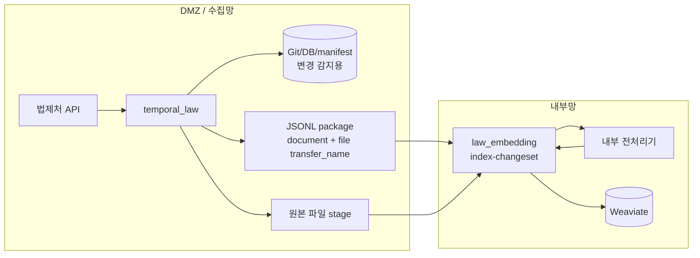

# 초기 반입 불가 + 원본 파일 전달 + 내부 전처리

이 문서는 아래처럼 말하는 환경을 위한 실행 매뉴얼이다.

> “내부망에 `law_data/admrul_data` 전체 repo를 처음부터 넣을 수 없다.  
> DMZ에서는 수집만 하고, 첨부 파일 전처리는 내부망에서 하겠다.  
> JSONL package와 원본 파일을 각각 전달할 수 있다.”

내부망에는 초기 전체 repo가 없으므로 `index --source both`를 돌리지 않는다. 수집기가 만든 package가 VDB의 입력이고, 첨부 원본 파일은 별도 파일 채널로 내부망에 도착해야 한다.

## 레포와 data 준비

내부망에는 초기 `law_data/admrul_data` 전체 repo가 없다. 먼저 `law_ai` 또는 `law_embedding`만 준비하고, package를 소비하면서 Weaviate를 채운다.

```bash
git clone --recursive https://github.com/genonai/law_ai.git
cd law_ai
git submodule update --init --recursive
```

내부망에도 repo 형식으로 데이터를 남길 거면 repo 경로를 준비한다.

```bash
mkdir -p data/law_data data/admrul_data
```

```dotenv
PACKAGE_MIRROR_REPO=true
LAW_REPO_PATH=/data/law_data
ADMRUL_REPO_PATH=/data/admrul_data
```

원본 파일 전달 케이스는 package 폴더와 파일 inbox가 둘 다 필요하다.

- 수집기 `PACKAGE_OUT_DIR=/mnt/handoff/packages`
- 수집기 `PACKAGE_FILE_STAGE_DIR=/mnt/handoff/files`
- 임베딩기 `PACKAGE_FILE_INBOX_DIR=/mnt/handoff/files`

DMZ 수집기가 `STORAGE_MODE=git|both`로 변경 감지를 한다면 DMZ 쪽에는 data repo가 필요하다.

## 흐름



## 이 문서에서 확정하는 선택

| 항목 | 선택한 값 | 다른 옵션 | 왜 이 케이스는 이 값인가 |
|---|---|---|---|
| 초기 반입 | 불가 | 가능 | 내부망에 전체 repo가 없으므로 `index --source both` 없이 package만 소비해 VDB를 채운다. |
| payload 원천 | `HANDOFF_PAYLOAD_SOURCE=auto` | `collect` | DMZ Git/DB에 저장된 최신 payload를 package에 넣는다. 저장소가 없거나 즉시 재수집해야 하는 환경이면 `collect`를 검토한다. |
| 첨부 처리 | `PACKAGE_ATTACHMENT_MODE=file_transfer` | `dmz`, `base64`, `none` | DMZ에서 전처리하지 않고 내부망 전처리기로 처리한다. 파일 bytes를 JSONL에 넣지 않고 별도 파일 채널로 나눠 보낸다. |
| 수집기 파일 stage | `PACKAGE_FILE_STAGE_DIR` | 비움 | `file_transfer`는 JSONL에 파일 내용이 없으므로 수집기가 원본 파일을 stage 폴더에 둬야 한다. |
| 임베딩기 파일 inbox | `PACKAGE_FILE_INBOX_DIR` | 비움 | 임베딩기가 `transfer_name`으로 실제 파일을 찾아야 하므로 inbox가 필요하다. |
| 임베딩기 전처리 env | `DOC_PARSER_*` 사용 | `PREPROCESS_*` | 전처리가 내부망 임베딩기 쪽에서 일어나므로 `DOC_PARSER_BASE_URL`, endpoint, API key가 필요하다. |
| 파일 삭제 | `PACKAGE_DELETE_CONSUMED_FILES=true` | `false` | 성공한 전달 파일을 정리한다. 재처리 검증 중이거나 원본 보관이 필요하면 `false`로 둔다. |
| 내부망 repo 유지 | `PACKAGE_MIRROR_REPO=false` | `true` | 초기 repo가 없으므로 기본은 VDB만 적재한다. repo까지 만들려면 path와 초기화 정책을 정하고 `true`로 바꾼다. |
| package 전달 | 공유 폴더 방식 (`PACKAGE_SINK=folder`) | `minio`, `none` | JSONL과 파일 stage를 함께 전달해야 하므로 folder가 기본이다. |

## 수집기 env

파일: `temporal_law/.env`

```dotenv
LAW_API_OC=<법제처 OC 키>
TEMPORAL_ADDRESS=<DMZ Temporal 주소>
TEMPORAL_NAMESPACE=<네임스페이스>
LAW_TASK_QUEUE=law-pipeline

STORAGE_MODE=git

LAW_ENABLED=true
LAW_CATALOG_LAW_ONLY=false
LAW_INCLUDE_LIST=
ADMRUL_ENABLED=true
ADMRUL_TARGETS=admrul,school,pi,public

GIT_EXPORT_ENABLED=true
GIT_EXPORT_REPO=/data/law_data
GIT_EXPORT_PUSH=false
ADMRUL_GIT_EXPORT_ENABLED=true
ADMRUL_GIT_EXPORT_REPO=/data/admrul_data
ADMRUL_GIT_EXPORT_PUSH=false

HANDOFF_ENABLED=true
HANDOFF_PAYLOAD_SOURCE=auto

# 핵심: 파일 bytes를 JSONL에 넣지 않고 파일 stage에 저장한다.
PACKAGE_ATTACHMENT_MODE=file_transfer
PACKAGE_FILE_STAGE_DIR=/mnt/handoff/files

PACKAGE_SINK=folder
PACKAGE_OUT_DIR=/mnt/handoff/packages
INDEX_TASK_QUEUE=
```

왜 이렇게 넣는가:

- `PACKAGE_ATTACHMENT_MODE=file_transfer`: package의 `file` record에는 `transfer_name`, `sha256` 등이 들어간다.
- `PACKAGE_FILE_STAGE_DIR`: 내부망으로 전달할 원본 파일을 모아두는 위치다.
- `HANDOFF_PAYLOAD_SOURCE=auto`: DMZ Git/DB에 저장된 최신 payload를 package에 담는다.
- `INDEX_TASK_QUEUE=`: 분리망에서는 내부망이 package를 읽어 소비한다.

## 임베딩기 env

파일: `law_embedding/.env`

```dotenv
WEAVIATE_HTTP_HOST=<내부망 Weaviate HTTP host>
WEAVIATE_HTTP_PORT=8080
WEAVIATE_GRPC_HOST=<내부망 Weaviate gRPC host>
WEAVIATE_GRPC_PORT=50051
WEAVIATE_API_KEY=<법령 컬렉션 write 키>
ADMRUL_WEAVIATE_API_KEY=<행정규칙 컬렉션 write 키>

LAW_COLLECTION=<법령 컬렉션>
ADMRUL_COLLECTION=<행정규칙 컬렉션>

EMBEDDING_BACKEND=remote
EMBEDDING_API_URL=<내부망 임베딩 /v1/embeddings>
EMBEDDING_MODEL=<모델명>

DOC_PARSER_BASE_URL=<내부망 전처리기 base URL>
DOC_PARSER_ENDPOINT_PATH=/preprocess_attachment_upload
DOC_PARSER_IMAGE_ENDPOINT_PATH=/preprocess_intelligent_upload
DOC_PARSER_API_KEY=<Doc Parser Bearer>
DOC_PARSER_UPLOAD=true

# file record를 내부망 전처리기로 보낸다.
PACKAGE_PREPROCESS_FILES=true

# 수집기 PACKAGE_FILE_STAGE_DIR에서 온 파일이 내부망에 놓이는 위치.
PACKAGE_FILE_INBOX_DIR=/mnt/handoff/files

# 성공한 파일을 지울지 결정한다. 처음 검증 중이면 false도 가능하다.
PACKAGE_DELETE_CONSUMED_FILES=true

PACKAGE_MIRROR_REPO=false
PACKAGE_STORE_ORIGINAL=false
PACKAGE_ORIGINAL_DIR=
PACKAGE_DELETE_CONSUMED_PACKAGE=false
```

## 이 케이스의 env 의존관계

| env | 같이 필요한 값 | 주의 |
|---|---|---|
| `PACKAGE_ATTACHMENT_MODE=file_transfer` | `PACKAGE_FILE_STAGE_DIR`, `PACKAGE_FILE_INBOX_DIR` | package에는 파일 내용이 없으므로 원본 파일 채널이 반드시 필요하다. |
| `PACKAGE_PREPROCESS_FILES=true` | 내부망 `DOC_PARSER_*` env | 내부망에서 원본 파일을 전처리한다. |
| `PACKAGE_DELETE_CONSUMED_FILES=true` | 파일 보관 정책 확인 | 성공 후 파일을 지운다. 원본을 남길 거면 `false` 또는 `PACKAGE_STORE_ORIGINAL=true`. |
| `PACKAGE_MIRROR_REPO=false` | 없음 | 초기 repo가 없으므로 기본은 VDB만 채운다. repo를 만들려면 path를 지정한다. |

같이 쓰면 헷갈리는 조합:

- `file_transfer` + 파일 미전달: document는 처리돼도 첨부는 실패/보류된다.
- `file_transfer` + JSONL 하나만 허용되는 망연계: [c-base64.md](c-base64.md)가 더 맞다.

## 실행 순서

### 1. Weaviate 컬렉션 생성

```bash
cd law_embedding
uv run python -m law_indexer create-collection
```

### 2. DMZ에서 sync 실행

```bash
cd temporal_law
uv run python -m pipeline.starter sync-now
```

### 3. JSONL과 파일 전달 확인

```text
/mnt/handoff/
├── packages/
│   └── PACKAGE.jsonl
└── files/
    └── <transfer_name 파일들>
```

### 4. 내부망에서 package 소비

```bash
cd law_embedding
uv run python -m law_indexer index-changeset --input /mnt/handoff/packages/PACKAGE.jsonl
```

## 확인

- package의 `file` record에 `transfer_name`과 `sha256`이 있어야 한다.
- 내부망 `PACKAGE_FILE_INBOX_DIR`에 같은 `transfer_name` 파일이 있어야 한다.
- 전처리 성공 후 `PACKAGE_DELETE_CONSUMED_FILES=true`면 해당 파일은 삭제된다.
- 파일이 없으면 첨부는 pending/오류로 남고, document 본문은 처리될 수 있다.

## 변형

| 바꾸고 싶은 것 | 바꿀 값 |
|---|---|
| 파일도 내부망 repo 형식으로 남김 | `PACKAGE_MIRROR_REPO=true`, `LAW_REPO_PATH/ADMRUL_REPO_PATH` 지정 |
| repo와 별도로 원본 파일 보관 | `PACKAGE_STORE_ORIGINAL=true`, `PACKAGE_ORIGINAL_DIR=<보관 경로>` |
| package 하나만 전달하고 싶음 | [c-base64.md](c-base64.md) |
| 파일 반출이 불가 | [a-DMZ전처리.md](a-DMZ전처리.md) 또는 [d-json만.md](d-json만.md) |
| package 성공 후 삭제 | `PACKAGE_DELETE_CONSUMED_PACKAGE=true` |

## 주의

- JSONL과 원본 파일 채널이 둘 다 필요하다. 둘 중 하나만 오면 첨부 전처리가 완료되지 않는다.
- `PACKAGE_DELETE_CONSUMED_FILES=true`는 전처리 성공 후 파일을 지우는 옵션이다. 원본 보관이 필요하면 끈다.
- 내부망에 전체 repo가 없으므로 `index --source both`는 실행하지 않는다.
