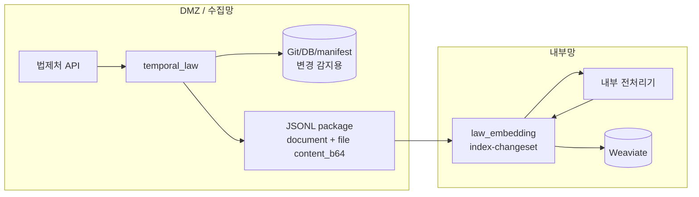

# 초기 반입 불가 + base64 인라인 + 내부 전처리

이 문서는 아래처럼 말하는 환경을 위한 실행 매뉴얼이다.

> “내부망에 `law_data/admrul_data` 전체 repo를 처음부터 넣을 수 없다.  
> 그래도 첨부 파일은 내부망 전처리기로 처리하고 싶다.  
> 파일 채널은 따로 만들기 어렵고, JSONL 하나만 넘길 수 있다.”

이 케이스에서는 첫 sync부터 JSONL package로 VDB를 채운다. 첨부 원본 파일은 `content_b64`로 JSONL 안에 들어가고, 내부망 `law_embedding`이 디코딩해서 전처리 API에 보낸다.

## 레포와 data 준비

내부망에는 초기 `law_data/admrul_data` 전체 repo가 없다. 먼저 `law_ai` 또는 `law_embedding`만 준비하고, package를 소비하면서 Weaviate를 채운다.

```bash
git clone --recursive https://github.com/genonai/law_ai.git
cd law_ai
git submodule update --init --recursive
```

내부망에도 repo 형식으로 데이터를 남길 거면 repo 경로를 준비한다.

```bash
mkdir -p data/law_data data/admrul_data
```

```dotenv
PACKAGE_MIRROR_REPO=true
LAW_REPO_PATH=/data/law_data
ADMRUL_REPO_PATH=/data/admrul_data
```

base64 케이스는 원본 파일용 별도 inbox가 필요 없다. 파일 bytes가 JSONL 안에 들어오기 때문에 임베딩기에서 `PACKAGE_PREPROCESS_FILES=true`와 `DOC_PARSER_*`만 맞추면 된다.

DMZ 수집기가 `STORAGE_MODE=git|both`로 변경 감지를 한다면 DMZ 쪽에는 data repo가 필요하다.

## 흐름



## 이 문서에서 확정하는 선택

| 항목 | 선택한 값 | 다른 옵션 | 왜 이 케이스는 이 값인가 |
|---|---|---|---|
| 초기 반입 | 불가 | 가능 | 내부망 전체 repo 없이 package만으로 VDB를 채운다. 따라서 `index --source both`는 실행하지 않는다. |
| payload 원천 | `HANDOFF_PAYLOAD_SOURCE=auto` | `collect` | DMZ 저장소의 최신 payload를 package에 넣는다. 저장소를 유지하지 않는 제한 환경이면 `collect`를 검토한다. |
| 첨부 처리 | `PACKAGE_ATTACHMENT_MODE=base64` | `dmz`, `file_transfer`, `none` | 별도 파일 채널 없이 JSONL 하나로 본문과 파일 bytes를 함께 넘기려는 케이스다. |
| 임베딩기 전처리 | `PACKAGE_PREPROCESS_FILES=true` | `false` | base64 파일을 내부망에서 디코딩하고 전처리해야 하므로 켠다. 끄면 첨부 청크가 빠진다. |
| 전처리 env | `DOC_PARSER_*` 사용 | `PREPROCESS_*` | 전처리가 내부망 임베딩기 쪽에서 일어나므로 `DOC_PARSER_*`를 쓴다. `PREPROCESS_*`는 DMZ 전처리용이다. |
| 파일 inbox | 비움 | `PACKAGE_FILE_INBOX_DIR=/...` | base64는 파일을 폴더에서 찾지 않는다. inbox는 `file_transfer`용이다. |
| 내부망 repo 유지 | `PACKAGE_MIRROR_REPO=false` | `true` | 초기 repo가 없으므로 기본은 VDB만 갱신한다. repo까지 만들려면 path와 초기화 정책을 정한다. |
| package 삭제 | `PACKAGE_DELETE_CONSUMED_PACKAGE=false` | `true` | base64 package는 재전송 비용이 크므로 검증 전 삭제하지 않는다. 운영 안정 후 `true`로 바꾼다. |
| package 전달 | 공유 폴더 방식 (`PACKAGE_SINK=folder`) | `minio`, `none` | JSONL 하나만 전달하면 되므로 folder가 기본이다. |

## 수집기 env

파일: `temporal_law/.env`

```dotenv
LAW_API_OC=<법제처 OC 키>
TEMPORAL_ADDRESS=<DMZ Temporal 주소>
TEMPORAL_NAMESPACE=<네임스페이스>
LAW_TASK_QUEUE=law-pipeline

STORAGE_MODE=git

LAW_ENABLED=true
LAW_CATALOG_LAW_ONLY=false
LAW_INCLUDE_LIST=
ADMRUL_ENABLED=true
ADMRUL_TARGETS=admrul,school,pi,public

GIT_EXPORT_ENABLED=true
GIT_EXPORT_REPO=/data/law_data
GIT_EXPORT_PUSH=false
ADMRUL_GIT_EXPORT_ENABLED=true
ADMRUL_GIT_EXPORT_REPO=/data/admrul_data
ADMRUL_GIT_EXPORT_PUSH=false

HANDOFF_ENABLED=true
HANDOFF_PAYLOAD_SOURCE=auto

# 핵심: 원본 파일 bytes를 JSONL file.content_b64에 넣는다.
PACKAGE_ATTACHMENT_MODE=base64

PACKAGE_SINK=folder
PACKAGE_OUT_DIR=/mnt/handoff/packages
INDEX_TASK_QUEUE=
```

왜 이렇게 넣는가:

- `PACKAGE_ATTACHMENT_MODE=base64`: JSONL 하나만 내부망으로 넘기기 위한 선택이다.
- `PACKAGE_FILE_STAGE_DIR`가 없다: 별도 파일 stage를 만들지 않는다.
- `HANDOFF_PAYLOAD_SOURCE=auto`: DMZ 저장소의 최신 document payload를 package에 넣는다.
- `STORAGE_MODE=git`: 증분 수집 상태는 DMZ Git manifest가 기억한다.

## 임베딩기 env

파일: `law_embedding/.env`

```dotenv
WEAVIATE_HTTP_HOST=<내부망 Weaviate HTTP host>
WEAVIATE_HTTP_PORT=8080
WEAVIATE_GRPC_HOST=<내부망 Weaviate gRPC host>
WEAVIATE_GRPC_PORT=50051
WEAVIATE_API_KEY=<법령 컬렉션 write 키>
ADMRUL_WEAVIATE_API_KEY=<행정규칙 컬렉션 write 키>

LAW_COLLECTION=<법령 컬렉션>
ADMRUL_COLLECTION=<행정규칙 컬렉션>

EMBEDDING_BACKEND=remote
EMBEDDING_API_URL=<내부망 임베딩 /v1/embeddings>
EMBEDDING_MODEL=<모델명>

DOC_PARSER_BASE_URL=<내부망 전처리기 base URL>
DOC_PARSER_ENDPOINT_PATH=/preprocess_attachment_upload
DOC_PARSER_IMAGE_ENDPOINT_PATH=/preprocess_intelligent_upload
DOC_PARSER_API_KEY=<Doc Parser Bearer>
DOC_PARSER_UPLOAD=true

# content_b64를 디코딩해서 내부 전처리한다.
PACKAGE_PREPROCESS_FILES=true

# base64 방식은 inbox가 필요 없다.
PACKAGE_FILE_INBOX_DIR=
PACKAGE_DELETE_CONSUMED_FILES=false

PACKAGE_MIRROR_REPO=false
PACKAGE_STORE_ORIGINAL=false
PACKAGE_ORIGINAL_DIR=
PACKAGE_DELETE_CONSUMED_PACKAGE=false
```

## 이 케이스의 env 의존관계

| env | 같이 필요한 값 | 주의 |
|---|---|---|
| `PACKAGE_ATTACHMENT_MODE=base64` | package 크기 제한 확인 | 파일 bytes가 JSONL 안에 들어가므로 파일 채널은 필요 없지만 package가 커진다. |
| `PACKAGE_PREPROCESS_FILES=true` | 내부망 `DOC_PARSER_*` env | base64 파일을 디코딩한 뒤 전처리한다. |
| `PACKAGE_FILE_INBOX_DIR=` | 없음 | base64는 파일을 폴더에서 찾지 않는다. |
| `PACKAGE_MIRROR_REPO=false` | 없음 | 초기 repo가 없으므로 기본은 VDB만 갱신한다. |

같이 쓰면 헷갈리는 조합:

- `base64` + `PACKAGE_FILE_INBOX_DIR=/...`: inbox는 `file_transfer`용이다.
- `base64` + `PACKAGE_PREPROCESS_FILES=false`: 첨부 파일은 도착하지만 전처리하지 않아 첨부 청크가 빠질 수 있다.

## 실행 순서

### 1. Weaviate 컬렉션 생성

```bash
cd law_embedding
uv run python -m law_indexer create-collection
```

### 2. DMZ에서 sync 실행

```bash
cd temporal_law
uv run python -m pipeline.starter sync-now
```

### 3. 내부망에서 package 소비

```bash
cd law_embedding
uv run python -m law_indexer index-changeset --input /mnt/handoff/packages/PACKAGE.jsonl
```

## 확인

- package의 `file` record에 `content_b64`가 있어야 한다.
- `PACKAGE_FILE_INBOX_DIR`는 비어 있어야 한다.
- 첨부가 처리되면 전처리 결과 청크가 VDB에 같이 들어간다.
- package 소비 실패를 대비해 초반에는 `PACKAGE_DELETE_CONSUMED_PACKAGE=false`를 유지한다.

## 변형

| 바꾸고 싶은 것 | 바꿀 값 |
|---|---|
| 내부망 repo도 생성/유지 | `PACKAGE_MIRROR_REPO=true`, `LAW_REPO_PATH/ADMRUL_REPO_PATH` 지정 |
| 디코딩한 원본 파일 별도 저장 | `PACKAGE_STORE_ORIGINAL=true`, `PACKAGE_ORIGINAL_DIR=<보관 경로>` |
| 첨부가 커서 JSONL이 너무 커짐 | [b-원본파일.md](b-원본파일.md) |
| 파일을 내부망으로 못 보냄 | [a-DMZ전처리.md](a-DMZ전처리.md) 또는 [d-json만.md](d-json만.md) |
| package 성공 후 삭제 | `PACKAGE_DELETE_CONSUMED_PACKAGE=true` |

## 주의

- base64는 원본 파일보다 용량이 커진다. 초기 대량 적재에서는 package 크기와 망연계 제한을 먼저 확인한다.
- 내부망에 전체 repo가 없으므로 `index --source both`를 실행하지 않는다.
- package 하나가 본문과 파일을 모두 들고 있으므로 재처리용 보관 정책을 먼저 정한다.
