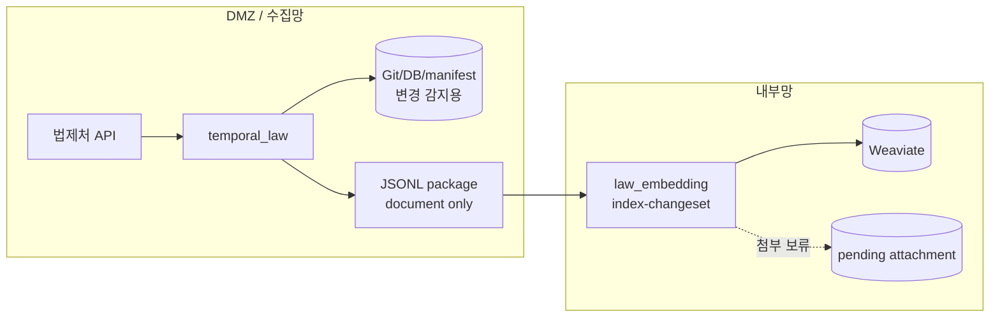

# 초기 반입 불가 + JSON만 + 첨부 보류

이 문서는 아래처럼 말하는 환경을 위한 실행 매뉴얼이다.

> “내부망에 `law_data/admrul_data` 전체 repo를 처음부터 넣을 수 없다.  
> 파일 원본도 못 보내고, DMZ 전처리기도 당장은 없다.  
> 우선 법령/행정규칙 JSON 본문만 Weaviate에 넣고 첨부는 나중에 처리하겠다.”

이 케이스는 가장 가벼운 대신 첨부 기반 별표·별지·서식 본문은 빠질 수 있다. 특히 파일로만 존재하는 행정규칙 데이터가 중요하면 나중에 `DMZ 전처리`, `원본파일`, `base64` 중 하나로 전환해야 한다.

## 레포와 data 준비

내부망에는 초기 `law_data/admrul_data` 전체 repo가 없다. 먼저 `law_ai` 또는 `law_embedding`만 준비하고, package를 소비하면서 Weaviate를 채운다.

```bash
git clone --recursive https://github.com/genonai/law_ai.git
cd law_ai
git submodule update --init --recursive
```

내부망에도 repo 형식으로 데이터를 남길 거면 repo 경로를 준비한다.

```bash
mkdir -p data/law_data data/admrul_data
```

```dotenv
PACKAGE_MIRROR_REPO=true
LAW_REPO_PATH=/data/law_data
ADMRUL_REPO_PATH=/data/admrul_data
```

JSON만 케이스는 원본 파일 전달과 전처리기를 모두 쓰지 않는다.

- 수집기 `PACKAGE_ATTACHMENT_MODE=none`
- 임베딩기 `PACKAGE_PREPROCESS_FILES=false`

DMZ 수집기가 `STORAGE_MODE=git|both`로 변경 감지를 한다면 DMZ 쪽에는 data repo가 필요하다.

## 흐름



## 이 문서에서 확정하는 선택

| 항목 | 선택한 값 | 다른 옵션 | 왜 이 케이스는 이 값인가 |
|---|---|---|---|
| 초기 반입 | 불가 | 가능 | 내부망 전체 repo 없이 package만으로 VDB를 채운다. 따라서 `index --source both`는 실행하지 않는다. |
| payload 원천 | `HANDOFF_PAYLOAD_SOURCE=auto` | `collect` | DMZ 저장소의 최신 document payload를 package에 넣는다. 저장소를 유지하지 않는 환경이면 `collect`를 검토한다. |
| 첨부 처리 | `PACKAGE_ATTACHMENT_MODE=none` | `dmz`, `file_transfer`, `base64` | 파일 원본과 전처리 결과를 모두 보내지 않고 본문 JSON만 적재한다. 가장 가볍지만 첨부 검색 품질은 포기한다. |
| 임베딩기 전처리 | `PACKAGE_PREPROCESS_FILES=false` | `true` | package에 `file` record가 없으므로 전처리할 대상이 없다. |
| 전처리 env | 사용 안 함 | `PREPROCESS_*`, `DOC_PARSER_*` | 첨부 처리를 보류하므로 DMZ 전처리 env와 내부망 전처리 env가 모두 필요 없다. |
| 내부망 repo 유지 | `PACKAGE_MIRROR_REPO=false` | `true` | 초기 repo가 없으므로 기본은 VDB만 갱신한다. repo까지 만들려면 path와 초기화 정책을 정한다. |
| package 삭제 | `PACKAGE_DELETE_CONSUMED_PACKAGE=false` | `true` | 첨부 보류 상태를 확인하기 전에는 package를 남긴다. 운영 안정 후 성공 package 삭제를 켠다. |
| package 전달 | 공유 폴더 방식 (`PACKAGE_SINK=folder`) | `minio`, `none` | 본문 JSONL만 전달하면 되므로 folder가 기본이다. |

## 수집기 env

파일: `temporal_law/.env`

```dotenv
LAW_API_OC=<법제처 OC 키>
TEMPORAL_ADDRESS=<DMZ Temporal 주소>
TEMPORAL_NAMESPACE=<네임스페이스>
LAW_TASK_QUEUE=law-pipeline

STORAGE_MODE=git

LAW_ENABLED=true
LAW_CATALOG_LAW_ONLY=false
LAW_INCLUDE_LIST=
ADMRUL_ENABLED=true
ADMRUL_TARGETS=admrul,school,pi,public

GIT_EXPORT_ENABLED=true
GIT_EXPORT_REPO=/data/law_data
GIT_EXPORT_PUSH=false
ADMRUL_GIT_EXPORT_ENABLED=true
ADMRUL_GIT_EXPORT_REPO=/data/admrul_data
ADMRUL_GIT_EXPORT_PUSH=false

HANDOFF_ENABLED=true
HANDOFF_PAYLOAD_SOURCE=auto

# 핵심: 첨부 파일은 package에 넣지 않는다.
PACKAGE_ATTACHMENT_MODE=none

PACKAGE_SINK=folder
PACKAGE_OUT_DIR=/mnt/handoff/packages
INDEX_TASK_QUEUE=
```

왜 이렇게 넣는가:

- `PACKAGE_ATTACHMENT_MODE=none`: 첨부 파일 record를 보내지 않고 본문 document 중심으로 package를 만든다.
- `PACKAGE_PREPROCESS_FILES=false`와 짝이다. 내부망에서 전처리를 시도하지 않는다.
- `STORAGE_MODE=git`: DMZ에서 다음 sync의 변경 기준을 유지한다.

## 임베딩기 env

파일: `law_embedding/.env`

```dotenv
WEAVIATE_HTTP_HOST=<내부망 Weaviate HTTP host>
WEAVIATE_HTTP_PORT=8080
WEAVIATE_GRPC_HOST=<내부망 Weaviate gRPC host>
WEAVIATE_GRPC_PORT=50051
WEAVIATE_API_KEY=<법령 컬렉션 write 키>
ADMRUL_WEAVIATE_API_KEY=<행정규칙 컬렉션 write 키>

LAW_COLLECTION=<법령 컬렉션>
ADMRUL_COLLECTION=<행정규칙 컬렉션>

EMBEDDING_BACKEND=remote
EMBEDDING_API_URL=<내부망 임베딩 /v1/embeddings>
EMBEDDING_MODEL=<모델명>

# 내부망에 전체 repo와 파일 전처리기가 없다는 전제.
INPUT_DATA_PATH=
LAW_REPO_PATH=
ADMRUL_REPO_PATH=

PACKAGE_PREPROCESS_FILES=false
PACKAGE_FILE_INBOX_DIR=
PACKAGE_DELETE_CONSUMED_FILES=false

PACKAGE_MIRROR_REPO=false
PACKAGE_STORE_ORIGINAL=false
PACKAGE_ORIGINAL_DIR=
PACKAGE_DELETE_CONSUMED_PACKAGE=false
```

## 이 케이스의 env 의존관계

| env | 같이 필요한 값 | 주의 |
|---|---|---|
| `PACKAGE_ATTACHMENT_MODE=none` | `PACKAGE_PREPROCESS_FILES=false` | 파일 record를 만들지 않으므로 전처리 대상도 없다. |
| `INPUT_DATA_PATH=` | 없음 | 내부망에 전체 repo가 없으므로 package만 소비한다. |
| `PACKAGE_MIRROR_REPO=false` | 없음 | 기본은 VDB만 갱신한다. repo를 만들려면 path와 초기화 정책이 필요하다. |
| `PACKAGE_DELETE_CONSUMED_PACKAGE=false` | 재처리 정책 확정 전까지 유지 | 첨부 보류 여부를 확인하기 전에는 삭제하지 않는다. |

같이 쓰면 헷갈리는 조합:

- `PACKAGE_ATTACHMENT_MODE=none` + 첨부 검색 기대: 파일 기반 별표/서식은 빠질 수 있다.
- `초기 반입 불가` + `index --source both`: 내부망 전체 repo가 없으므로 실행하지 않는다.

## 실행 순서

### 1. Weaviate 컬렉션 생성

```bash
cd law_embedding
uv run python -m law_indexer create-collection
```

### 2. DMZ에서 sync 실행

```bash
cd temporal_law
uv run python -m pipeline.starter sync-now
```

### 3. 내부망에서 package 소비

```bash
cd law_embedding
uv run python -m law_indexer index-changeset --input /mnt/handoff/packages/PACKAGE.jsonl
```

## 확인

- package에 `document` record가 있어야 한다.
- `file`, `preprocessed_chunk` record가 없거나 매우 적은 것이 정상이다.
- 파일 첨부가 많은 문서는 VDB에 본문만 들어가며, 첨부는 별도 처리 전까지 검색되지 않을 수 있다.

## 변형

| 바꾸고 싶은 것 | 바꿀 값 |
|---|---|
| DMZ에서 전처리 가능해짐 | [a-DMZ전처리.md](a-DMZ전처리.md) |
| 원본 파일을 내부망으로 보낼 수 있음 | [b-원본파일.md](b-원본파일.md) |
| JSONL 하나에 파일까지 넣고 싶음 | [c-base64.md](c-base64.md) |
| 내부망 repo도 만들고 싶음 | `PACKAGE_MIRROR_REPO=true`, `LAW_REPO_PATH/ADMRUL_REPO_PATH` 지정 |
| package 성공 후 삭제 | `PACKAGE_DELETE_CONSUMED_PACKAGE=true` |

## 주의

- 이 케이스는 “일단 본문만 넣자”에 가깝다. 첨부가 중요한 운영 환경에서는 최종안으로 두기 어렵다.
- 내부망에 전체 repo가 없으므로 `index --source both`를 실행하지 않는다.
- 파일로만 존재하는 행정규칙/별표/서식은 검색 누락 가능성이 있다.
