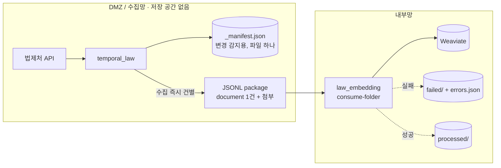

# 초기 반입 불가 + DMZ 무저장 스트리밍 (manifest만)

이 문서는 아래처럼 말하는 환경을 위한 실행 매뉴얼이다.

> “내부망에 `law_data/admrul_data` 전체 repo를 처음부터 넣을 수 없다.
> **게다가 DMZ에도 데이터를 쌓아둘 저장 공간이 없다.**
> 그러니 수집하자마자 한 건씩 바로 내부망으로 쏘고, DMZ에는 변경 감지용 `_manifest.json` 하나만 두겠다.”

핵심은 두 스위치다. **`MANIFEST_ONLY=true`** 로 전체 JSON/MD/첨부 파일·DB·git 명령을 다 끄고 매니페스트 파일 하나만 남기고, **`HANDOFF_STREAMING=true`** 로 한 문서를 수집하는 즉시 그 payload로 package 1개를 만들어 바로 보낸다(끝에 몰아서 emit 하지 않음). 그래서 DMZ에 데이터가 고이지 않는다.

package 교환 방식은 다른 케이스와 **완전히 동일**하다 — `document`가 한 package에 1건씩 들어갈 뿐이라, 내부망 소비자는 똑같이 먹는다.

## 레포와 data 준비

DMZ에는 `law_data/admrul_data`를 clone하지 않는다. 이 케이스는 DMZ에 payload JSON, DB, Git 산출물을 남기지 않고 `_manifest.json`만 남기는 구성이기 때문이다.

```bash
git clone --recursive https://github.com/genonai/law_ai.git
cd law_ai/temporal_law
mkdir -p /data/manifest
```

내부망은 package를 소비할 `law_embedding`과 Weaviate만 있으면 시작할 수 있다.

```bash
git clone --recursive https://github.com/genonai/law_ai.git
cd law_ai
git submodule update --init --recursive
```

내부망에도 repo 형식으로 데이터를 쌓아가려면 임베딩기 쪽에서만 repo 경로를 준비한다.

```bash
mkdir -p data/law_data data/admrul_data
```

```dotenv
PACKAGE_MIRROR_REPO=true
LAW_REPO_PATH=/data/law_data
ADMRUL_REPO_PATH=/data/admrul_data
```

이 경우 수집기는 저장하지 않지만, 내부망 임베딩기가 package의 `git_path`와 `document.payload`로 repo 구조를 만들어 간다.

## 흐름



## 이 문서에서 확정하는 선택

| 항목 | 선택한 값 | 다른 옵션 | 왜 이 케이스는 이 값인가 |
|---|---|---|---|
| 초기 반입 | 불가 | 가능 | 내부망에 전체 repo가 없다. `index --source both`를 돌리지 않고 첫 수집부터 package로 VDB를 채운다. |
| DMZ 저장 | `MANIFEST_ONLY=true` | git/both 전체 저장 | DMZ에 공간이 없다. 전체 파일·DB·git 명령을 끄고 `_manifest.json` 하나만 로컬 폴더에 둔다. |
| 매니페스트 위치 | `MANIFEST_DIR=/data/manifest` | `GIT_EXPORT_REPO` | 그냥 로컬 폴더 경로다. git init 불필요, git 명령 안 돎. |
| 발송 방식 | `HANDOFF_STREAMING=true` | 배치 emit(기본) | 수집 즉시 건별로 보내 DMZ에 데이터가 고이지 않게 한다. |
| payload 원천 | 방금 수집한 payload 직접 | `HANDOFF_PAYLOAD_SOURCE=collect` | 스트리밍은 손에 든 payload를 그대로 쓰므로 재수집이 없다. (배치로 갈 때만 collect가 의미) |
| 첨부 처리 | `PACKAGE_ATTACHMENT_MODE=` a/b/c/d 중 택1 | — | 스트리밍과 직교다. DMZ 전처리(dmz)·원본(file_transfer)·base64·보류(none) 그대로 동작한다. |
| package 전달 | 공유 폴더 (`PACKAGE_SINK=folder`) | `minio`, `none` | JSONL만 내부망으로 보내면 된다. 공유 폴더가 기본, 어려우면 MinIO. |
| 내부망 소비 | `consume-folder` | `index-changeset`(단건) | 건별 package가 여러 개 도착하므로 폴더를 폴링하며 하나씩 소비하고 성공/실패를 격리한다. |
| 내부망 repo 유지 | `PACKAGE_MIRROR_REPO=false` 또는 `true` | — | VDB만 채우면 `false`, 내부망에도 `law_data/admrul_data` repo 형식으로 남기려면 `true`다. manifest-only와 독립적으로 선택할 수 있다. |
| package 삭제 | `PACKAGE_DELETE_CONSUMED_PACKAGE=false` | `true` | 처음엔 남겨 검증한다. 안정 후 성공분 자동 삭제(또는 processed/ 아카이브)로. |

## 초기 전량 vs 이후 증분

이 모드는 명령으로 갈린다.

- **초기 전량**(내부망을 처음 채울 때) — `backfill`. 매니페스트가 비어 있으니 전부를 신규로 잡아 **한 건씩 전량 스트리밍**한다.
- **이후 증분**(매일) — `sync-now`. 매니페스트와 비교해 **바뀐 것만 건별 스트리밍**한다.

두 경우 다 배송은 건별이라 DMZ 저장 사용량은 "지금 처리 중인 한 건" 수준으로 유지된다.

## 수집기 env

파일: `temporal_law/.env`

```dotenv
LAW_API_OC=<법제처 OC 키>
TEMPORAL_ADDRESS=<DMZ Temporal 주소>
TEMPORAL_NAMESPACE=<네임스페이스>
LAW_TASK_QUEUE=law-pipeline

# 무저장: 전체 파일·DB·git 명령 다 끄고 매니페스트 파일 하나만.
MANIFEST_ONLY=true
MANIFEST_DIR=/data/manifest

LAW_ENABLED=true
LAW_CATALOG_LAW_ONLY=false
LAW_INCLUDE_LIST=
ADMRUL_ENABLED=true
ADMRUL_TARGETS=admrul,school,pi,public

# 수집 즉시 건별 발송(끝에 배치 emit 안 함).
HANDOFF_ENABLED=true
HANDOFF_STREAMING=true

# 첨부는 a/b/c/d 중 하나 그대로. 예시는 base64(원본을 JSONL 인라인 → 내부망 전처리).
#   dmz = DMZ 전처리 청크 / file_transfer = 원본 옆채널 / none = 보류
PACKAGE_ATTACHMENT_MODE=base64

# 공유 폴더로 JSONL 발송(어려우면 minio).
PACKAGE_SINK=folder
PACKAGE_OUT_DIR=/mnt/handoff/packages
```

왜 이렇게 넣는가:

- `MANIFEST_ONLY=true`: `STORAGE_MODE`와 무관하게 켜진다(내부적으로 DB off·매니페스트 머신만 on). git init 안 된 그냥 폴더여도 된다.
- `MANIFEST_DIR`: `_manifest.json`을 둘 로컬 폴더. `GIT_EXPORT_REPO` 안 써도 된다.
- `HANDOFF_STREAMING=true`: `collect_and_store`가 문서 하나 수집할 때마다 그 payload로 package를 바로 만들어 보낸다. 재수집 없음.
- `PACKAGE_ATTACHMENT_MODE`: 스트리밍과 독립. 첨부 파일은 payload의 URL에서 그때 받으므로 4모드 다 그대로다.

## 임베딩기 env

파일: `law_embedding/.env`

```dotenv
WEAVIATE_HTTP_HOST=<내부망 Weaviate HTTP host>
WEAVIATE_HTTP_PORT=8080
WEAVIATE_GRPC_HOST=<내부망 Weaviate gRPC host>
WEAVIATE_GRPC_PORT=50051
WEAVIATE_API_KEY=<법령 컬렉션 write 키>
ADMRUL_WEAVIATE_API_KEY=<행정규칙 컬렉션 write 키>

LAW_COLLECTION=<법령 컬렉션>
ADMRUL_COLLECTION=<행정규칙 컬렉션>

EMBEDDING_BACKEND=remote
EMBEDDING_API_URL=<내부망 임베딩 /v1/embeddings>
EMBEDDING_MODEL=<모델명>

# base64로 온 첨부를 내부에서 전처리(첨부 모드에 맞춰). dmz면 false, none이면 false.
DOC_PARSER_BASE_URL=<내부망 전처리기 base URL>
DOC_PARSER_ENDPOINT_PATH=/preprocess_attachment_upload
DOC_PARSER_IMAGE_ENDPOINT_PATH=/preprocess_intelligent_upload
DOC_PARSER_API_KEY=<Doc Parser Bearer>
DOC_PARSER_UPLOAD=true
PACKAGE_PREPROCESS_FILES=true
PACKAGE_FILE_INBOX_DIR=

# 내부망 repo를 만들지 않고 VDB만 채우면 false.
# 내부망에도 data repo 형식으로 보존하려면 true + 아래 path 지정.
PACKAGE_MIRROR_REPO=false
LAW_REPO_PATH=/data/law_data
ADMRUL_REPO_PATH=/data/admrul_data
PACKAGE_STORE_ORIGINAL=false
PACKAGE_ORIGINAL_DIR=

# 소비 성공 후 처리: consume-folder가 processed/로 옮긴다. 아예 지우려면 true.
PACKAGE_DELETE_CONSUMED_PACKAGE=false
```

## 이 케이스의 env 의존관계

| env | 같이 필요한 값 | 주의 |
|---|---|---|
| `MANIFEST_ONLY=true` | `MANIFEST_DIR`(또는 GIT_EXPORT_REPO) | 매니페스트 폴더가 파드 재시작에도 남는지 확인(영속 볼륨). 지워지면 다음 sync가 전량이 된다. |
| `HANDOFF_STREAMING=true` | `HANDOFF_ENABLED=true` | 배치 emit은 자동으로 폐지(delete)만 담는다 — 변경분은 이미 건별로 나갔다. |
| `PACKAGE_ATTACHMENT_MODE` | 그 모드의 부속 env | dmz면 수집기 `PREPROCESS_*`, base64/file_transfer면 임베딩기 `DOC_PARSER_*`+`PACKAGE_PREPROCESS_FILES=true`. |
| `PACKAGE_MIRROR_REPO=true` | `LAW_REPO_PATH`, `ADMRUL_REPO_PATH` | 내부망 repo를 유지할 때만 켠다. DMZ가 manifest-only여도 package의 `git_path`와 `payload`로 내부망 repo를 재현할 수 있다. |
| `consume-folder` | `--dir`(도착 폴더) | 건별 package가 많이 쌓이므로 processed/·failed/로 정리하며 소비한다. |

같이 쓰면 헷갈리는 조합:

- `MANIFEST_ONLY=true` + `index --source both`: 내부망에 repo가 없어 초기 색인 대상이 없다. 첫 적재는 DMZ `backfill` 스트리밍으로 한다.
- `HANDOFF_STREAMING=true` + 단건 `index-changeset` 반복: 건별 package가 폴더에 쌓이므로 `consume-folder`가 맞다.
- `PACKAGE_MIRROR_REPO=true` + `LAW_REPO_PATH/ADMRUL_REPO_PATH` 비움: 내부망 repo 저장 위치가 없어 mirror가 실패하거나 스킵된다.

## 실행 순서

### 1. 내부망 — Weaviate 컬렉션만 생성

```bash
cd law_embedding
uv run python -m law_indexer create-collection
```

### 2. DMZ — 초기 전량 스트리밍

```bash
cd temporal_law
uv run python -m pipeline.worker &
uv run python -m pipeline.starter discover     # 매니페스트 채우기(전부 신규)
uv run python -m pipeline.starter backfill     # 한 건씩 수집→바로 발송(전량)
```

### 3. 내부망 — 폴더 폴링 소비 (성공/실패 격리)

```bash
cd law_embedding
uv run python -m law_indexer consume-folder --dir /mnt/handoff/packages
# 성공 → /mnt/handoff/packages/processed/  ·  실패 → .../failed/ + <이름>.errors.json
```

주기 실행(cron 예: 5분):

```bash
* /5 * * * *  cd /path/law_embedding && ./.venv/bin/python -m law_indexer consume-folder --dir /mnt/handoff/packages
```

### 4. 이후 매일 — 증분 스트리밍

```bash
cd temporal_law && uv run python -m pipeline.starter sync-now   # 바뀐 것만 건별 발송
```

## 확인

- DMZ에 `_manifest.json`만 있고 `law_data/admrul_data` 전체 파일이 **안 쌓이는지**.
- package가 **한 건짜리 여러 개**(파일명에 law_id 포함)로 나오는지.
- `consume-folder` 요약에 `ok`/`failed` 카운트가 찍히고, 성공분은 `processed/`, 실패분은 `failed/` + `.errors.json`으로 가는지.
- 재실행하면 이미 옮겨진 건 다시 안 잡혀(`total`이 새로 온 것만) 멱등인지.

## 변형

| 바꾸고 싶은 것 | 바꿀 값 |
|---|---|
| DMZ에서 첨부를 전처리(원본 반출 X) | `PACKAGE_ATTACHMENT_MODE=dmz` + 수집기 `PREPROCESS_*` (임베딩기 `PACKAGE_PREPROCESS_FILES=false`) |
| 첨부 색인 포기 | `PACKAGE_ATTACHMENT_MODE=none`, `PACKAGE_PREPROCESS_FILES=false` |
| 내부망에도 data repo 저장 | `PACKAGE_MIRROR_REPO=true`, `LAW_REPO_PATH=/data/law_data`, `ADMRUL_REPO_PATH=/data/admrul_data` |
| 공유 폴더가 어려움 | 수집기 `PACKAGE_SINK=minio` + `PACKAGE_MINIO_*`, 소비자는 mc로 내려받은 폴더에 `consume-folder` |
| 성공 package 자동 삭제 | 임베딩기 `PACKAGE_DELETE_CONSUMED_PACKAGE=true` (processed/ 아카이브 대신 삭제) |
| DMZ에 저장소를 둘 수 있게 됨 | `MANIFEST_ONLY` 끄고 [a-DMZ전처리.md](a-DMZ전처리.md) 등으로 |

## 주의

- **매니페스트 폴더는 영속 볼륨에.** 지워지면 다음 sync가 전량 스트리밍이 된다(비용 큼).
- 스트리밍은 건별 package가 **대량**으로 나올 수 있다 — 소비자 `consume-folder`가 못 따라가면 폴더가 쌓인다. 소비 주기·병렬을 조절한다.
- DMZ 저장이 없으니 **원문 표시·연혁 도구는 내부망에서 쓸 수 없다**(데이터가 안 남는다). 필요하면 초기 반입 가능 케이스로.
- 코드(`.env`)를 바꾸면 워커를 재시작해야 반영된다.
