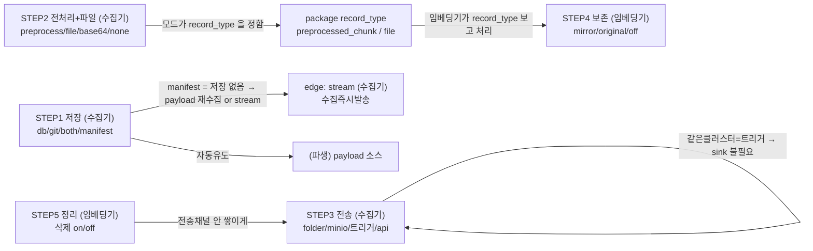

# 배포 구성 — 옵션 통합 설계 (구현 전 확정안)

> 수집기(`temporal_law`) → 핸드오프(JSONL package) → 임베딩 소비자(`law_embedding`) 를
> **어떤 망/리소스에서 어떻게 구성하나**. 아래는 **통합 후 목표 설계** — 옵션을 최대한 줄이고
> 나머지는 자동 유도한다. 안정성(재시도·self-heal·delete-after-upsert·false-repeal 방지)은
> 어떤 조합이든 항상 켜짐 — 결정 대상 아님([RELIABILITY.md](RELIABILITY.md)).
>
> 범례: ✅ 구현됨 · ⚠️ 부분/조건부 · ❌ 미구현([미구현.md](미구현.md)) · [수집기]/[임베딩기] = 설정 위치
>
> ※ 아직 구현 시작 전. 이 문서는 "어떻게 통합할지" 확정용.

---

## ★ 대전제: 설정은 두 망에 나뉜다

수집기(VM1)와 임베딩기(VM2)는 **망이 분리**돼 각자 `.env` 를 가진다. **한쪽이 다른 쪽 env 를 못 본다.**
그래서 소비자 동작을 생산자 env 에서 유도할 수 없다 — 대신 **패키지가 자기서술적(self-describing)** 이라
소비자는 패키지 안 `record_type` 만 보고 처리한다:

- `document`           → 본문(항상 옴). 매핑.
- `preprocessed_chunk` → 생산자가 이미 전처리함. 매핑만(소비자 전처리 X).
- `file`               → 원본 파일. **소비자가 전처리**(자기 Doc Parser 있으면; 없으면 pending).
- `pending_attachment` / `delete` → 보류 / 폐지.

→ **소비자는 생산자 모드를 알 필요 없다.** record_type 이 뭘 할지 알려준다.

---

## A. 통합 방향 (확정된 결정)

1. **`MANIFEST_ONLY` 를 `STORAGE_MODE` 에 흡수** → `STORAGE_MODE = db | git | both | manifest`.
   (manifest 와 db 는 배타적 → 별도 플래그일 이유 없음.)
2. **`HANDOFF_PAYLOAD_SOURCE`(collect/auto) 삭제** → STORAGE_MODE 에서 자동 유도
   (manifest → collect(재수집) / 그 외 → auto(저장 읽기)). [수집기 안에서 유도 — 같은 env]
3. **소비자 `PACKAGE_PREPROCESS_FILES` 삭제** → **소비자 자신의 Doc Parser 연결 여부**에서 유도
   (Doc Parser 있음 → file 레코드 전처리 / 없음 → pending). **생산자 ATTACHMENT_MODE 와 무관**(망 분리).
4. **`dmz` 모드 → `preprocess` 로 개명** (망 이름이 아니라 "수집기에서 미리 전처리" 라는 뜻).
   부속 env `PACKAGE_DMZ_PARSER_URL` → `PACKAGE_PREPROCESS_PARSER_URL`.
5. **전송 타이밍(stream/package)을 결정 트리에서 제외** → 기본 **package**, `stream` 은 "수집 즉시
   발송해야 하는 특수 상황"에서만 켜는 edge 플래그(`HANDOFF_STREAMING`).
6. **env 순서를 STEP 순서대로 정렬** (수집기·임베딩기 각각).
7. **DB 초기적재는 보류** — 원본 보존쪽 DB 개발까지 딸려 옴.
8. **API push 전송은 목업만**.

→ 사라지는 knob 3개: `MANIFEST_ONLY`, `HANDOFF_PAYLOAD_SOURCE`, `PACKAGE_PREPROCESS_FILES`.

---

## B. 통합 후 결정 트리 (사용자가 고르는 5개 + edge)

### STEP 1. [수집기] 저장 위치 — 수집기가 무엇을 로컬에 남기나
`STORAGE_MODE = db | git | both | manifest`

| 상황 | 값 | 구현 |
|---|---|---|
| 처음부터 재수집 / 백업 필요 | `db` `git` `both` | ✅ |
| 증분만, 초기데이터 GIT 이관(pull→index) | `git` `both` | ✅ |
| 증분만, 초기데이터 DB 이관(dump→직접 임베딩) | (db 초기적재) | ❌ 보류 |
| 백업 불필요·무저장(json·별표 저장 안 하고 즉시 전송) | `manifest` | ✅ |

- 자동 유도: `USE_DB` `USE_GIT` `READ_PREFERS_GIT`, **payload 소스**(manifest → 재수집 / 그 외 → 저장 읽기).

### STEP 2. [수집기] 전처리 위치 + 파일 전송 — 첨부(별표/원문)를 누가 텍스트로 만드나
`PACKAGE_ATTACHMENT_MODE = preprocess | file_transfer | base64 | none` (본문 payload 는 항상 JSONL)

| 상황 | 값 | 보내는 record | 구현 |
|---|---|---|---|
| 전처리를 **수집기**에서(원본 반출 불가) | `preprocess` | preprocessed_chunk | ✅ |
| 전처리를 **임베딩기**서 + 파일 원문 전송 | `file_transfer` | file(옆채널) | ✅ |
| 전처리를 임베딩기서 + 인코딩 전송 | `base64` | file(content_b64) | ✅ |
| 파일 전송 안 함(본문만) | `none` | pending_attachment | ✅ |

- `preprocess` 는 수집기에 전처리기 URL 필요(`PACKAGE_PREPROCESS_PARSER_URL`/`PREPROCESS_API_*`),
  `file_transfer` 는 옆채널 dir 필요.
- **소비자는 record_type 만 보고 처리**(대전제) — 어느 모드로 와도 결국 (본문 + 파일별 청크)로 수렴.

### STEP 3. [수집기] 전송 위치 — 어디로 떨구나
`PACKAGE_SINK = folder | minio | api | none` (+ 같은 클러스터면 `INDEX_TASK_QUEUE` 로 직접 트리거)

| 값 | 뜻 | 구현 |
|---|---|---|
| `folder` | 공유폴더/NFS/망연계 폴더(기본·우선) | ✅ |
| `minio` | 오브젝트 스토리지 | ✅ |
| `INDEX_TASK_QUEUE` | 같은 Temporal → sink 없이 색인 워크플로 직접 트리거 | ✅ |
| `api` | HTTP push 등 | ❌ 목업만 예정 |
| `none` | 빌드만/드라이런 | ✅ |

### STEP 4. [임베딩기] 내부망 원본 보존 — 소비자가 원본을 남기나 (STEP1·2에 의존)

| 상황 | 값 | 구현 |
|---|---|---|
| 데이터 그대로 보존(레포 레이아웃) | `PACKAGE_MIRROR_REPO=<repo>` | ⚠️ document JSON만 정확·파일은 `첨부미러/` |
| 내부 flat 저장 | `PACKAGE_STORE_ORIGINAL=true` | ✅ |
| 보존 안 함(VDB만) | (미설정) | ✅ |
| (DB 기반 보존) | — | ❌ 보류(DB와 함께) |

- 원본 **파일** 보존은 STEP2가 file/base64(원본이 임베딩기로 옴)일 때만 의미. preprocess/none 이면 document JSON 만.
- **★ 바꿀 것: RepoMirror 를 초기 gitexport 와 동일한 진짜 레플리카로.** 지금은 파일을 `첨부미러/`에 몰아
  두는데(서브폴더 규칙 몰라서), 이제 규칙을 아니까(`git_rel_path` 로직) `별표/별지/원문/본문이미지` 정확한
  서브폴더로 넣는다. `file` 레코드에 `unit_type`·`file_name` 있어 소비자가 재검색 없이 판별 가능.
- **내부망 git push 대상**: RepoMirror 는 단순 파일복사가 아니라 **진짜 git 레포**여야 한다 — 내부망
  Gitea/GitLab 에 commit+push 할 수 있게(초기반입한 레포를 내부에서 계속 최신화 후 내부 git 서버로 push).

### STEP 5. [임베딩기] 적재 후 정리 — 소비한 package/파일을 지우나

| 값 | 구현 |
|---|---|
| `PACKAGE_DELETE_CONSUMED_PACKAGE=true`(전송채널에 안 쌓이게) | ✅ |
| `PACKAGE_DELETE_CONSUMED_FILES=true`(옆채널 inbox 파일) | ✅ |
| 삭제 안 함(재처리·감사) | ✅ |

### (edge) [수집기] 전송 타이밍 — 특수 상황에서만
`HANDOFF_STREAMING=true` — 처음부터 수집하며 수집 끝날 때마다 바로 적재 + 파일 저장 못 하는 한정 리소스.
기본은 package(배치). `HANDOFF_ENABLED=false` 면 stream·package 다 안 나감(마스터).

---

## C. 자동 파생 (knob 없어짐)

| 파생값 | 유도 규칙 | 어디서 |
|---|---|---|
| payload 소스(collect/auto) | manifest && 배치 → collect / 그 외 → auto | [수집기] |
| USE_DB / USE_GIT / READ_PREFERS_GIT | STORAGE_MODE | [수집기] |
| 소비자 전처리 on/off | **소비자 Doc Parser 연결 여부** (생산자 모드 무관) + record_type | [임베딩기] |

---

## D. STEP 상호 연관 (얽힌 부분)



외울 연관 5개:
1. **manifest = 저장 없음** → payload 를 재수집(collect)하거나 stream 으로 즉시 발송. 원본 파일 보존 불가.
2. **payload 소스는 파생**(수집기 STORAGE), 사용자가 안 고른다.
3. **소비자 전처리는 소비자 자신의 Doc Parser 유무로 결정**(생산자 모드 무관 — 망 분리). 패키지 record_type 이 뭘 할지 알려줌.
4. **preprocess/none = 원본 파일이 임베딩기로 안 옴** → STEP4 파일 보존 불가(document JSON 만).
5. **같은 클러스터 트리거 = sink 불필요**, 망분리면 folder/minio.

---

## E. 권장 env 순서 (STEP대로 — 두 망 각각)

### 수집기(VM1) `.env`
```
# STEP1 저장
STORAGE_MODE=both            # db | git | both | manifest
GIT_EXPORT_REPO=...          # git/both/manifest 일 때
MANIFEST_DIR=...             # manifest 일 때(비면 GIT_EXPORT_REPO)

# STEP2 전처리+파일
PACKAGE_ATTACHMENT_MODE=base64      # preprocess | file_transfer | base64 | none
PACKAGE_FILE_STAGE_DIR=...          # file_transfer 일 때(옆채널)
PACKAGE_PREPROCESS_PARSER_URL=...   # preprocess 일 때(+PREPROCESS_*)

# STEP3 전송
PACKAGE_SINK=folder          # folder | minio | api | none
PACKAGE_OUT_DIR=...           # folder
PACKAGE_MINIO_*=...           # minio
INDEX_TASK_QUEUE=...          # 같은 클러스터 직접 트리거(비우면 안 씀)

# edge
HANDOFF_ENABLED=true          # 마스터
HANDOFF_STREAMING=false        # 수집 즉시 발송(특수)
```

### 임베딩기(VM2) `.env`
```
# 전처리(소비자) — Doc Parser 있으면 file 레코드 전처리, 없으면 pending
DOC_PARSER_BASE_URL=...
DOC_PARSER_UPLOAD / _ENDPOINT_PATH / _API_KEY ...
PACKAGE_FILE_INBOX_DIR=...    # file_transfer 수신 옆채널

# STEP4 보존
PACKAGE_MIRROR_REPO=...       # 레포 레이아웃 보존
PACKAGE_STORE_ORIGINAL=false  # flat 보존

# STEP5 정리
PACKAGE_DELETE_CONSUMED_PACKAGE=false
PACKAGE_DELETE_CONSUMED_FILES=false

# Weaviate 접속(색인 대상)
WEAVIATE_* / LAW_COLLECTION / ADMRUL_COLLECTION ...
```

---

## F. 실제 배포 프로파일 (이 조합만 실전)

| 이름(가칭) | STEP1 | STEP2 | STEP3 | STEP4 | stream |
|---|---|---|---|---|---|
| local-allinone | both | base64 | 트리거 | off | X |
| db-batch | both | preprocess | folder | off | X |
| git-mirror | git | file_transfer | folder | mirror | X |
| airgap-stream | manifest | base64/preprocess | folder | off | O |
| db-only-full | db | base64 | minio | off | X (❌ 미구현) |

→ 나중에 `DEPLOY_PROFILE=<이름>` 하나로 전개(override 허용). 지금은 설계만.

---

## G. 구현 순서 (정한 뒤 시작)

1. `STORAGE_MODE` 에 `manifest` 흡수 + `MANIFEST_ONLY` 제거(하위호환 별칭만 잠깐).
2. `HANDOFF_PAYLOAD_SOURCE` 제거 → STORAGE_MODE 에서 유도.
3. 소비자 `PACKAGE_PREPROCESS_FILES` 제거 → 소비자 Doc Parser 유무에서 유도.
4. `PACKAGE_ATTACHMENT_MODE` 의 `dmz` → `preprocess` 개명(+`PACKAGE_PREPROCESS_PARSER_URL`).
5. `HANDOFF_STREAMING` 을 edge 로 정리(문서·검증에 "특수" 명시).
6. env/config 를 STEP 순서로 재정렬(두 망 각각) + `validate_handoff_config` 에 불가능 조합 추가.
7. API push sink **목업** 추가(인터페이스만).
8. **RepoMirror 진짜 레플리카화** — 파일을 `첨부미러/` 대신 `별표/별지/원문/본문이미지` 정확한 서브폴더로
   (`git_rel_path` 로직 재사용) + **내부망 Gitea/GitLab 로 commit·push** 지원(진짜 git 레포).
9. (나중) `DEPLOY_PROFILE`, DB 초기적재.

---

## H. 긴 파일명(255바이트 초과) — 정책 B: **git 은 항상 원본 이름** (구현 완료 2026-08)

**실측**: `data/` 345,030개 중 경로요소 255바이트 초과는 **소수(별표/별지/서식, 한글 ~86자↑, 최대 310B)**.
**법령·행정규칙 JSON, 일반 파일은 0개.** git_path(JSON)는 안 걸려 git_history·"git 으로 찾아가기"는 무관.

**결정(사용자 확정)**: git(GitHub·내부 Gitea)에는 **safe 없이 정확한 원본 글자**가 들어가야 한다 — 수집기가
push 하든 임베딩기가 push 하든. `safe`(바이트절단)는 **리눅스 로컬 작업본에서만** 쓰고, git 경계에서 변환한다.
(리눅스 ext4 는 255**바이트**, macOS 는 255**글자** 한계 → 한글 ~100자 이름이 리눅스에서만 checkout 실패.)

- **수집기 `mdexport._safe`** = 원본 이름(금지문자 치환 + 120자 컷만, 바이트절단·해시 없음). 내가 넣었던
  바이트절단은 **revert** — 그게 git 에 잘린 이름을 넣을 유일한 코드였다. (수집기는 macOS 호스트면 그대로 써짐.)
- **임베딩기 read(`git_sync.sync_repo`)**: clone/fetch 시 255바이트 초과 파일은 리눅스가 checkout 을 못 하므로
  '파일명 너무 김' 오류를 관용하고, 그 파일만 **safe 이름으로 materialize**(`git cat-file`)한다. 원본(긴) 경로는
  `skip-worktree` + `.git/info/exclude` 로 표시 → git 원본 불변, `git add -A` 로도 safe 사본이 안 샌다.
- **임베딩기 `preprocess._safe_name`** = 수집기와 동일(clean+120자컷) 후 **255바이트 초과일 때만** 바이트절단.
  materialize 규칙과 같은 함수라 색인이 그 파일을 정확히 찾는다.
- **미러 push(`RepoMirror`, `PACKAGE_MIRROR_PUSH=on`)**: 255바이트 초과 첨부는 리눅스 작업트리에 못 쓰므로
  **git plumbing**(`hash-object`→index cacheinfo, `skip-worktree`)으로 **원본 경로** blob 을 커밋 트리에 넣는다
  → 내부 Gitea 도 원본(한글) 이름으로 찾아간다. (folder-only 면 git 조작 없이 로컬 브라우징용 safe 사본만.)

**남은 것**: ⒜ 기존 `data/law_data`(GitHub)는 이미 **원본 이름**이라(수집기가 원래 안 잘랐음) 손댈 것 없음 —
리눅스 소비자는 위 materialize 로 자동 처리. ⒝ 수집기를 **리눅스에서 직접** 돌려 그 초과 이름을 커밋해야 하면
수집기 gitexport 에도 같은 plumbing 이 필요(현재 미구현 — macOS/윈도우 호스트면 불필요).

각 단계 테스트 동반(수집기 70 · 임베딩 163 passed). 구현 완료.
</content>
