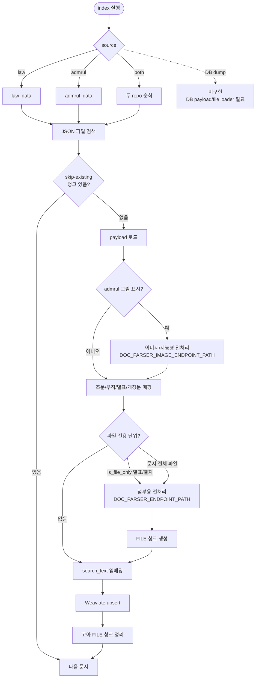
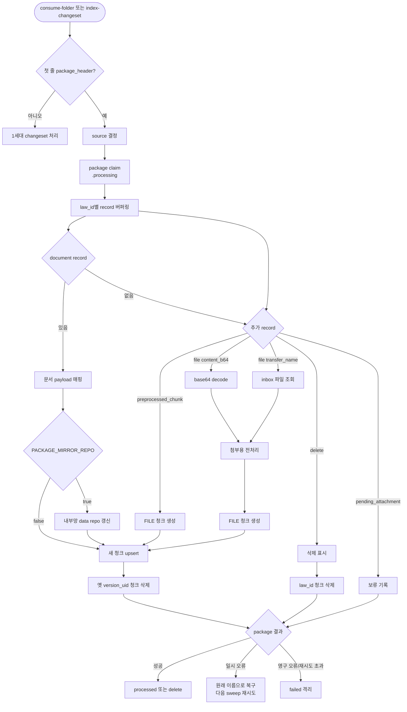
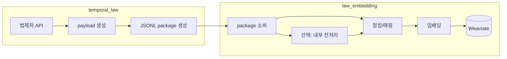

# [산출물] 임베딩 파이프라인 개발 완료 및 적재 구조 정리

## 1. 개요

`law_embedding`은 `temporal_law` 수집기가 만든 법령/행정규칙 payload를 읽어 Weaviate 검색 인덱스를 만드는 파이프라인이다.

수집은 하지 않는다. 역할은 data repo 또는 JSONL package를 입력으로 받아 조문/부칙/별표/첨부파일 단위로 청킹하고, 필요한 파일만 전처리한 뒤, 임베딩 벡터를 생성해 Weaviate에 upsert/delete하는 것이다.

처음 보면 아래 네 가지로 이해하면 된다.

| 질문 | 답 |
| --- | --- |
| 무엇을 읽나? | `law_data`, `admrul_data`의 JSON payload 또는 수집기가 보낸 JSONL package |
| 무엇을 만들까? | 법령/행정규칙 조문, 부칙, 별표, 첨부파일 청크의 Weaviate 객체 |
| 무엇을 임베딩하나? | `search_text`. 법령명, 종류, 장, 조문번호, 제목, 본문을 합친 텍스트 |
| 원본 repo를 고치나? | 기본 전체 색인은 읽기만 한다. package 소비 시 `PACKAGE_MIRROR_REPO=true`일 때만 내부망 repo를 갱신한다. |

상세 문서:

- README: https://github.com/sehunpark-genon/law_embedding/blob/develop/README.md
- 색인기: https://github.com/sehunpark-genon/law_embedding/blob/develop/docs/indexer.md
- package 소비: https://github.com/sehunpark-genon/law_embedding/blob/develop/docs/package.md
- Weaviate 스키마: https://github.com/sehunpark-genon/law_embedding/blob/develop/docs/schema.md
- 흐름도: https://github.com/sehunpark-genon/law_embedding/blob/develop/docs/flow.md
- 수집기 package 생산 구조: https://github.com/sehunpark-genon/temporal_law/blob/develop/docs/pipeline.md

## 2. 전체 흐름도

### 2.1 초기/전체 색인



이 흐름은 초기/전체 색인이다. data repo의 JSON을 하나씩 열어 조문, 부칙, 별표로 청킹하고, 파일에만 본문이 있는 단위만 전처리를 거쳐 FILE 청크로 만든 뒤, 임베딩 대상 텍스트인 `search_text`를 벡터로 만들어 Weaviate에 upsert한다.

### 2.2 package 증분 소비



증분 소비는 package(JSONL) 하나를 원자적으로 잡아 처리한다. `claim`은 package 파일 이름을 `.processing`으로 바꿔 처리 중임을 표시하는 것이고, `sweep`은 폴더를 반복해서 훑어 아직 처리 안 된 package를 집는 순회다. 문서를 새로 upsert한 뒤에는 같은 문서의 옛 `version_uid` 청크를 지워 한 버전만 남긴다.

### 2.3 수집기와 임베딩기 역할



수집기(`temporal_law`)가 payload와 package를 만들고, 임베딩기(`law_embedding`)는 그 package를 소비해 청킹, 필요 시 전처리, 임베딩을 수행한다. package를 무엇으로 채울지 고르는 규칙과 manifest 관리는 수집기 몫이고, 도착한 package를 어떻게 소비할지는 임베딩기 몫이다.

## 3. 입력 원천

현재 구현된 입력 원천은 두 가지다.

| 입력 원천 | 구현 상태 | 설명 |
| --- | --- | --- |
| data repo | 구현됨 | `law_data`, `admrul_data` 폴더를 순회해 `.json` payload를 색인한다. 초기/전체 적재의 기본 경로다. |
| JSONL package | 구현됨 | `temporal_law` handoff package를 소비해 변경 문서만 upsert/delete한다. 증분 적재의 기본 경로다. |
| DB dump | 미구현 | DB dump만으로 초기 적재하려면 DB payload loader와 file_asset 원본 파일 위치 규칙을 추가해야 한다. |

data repo 구조:

```text
data/
├── law_data/
│   └── {법령명}/{법률|시행령|시행규칙}/{문서명}.json
└── admrul_data/
    └── {행정규칙|학칙|공단정관|공공기관}/{문서명}/{문서명}.json
```

색인 대상:

- `.json`
- `appendices[].is_file_only=true`인 별표/별지/서식 파일
- 본문 텍스트가 없고 `attachments[]`만 있는 행정규칙류 원문 파일
- 행정규칙 조문 본문 안 `[그림]`에 대응하는 본문이미지

색인하지 않는 것:

- `.md`
- `_manifest.json`
- 본문 텍스트가 이미 있는 문서의 최상위 `attachments[]`
- 삭제 안내문뿐인 별표/별지/서식

초기 적재는 DB를 읽지 않는다. `LAW_REPO_PATH`, `ADMRUL_REPO_PATH` 아래 JSON 파일을 실제 파일시스템에서 순회한다. DB dump만 받아 초기 적재하는 경로는 아직 구현되어 있지 않다.

## 4. 초기/전체 색인 흐름

```text
JSON 파일 순회
  -> payload 읽기
  -> 이미 적재된 law_id면 skip (--skip-existing)
  -> 행정규칙 [그림] 본문이미지 OCR 보강
  -> 조문/부칙/별표/개정문 청크 생성
  -> 파일 전용 별표/별지/서식 전처리
  -> 문서 전체가 파일뿐인 문서 전처리
  -> search_text 임베딩
  -> Weaviate upsert
  -> 파일 청크 고아 정리
```

실패 단위:

- JSON 파일을 읽지 못하면 그 파일만 실패로 기록하고 다음 파일을 처리한다.
- 조문/부칙/별표 mapper가 실패하면 그 문서만 실패로 기록한다.
- 특정 첨부파일 전처리가 실패해도 본문 조문 청크는 계속 적재한다.
- 임베딩/upsert가 문서 단위로 실패하면 해당 문서는 다음 실행에서 다시 시도할 수 있다.

## 5. 청크 단위

| payload 위치 | unit_type | 설명 |
| --- | --- | --- |
| `body.articles[]` | `ARTICLE` | 조문 |
| `addenda[]` | `ADDENDUM` | 부칙 |
| `appendices[]` | `APPENDIX` | 텍스트 별표/별지/서식 |
| `amendment_text`, `revision_reason` | `AMENDMENT` | 개정문/개정이유 |
| 전처리된 첨부 파일 | `APPENDIX` 또는 `FILE` | 파일-only 별표/별지/서식 또는 문서 전체 원문 |

긴 본문은 문단/행 경계로 나눈다. 쪼개진 조각도 같은 `provision_id`를 유지하므로 검색 후 조문 단위 복원이 가능하다.

Weaviate에 저장하는 실제 본문은 `content`이고, 임베딩 대상은 `search_text`다.

`search_text`는 다음 값을 줄바꿈으로 합친다.

```text
law_name
law_type
chapter
unit_no
unit_title
content
```

첨부파일 청크도 파일 텍스트만 넣지 않고 문서명, 법령 종류, 별표/원문 문맥, 페이지 정보를 함께 넣는다.

식별자 기준:

| 식별자 | 무엇을 가리키나 | 쓰는 곳 |
| --- | --- | --- |
| `law_id` / `doc_id` | 문서 하나 | 문서 단위 삭제, skip-existing 판단 |
| `doc_uid` | `{doc_domain}:{doc_target}:{doc_id}` 문서 통합키 | 법령/행정규칙 통합 식별 |
| `version_uid` | 문서의 한 버전. 법령은 `{doc_uid}:{MST}:{시행일}` 기준 | 개정 전/후 청크 정리 기준 |
| `provision_id` | 조문/부칙/별표 한 단위 | relation, 조문 단위 복원 |
| `file_id` | 첨부파일 하나 | FILE 청크 묶음 정리 |
| `chunk_id` | Weaviate 객체 하나 | 멱등 upsert 기준 |

`chunk_id`는 payload 식별자와 단위 정보를 기반으로 결정적으로 만든다. 같은 청크는 다시 색인해도 같은 UUID로 들어가므로 재실행해도 같은 객체를 교체한다.

## 6. 전처리 정책

전처리는 payload 안에 이미 텍스트가 있는 조문을 다시 파싱하는 기능이 아니다. 파일에만 본문이 있거나, 행정규칙 조문 일부가 이미지로 빠져 있는 경우에 검색 가능한 텍스트를 보강하는 단계다.

전처리하는 대상:

| 대상 | 조건 |
| --- | --- |
| 별표/별지/서식 파일 | `appendices[].is_file_only=true` |
| 행정규칙 원문 파일 | 본문에 의미 있는 텍스트가 없고 `attachments[]`가 있는 경우 |
| 행정규칙 본문이미지 | 조문 content에 `[그림]`이 있고 `본문이미지/{article_no}_{n}.gif|png|jpg`가 있는 경우 |
| package의 `file` record | 내부 전처리기가 연결되어 있을 때 |

전처리하지 않는 대상:

| 대상 | 이유 |
| --- | --- |
| 법령/행정규칙 조문 본문 | payload의 `body.articles[]` 텍스트를 바로 청킹한다. |
| 부칙, 개정문, 텍스트 별표/별지 | payload에 구조화 텍스트가 있으므로 외부 파서가 필요 없다. |
| 법령류 본문 이미지 | 조문 본문 텍스트가 이미 있고 이미지는 수식/표 조각인 경우가 많아 중복과 비용이 크다. |
| 본문 텍스트가 있는 문서의 최상위 `attachments[]` | 본문과 중복될 수 있어 자동 전처리하지 않는다. |
| package의 `preprocessed_chunk` | 수집기 쪽에서 이미 전처리된 결과이므로 그대로 FILE 청크로 만든다. |
| package의 `pending_attachment` | 보류 정보만 남기고 색인 객체는 만들지 않는다. |

전처리기는 두 종류의 endpoint를 나눠 쓸 수 있다.

| endpoint | env | 사용 대상 |
| --- | --- | --- |
| 첨부용 전처리기 | `DOC_PARSER_ENDPOINT_PATH` | 별표/별지/서식 파일, 문서 전체 원문 파일 |
| 이미지/지능형 전처리기 | `DOC_PARSER_IMAGE_ENDPOINT_PATH` | 행정규칙 조문 안 `[그림]` 본문이미지 |

문서 파일(hwp/hwpx/pdf/docx 등)은 첨부용 endpoint로 보낸다. 이미지만 이미지/지능형 endpoint를 사용한다. `DOC_PARSER_IMAGE_ENDPOINT_PATH`를 비우면 이미지도 첨부용 endpoint로 간다.

전처리 호출 방식:

| 방식 | 설정 | 설명 |
| --- | --- | --- |
| path | `DOC_PARSER_UPLOAD=false` | 전처리기에게 파일 경로를 넘긴다. 색인기와 전처리기가 같은 파일을 볼 수 있어야 한다. |
| multipart | `DOC_PARSER_UPLOAD=true` | 파일 bytes를 업로드한다. 전처리기가 별도 컨테이너/API로 떠 있으면 이 방식이 안전하다. |

## 7. 전처리 응답 정규화

전처리기 원시 응답은 대략 다음 형태다.

```json
{
  "code": 0,
  "errMsg": "success",
  "data": [
    {
      "text": "전처리된 본문",
      "n_char": 328,
      "n_word": 50,
      "n_line": 43,
      "i_page": 1,
      "e_page": 1,
      "i_chunk_on_doc": 0,
      "n_chunk_of_doc": 1,
      "reg_date": "2026-08-04T18:09:01Z",
      "chunk_bboxes": null,
      "media_files": null,
      "guardrail_categories": null
    }
  ]
}
```

색인기는 이 응답을 바로 저장하지 않고 FILE 청크 필드로 정규화한다.

| 전처리기 응답 | FILE 청크 필드 |
| --- | --- |
| `text` | `content` |
| `i_page` | `page_no`, `start_page` |
| `e_page` | `end_page` |
| `i_chunk_on_doc` | `chunk_index` |
| `reg_date` | `parser_reg_date` |
| `chunk_bboxes`, `media_files`, `guardrail_categories` | 같은 이름의 메타 필드 |
| `n_char`, `n_word`, `n_line` | 같은 이름의 통계 필드 |

이렇게 만든 FILE 청크도 조문 청크와 같은 컬렉션에 들어간다. 별도 파일 전용 컬렉션은 없다.

## 8. Weaviate 스키마

법령과 행정규칙은 컬렉션을 분리하지만 같은 스키마를 사용한다.

| source | 기본 컬렉션 |
| --- | --- |
| `law` | `LegalProvisionIndex` |
| `admrul` | `AdmrulProvisionIndex` |

컬렉션은 self-provided vector 방식이다. Weaviate 내부 vectorizer는 쓰지 않고, `law_embedding`이 만든 벡터를 직접 넣는다.

스키마는 세 층으로 나뉜다.

| 구분 | 설명 |
| --- | --- |
| 필터 필드 | relation 탐색, 삭제, 날짜/문서 필터에 자주 쓰는 값 |
| 표시 필드 | 답변, 디버깅, 출처 표시에 필요한 값 |
| `meta` | 자주 필터하지 않지만 잃으면 안 되는 부가 정보를 JSON 문자열로 보존 |

주요 필터 필드:

- `chunk_id`
- `provision_id`
- `law_id`
- `version_uid`
- `file_id`
- `unit_type`
- `is_current`
- `enforcement_date`
- `reference_ids`
- `parent_provision_id`
- `ministry`

주요 표시 필드:

- `domain`
- `law_name`, `law_abbr`, `law_type`
- `unit_no`, `unit_title`, `chapter`
- `content`
- `search_text`
- `source_type`
- `source_url`
- `git_path`
- `mst`
- `adm_uid`
- `file_name`, `file_url`, `page_no`
- `chunk_index`, `chunk_count`
- `is_future`
- `promulgation_date`, `revision_date`, `revision_type`

`meta`에는 Git/파일 출처, relation 상세, 파일 종류, 페이지/좌표/미디어, 본문 이미지 URL, 전처리 통계, 시행예정/폐지 메타 등을 보존한다.

payload 전체를 Weaviate top-level 필드로 그대로 올리지는 않는다. 검색/필터/출처 표시에 자주 쓰는 값은 top-level로 올리고, 나머지는 `meta`에 보존한다. 원본 payload 전체가 필요하면 data repo JSON 또는 package mirror repo를 본다.

## 9. relation 조회 방식

relation 탐색은 path 문자열을 추측하지 않는다.

기본 방식:

1. 검색 hit의 `reference_ids`를 읽는다.
2. 각 값은 대상 조문의 `provision_id`다.
3. Weaviate에서 `provision_id == reference_id`로 exact fetch한다.
4. fetch된 대상 hit의 `git_path`, `content`, `unit_no`, `unit_title`을 사용한다.

행정규칙류는 `행정규칙`, `학칙`, `공단정관`, `공공기관`처럼 상위 폴더가 갈라진다. 따라서 `reference_id` 문자열만으로 경로를 조립하면 위험하다. 현재 데이터로는 대상 레코드를 다시 조회해 그 레코드의 `git_path`를 쓰는 방식이 맞다.

첨부 실제 파일 경로가 필요하면 `meta.source_relative_path`를 우선 사용한다.

## 10. package 증분 소비

증분 색인은 수집기가 만든 JSONL package를 읽는다.

package 하나를 직접 소비:

```bash
uv run python -m law_indexer index-changeset --input /mnt/handoff/packages/law-20260814-010000.jsonl
```

폴더에 도착한 package를 순차 소비:

```bash
uv run python -m law_indexer consume-folder --dir /mnt/handoff/packages
```

`consume-folder`는 운영용에 가깝다. package를 `.processing`으로 rename해 원자적으로 claim하고, 성공/실패/재시도를 분리한다.

소비 흐름:

```text
package 읽기
  -> source 결정
  -> law_id별 record 버퍼링
  -> document payload가 있으면 내부망 repo mirror 선택 수행
  -> preprocessed_chunk/file/normalized_chunk를 같은 law_id 버퍼에 합침
  -> 새 청크 upsert
  -> 성공 후 오래된 version_uid 청크 삭제
  -> 성공 package 이동 또는 삭제
```

중요한 점은 upsert 먼저, 옛 청크 삭제는 나중이라는 점이다. 새 버전 적재가 실패하면 기존 청크가 검색에서 사라지지 않게 하기 위한 정책이다.

폐지 문서처럼 `delete`만 있고 재적재할 내용이 없으면 `law_id` 단위로 삭제한다.

## 11. package record 처리

| record_type | 처리 |
| --- | --- |
| `package_header` | source와 package_id를 읽는다. source로 법령/행정규칙 컬렉션을 결정한다. |
| `document` | payload를 mapper로 보내 조문/부칙/별표/개정문 청크를 만든다. |
| `normalized_chunk` | 생산자가 미리 만든 정규화 청크를 청크 객체로 만든다. |
| `preprocessed_chunk` | 수집기 쪽 전처리 결과를 FILE 청크로 만든다. |
| `file` | 원본 파일을 내부망 전처리기로 보낸 뒤 FILE 청크로 만든다. |
| `pending_attachment` | 처리 보류 정보를 기록한다. 색인 객체는 만들지 않는다. |
| `delete` | 해당 `law_id` 청크를 삭제한다. |
| `package_footer` | record_count를 검증한다. |

`file` record는 파일 바이트를 직접 담는 방식과 옆채널 파일을 참조하는 방식이 있다.

| 방식 | record 필드 | 파일 확보 | 필요한 env |
| --- | --- | --- | --- |
| base64 | `content_b64` | base64를 임시 파일로 decode | `DOC_PARSER_BASE_URL` |
| 옆채널 파일 | `transfer_name` | `PACKAGE_FILE_INBOX_DIR/transfer_name` 파일 조회 | `PACKAGE_FILE_INBOX_DIR`, `DOC_PARSER_BASE_URL` |
| 둘 다 없음 | 없음 | 확보 불가, pending | 없음 |

`DOC_PARSER_BASE_URL`이 있으면 `file` record는 내부망 전처리 대상으로 처리된다. 없으면 파일 record는 pending으로 남고 package 소비는 계속된다.

## 12. 내부망 repo mirror

`PACKAGE_MIRROR_REPO=true`면 package 소비 중 내부망 data repo를 갱신한다.

mirror는 Weaviate 적재와 별개의 선택이다.

| 설정 | 결과 |
| --- | --- |
| `PACKAGE_MIRROR_REPO=false` | package는 Weaviate 적재에만 사용하고 내부망 data repo는 만들지 않는다. |
| `PACKAGE_MIRROR_REPO=true` | package의 `git_path` 기준으로 내부망 data repo 구조를 갱신한다. |
| `PACKAGE_MIRROR_PUSH=true` | 갱신 후 내부 Git 서버로 commit/push한다. |

수집기가 `manifest` 모드라서 DMZ에 payload/file을 남기지 않아도, package 안에 `document.payload`, `git_path`, `file` record가 있으면 소비자가 내부망 repo를 만들 수 있다.

## 13. 주요 환경변수

Weaviate:

| env | 설명 |
| --- | --- |
| `WEAVIATE_HTTP_HOST`, `WEAVIATE_HTTP_PORT` | Weaviate HTTP 주소 |
| `WEAVIATE_GRPC_HOST`, `WEAVIATE_GRPC_PORT` | Weaviate gRPC 주소 |
| `WEAVIATE_API_KEY` | 법령 컬렉션 API key. 인증 없으면 비움 |
| `ADMRUL_WEAVIATE_API_KEY` | 행정규칙 컬렉션 API key. 없으면 `WEAVIATE_API_KEY`로 폴백 |
| `WEAVIATE_SECURE` | TLS 사용 여부 |
| `LAW_COLLECTION` | 법령 컬렉션 이름. 기본 `LegalProvisionIndex` |
| `ADMRUL_COLLECTION` | 행정규칙 컬렉션 이름. 기본 `AdmrulProvisionIndex` |

임베딩:

| env | 설명 |
| --- | --- |
| `EMBEDDING_BACKEND` | `local` 또는 `remote` |
| `EMBEDDING_MODEL` | 임베딩 모델명 |
| `EMBEDDING_BATCH_SIZE` | 임베딩 요청 배치 크기 |
| `NORMALIZE_EMBEDDINGS` | 벡터 정규화 여부 |
| `EMBEDDING_API_URL` | `EMBEDDING_BACKEND=remote`일 때 `/v1/embeddings` endpoint |
| `EMBEDDING_API_KEY` | remote embedding 인증이 필요할 때 |

data repo:

| env | 설명 |
| --- | --- |
| `INPUT_DATA_PATH` | `law_data`, `admrul_data`를 담은 루트 |
| `LAW_REPO_URL`, `LAW_REPO_PATH`, `LAW_REPO_BRANCH` | 법령 repo 설정 |
| `ADMRUL_REPO_URL`, `ADMRUL_REPO_PATH`, `ADMRUL_REPO_BRANCH` | 행정규칙 repo 설정 |
| `GIT_SYNC_TIMEOUT` | clone/fetch timeout |

전처리:

| env | 설명 |
| --- | --- |
| `DOC_PARSER_BASE_URL` | 내부망 전처리기 주소. 비우면 file record와 file-only 첨부는 pending/오류로 남고 FILE 청크를 만들지 않는다. |
| `DOC_PARSER_ENDPOINT_PATH` | 첨부용 전처리 endpoint. hwp/hwpx/pdf/docx 같은 파일 전처리에 쓴다. |
| `DOC_PARSER_IMAGE_ENDPOINT_PATH` | 이미지/지능형 전처리 endpoint. 행정규칙 본문 `[그림]` OCR에만 쓴다. |
| `DOC_PARSER_UPLOAD` | multipart 업로드 여부 |
| `DOC_PARSER_API_KEY` | Bearer 인증 |
| `DOC_PARSER_TIMEOUT`, `DOC_PARSER_MAX_RETRIES` | 전처리 호출 timeout/retry |
| `DOC_PARSER_SHARED_*` | path 방식 전처리기와 파일 경로를 공유할 때 사용 |

package 소비:

| env | 설명 |
| --- | --- |
| `PACKAGE_FILE_INBOX_DIR` | `file_transfer`로 온 파일을 읽는 폴더 |
| `PACKAGE_PREPROCESS_FILES` | `file` record를 내부 전처리기로 돌릴지. 미지정이면 `DOC_PARSER_BASE_URL` 유무로 자동 유도 |
| `PACKAGE_DELETE_CONSUMED_FILES` | 전처리 성공한 inbox 파일 삭제 여부 |
| `PACKAGE_MIRROR_REPO` | package 소비 시 내부망 data repo 구조를 갱신할지 |
| `PACKAGE_MIRROR_PUSH` | mirror 후 내부 Git 서버로 commit/push할지 |
| `PACKAGE_STORE_ORIGINAL` | repo 외 별도 원본 저장소에 document/file을 보관할지 |
| `PACKAGE_ORIGINAL_DIR` | 별도 원본 저장소 경로 |
| `PACKAGE_DELETE_CONSUMED_PACKAGE` | 성공한 package JSONL 삭제 여부 |

## 14. consume-folder 안전장치

`consume-folder`는 단순 for-loop가 아니라 운영 중 재시도를 고려한다.

| 장치 | 설명 |
| --- | --- |
| 원자적 claim | 소비 전 `package.jsonl.processing`으로 rename한다. |
| stale 복구 | 이전 실행이 죽어 남은 `.processing` 파일을 다음 실행 시작에 되돌린다. |
| transient 재시도 | Weaviate 연결 실패, timeout, 서버 오류 등은 원래 이름으로 되돌리고 재시도한다. |
| 영구 오류 격리 | JSON 파싱 실패, source 미결정, footer count 불일치 등은 `failed/`로 보낸다. |
| 성공 처리 | 성공 package는 `processed/`로 이동하거나 설정에 따라 삭제한다. |

실패 구분:

- Weaviate 연결 실패, timeout, OOM 등 일시 장애는 package를 원래 이름으로 되돌리고 다음 sweep에서 재시도한다.
- JSON 파싱 실패, source 미결정, footer count 불일치는 결정적 오류로 보고 `failed/`로 격리한다.
- 특정 파일 전처리 실패는 package 전체를 막지 않고 해당 파일을 pending으로 남길 수 있다.
- 특정 law_id upsert 실패는 package에는 오류가 남아 재시도/격리 대상이 된다. 성공한 다른 law_id는 이미 반영될 수 있다.

## 15. 모델/컬렉션 변경 주의

한 컬렉션에는 같은 차원의 벡터만 들어갈 수 있다. `EMBEDDING_MODEL` 또는 벡터 차원이 바뀌면 기존 컬렉션에 섞어서 넣으면 안 된다.

모델을 바꿀 때는 컬렉션을 recreate하고 재색인한다.

```bash
uv run python -m law_indexer create-collection --source law --recreate
uv run python -m law_indexer index --source law
```

## 16. 실행 예시

설치:

```bash
uv sync
cp .env.example .env
```

Weaviate 확인:

```bash
docker compose up -d
uv run python -m law_indexer health
```

컬렉션 생성:

```bash
uv run python -m law_indexer create-collection --source both
```

data repo 동기화:

```bash
uv run python -m law_indexer sync --source both
```

전체 색인:

```bash
uv run python -m law_indexer index --source law --skip-existing
uv run python -m law_indexer index --source admrul --skip-existing
```

package 증분 소비:

```bash
uv run python -m law_indexer consume-folder --dir /mnt/handoff/packages
```

검색 확인:

```bash
uv run python -m law_indexer search --source law --query "연차 유급휴가 사용 촉진" --limit 5
```

## 17. 현재 완료된 것

- data repo 기반 초기/전체 색인
- `law`, `admrul`, `both` source 처리
- 법령/행정규칙 컬렉션 분리
- 같은 스키마 기반 Weaviate 객체 생성
- 조문/부칙/별표/개정문/파일 청크 매핑
- `search_text` 기반 임베딩
- 파일-only 별표/별지/서식 전처리
- 행정규칙 본문 `[그림]` 이미지/지능형 전처리 연결
- JSONL package 증분 소비
- `document`, `file`, `preprocessed_chunk`, `delete`, `pending_attachment` record 처리
- 내부망 repo mirror 옵션
- `consume-folder` claim/retry/failed 격리 처리

## 18. 남은 작업 / 확인 필요

- DB dump만으로 초기 색인하는 loader는 아직 미구현
- DB 기반 초기 적재를 쓰려면 `document_version.payload`, `file_asset` 원본 파일 위치, MinIO/NFS/파일 경로 규칙을 추가해야 함
- package 소비 결과를 수집기 쪽으로 회수하는 callback/log 구조는 별도 연결 필요
- 전처리기 endpoint와 chunk size 정책은 운영 전 최종 확정 필요
- 모델 변경 시 컬렉션 벡터 차원이 달라지므로 컬렉션 recreate 후 재색인 필요
- 내부망 repo mirror를 사용할 경우 내부 Git origin, push 인증, 경로 규칙 확정 필요
