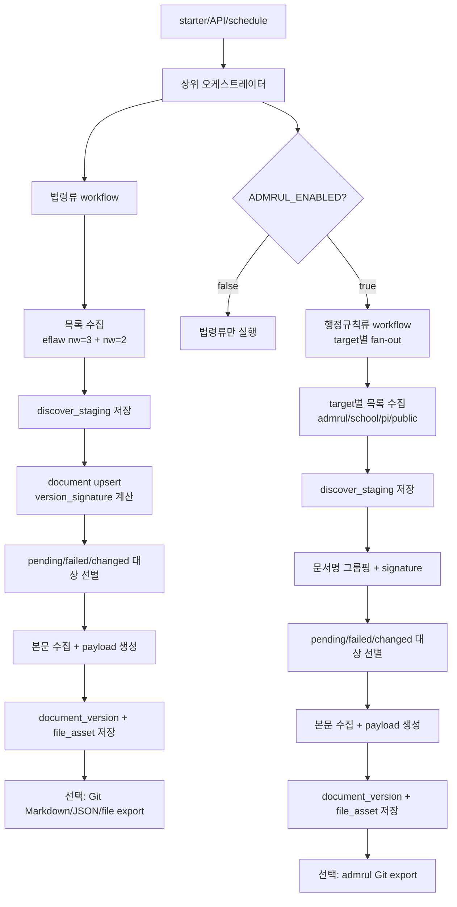
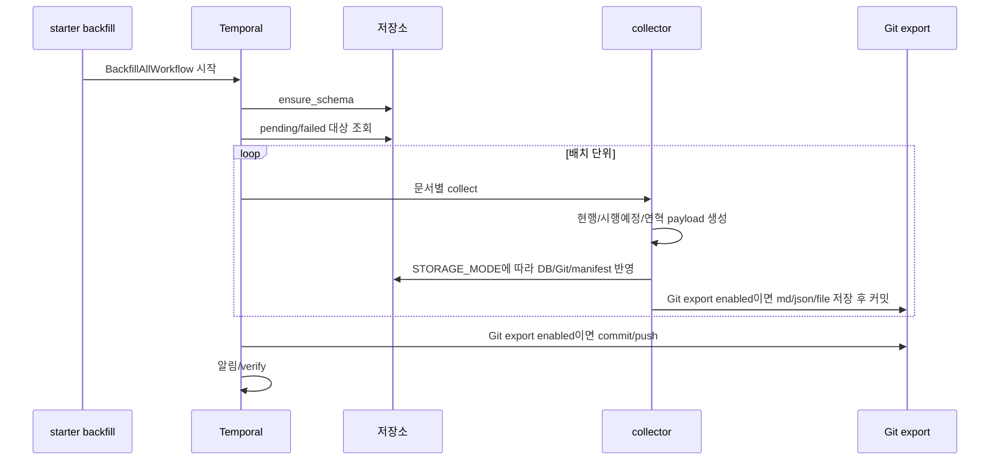
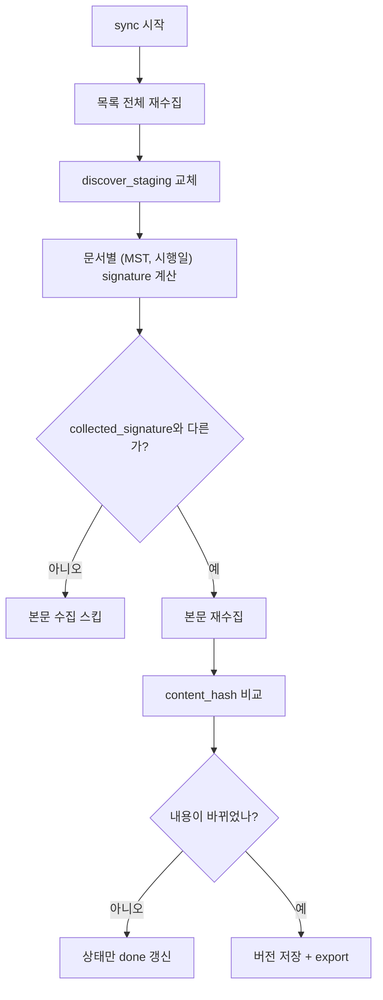
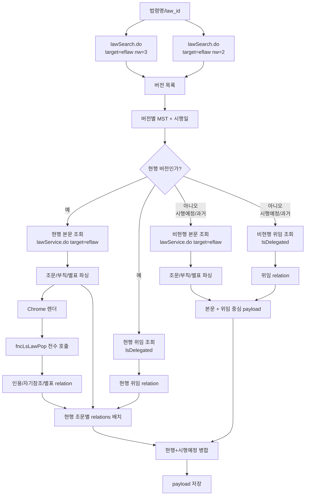
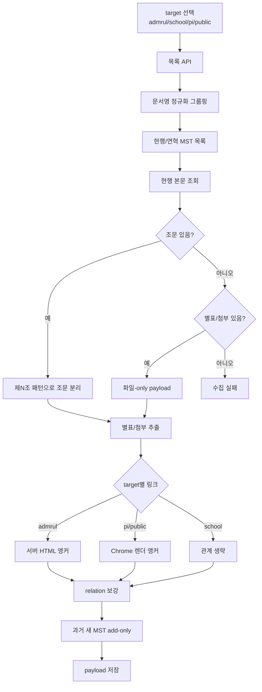
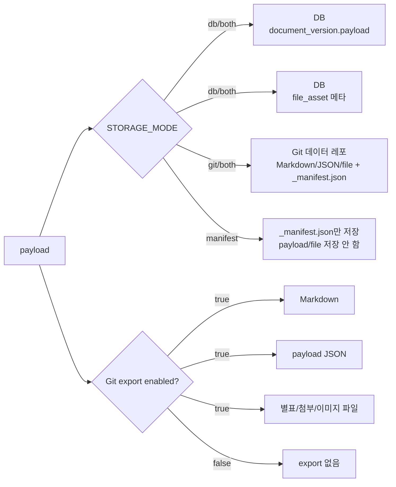
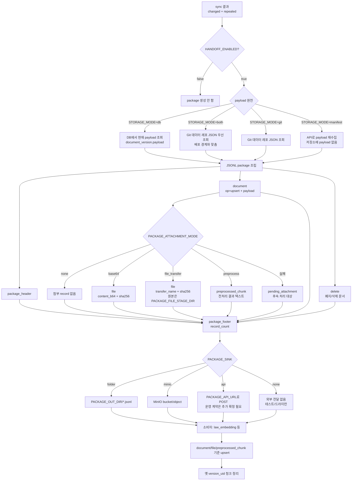

# GBD-14. [산출물] 수집 파이프라인 개발 완료 및 증분 전달 구조 정리

## 1. 개요

`temporal_law/pipeline`은 수집기 collector를 Temporal workflow/activity로 감싸 대량 수집을 반복 가능하게 실행하는 운영 계층이다.

collector가 문서 1건을 payload JSON으로 만드는 역할이라면, pipeline은 전체 목록 수집, 신규/변경/폐지 판단, 초기 적재, 실패분 재처리, 매일 sync, DB/Git 저장, handoff package 생성을 담당한다.

수집기 내부 동작, 법령류/행정규칙류 수집 방식, relation 확정 방식은 GBD-10을 함께 보면 된다.

상세 문서:

- 파이프라인 문서: https://github.com/sehunpark-genon/temporal_law/blob/develop/docs/pipeline.md
- 흐름도: https://github.com/sehunpark-genon/temporal_law/blob/develop/docs/flow.md
- ERD: https://github.com/sehunpark-genon/temporal_law/blob/develop/docs/ERD.md
- README: https://github.com/sehunpark-genon/temporal_law/blob/develop/README.md
- 수집기 산출물 이슈: https://genon.youtrack.cloud/issue/GBD-10

## 2. 대상 범위

파이프라인은 법령류와 행정규칙류를 모두 처리한다.

법령류:

- 법률
- 시행령
- 시행규칙

행정규칙류:

- 행정규칙
- 학칙
- 공단정관
- 공공기관 규정

법령류와 행정규칙류는 workflow/activity를 분리했다. 원천 API 구조와 본문 처리 방식이 다르기 때문이다. 다만 상위 orchestrator에서 둘을 함께 실행할 수 있다.

## 3. 파이프라인 디렉터리 구조

```text
pipeline/
├── starter.py              # workflow 실행 CLI
├── worker.py               # Temporal worker
├── orchestrator.py         # 법령류/행정규칙류 상위 workflow
├── config.py               # env 기반 실행 옵션
├── gitexport.py            # payload -> Git 데이터 레포 export
├── notify.py               # Slack 알림
├── law/
│   ├── workflows.py        # 법령류 workflow
│   ├── activities.py       # 법령류 activity
│   └── collect.py          # 법령류 collector adapter
├── admrul/
│   ├── workflows.py        # 행정규칙류 workflow
│   ├── activities.py       # 행정규칙류 activity
│   └── collect.py          # 행정규칙류 collector adapter
└── common/
    ├── models.py           # 통합 DB 모델
    ├── db.py               # DB engine/session/schema
    ├── store.py            # DB/Git 저장 모드 분기
    ├── staging.py          # 목록 수집 staging
    ├── manifest.py         # Git/manifest 모드 상태 파일
    ├── changeset.py        # 변경분 JSONL 생성 유틸
    ├── package.py          # handoff package 생성 유틸
    ├── handoff.py          # package 생성 + folder/minio/api sink 전송 조립
    ├── payloads.py         # DB/Git payload getter
    ├── preprocess.py       # 전처리기 HTTP client
    └── activities.py       # 공용 activity
```

핵심 흐름은 `starter.py`가 workflow를 시작하고, `worker.py`가 activity를 실행하며, `orchestrator.py`가 법령류와 행정규칙류를 묶는 구조다.

## 4. 실행 단위

파이프라인은 크게 네 단계로 나뉜다.

| 단계 | 역할 |
| --- | --- |
| `discover` | 전체 목록을 읽고 신규/변경/폐지 후보를 계산한다. 본문은 아직 수집하지 않는다. |
| `backfill` | 아직 수집하지 않았거나 실패한 문서의 본문을 채운다. 초기 적재와 실패분 재처리에 사용한다. |
| `sync` | 운영 중 변경된 문서만 다시 수집한다. |
| `handoff` | sync에서 바뀐 문서를 임베딩 파이프라인으로 넘길 JSONL package를 만든다. |

실행 명령:

```bash
uv run python -m pipeline.worker
uv run python -m pipeline.starter discover
uv run python -m pipeline.starter backfill
uv run python -m pipeline.starter sync-now
uv run python -m pipeline.starter schedule
uv run python -m pipeline.starter unschedule
uv run python -m pipeline.starter cleanup-repealed 180
```

`starter`는 workflow를 시작하는 CLI이고, 실제 API 호출과 저장소 반영은 상주 worker가 activity로 실행한다. `.env`나 코드를 바꿨다면 worker를 재시작해야 반영된다.

## 5. Workflow 흐름

전체 흐름:

```text
목록 수집
  -> 변경 감지
  -> 본문 수집
  -> 선택한 저장소에 반영
  -> 필요하면 Git export
  -> 폐지 처리
  -> 변경분 handoff
```

### 5.1 전체 흐름도

아래 그림은 파이프라인이 실제로 어떤 순서로 실행되는지 보여준다. **discover**는 법제처 목록 API를 읽어 어떤 문서와 버전이 있는지만 확인하는 단계이고, 본문은 아직 수집하지 않는다. 법령류는 `eflaw` 목록을 `nw=3`(현행)과 `nw=2`(시행예정) 두 갈래로 보고, 행정규칙류는 `admrul`, `school`, `pi`, `public` target을 각각 본다.

목록에서 읽은 값은 `discover_staging`에 담고, 문서마다 변경 감지 지문인 `version_signature`를 계산한다. 여기서 `version_signature`는 문서의 전체 버전 `(MST, 시행일)` 집합을 기준으로 만든다. 이 지문이 지난번 수집 완료 지문인 `collected_signature`와 다르면 본문을 다시 수집한다.



### 5.2 backfill 흐름도

backfill은 처음 적재하거나 실패분을 이어받을 때 쓴다. 초기 적재 중 일부 문서가 실패해도 전체가 멈추지 않고, 다음 backfill에서 `pending/failed` 문서만 다시 잡는다.



법령류 backfill은 `GIT_EXPORT_HISTORY=true`이고 내용이 바뀐 경우 과거 연혁을 시행일 순서로 replay한다. 행정규칙류는 staging에 있는 연혁 중 아직 저장소에 없는 MST만 add-only로 가져온다.

### 5.3 sync 흐름도

sync는 전체 본문을 다시 긁지 않는다. 목록은 전체를 다시 보지만, 본문은 변경된 문서만 다시 수집한다.



이 그림에서 `version_signature`는 본문을 다시 긁을지 판단하고, `content_hash`는 실제 payload를 새로 저장할지 판단한다. 새 시행예정이 생기거나 철회되거나, 현행 MST가 승격되면 `version_signature`가 바뀐다.

discover:

- 법제처 목록 API를 읽어 문서와 버전 존재 여부를 확인한다.
- 본문은 가져오지 않는다.
- 법령류는 `eflaw` 목록을 `nw=3`(현행)과 `nw=2`(시행예정)로 나누어 본다.
- 행정규칙류는 `admrul`, `school`, `pi`, `public` target별로 목록을 본다.
- 목록 API가 전체 모드에서 0건이면 장애 가능성이 있으므로 실패 처리한다. 빈 목록을 정상으로 보면 기존 문서를 전부 폐지로 오판할 수 있기 때문이다.

backfill:

- `is_active=true`이고 `status in (pending, failed)`인 문서를 수집한다.
- 초기 적재 중 일부 문서가 실패해도 다음 backfill에서 이어받을 수 있다.
- 법령류는 옵션에 따라 과거 연혁을 시행일 순서로 Git replay할 수 있다.

sync:

- 목록은 전체를 다시 읽는다.
- 본문은 `version_signature`가 바뀐 문서와 아직 `done`이 아닌 문서만 다시 수집한다.
- 수집 결과를 DB/Git/manifest 모드에 따라 반영한다.
- 폐지 문서는 soft-delete 처리한다.
- `HANDOFF_ENABLED=true`면 변경분 package를 만든다.

cleanup-repealed:

- 폐지 문서를 바로 DB에서 삭제하지 않는다.
- DB에는 `is_active=false`로 남긴다.
- Git working tree에서는 일정 유예기간 이후 제거할 수 있다.
- Git에서 제거해도 과거 commit에는 남아 있어 이력 복구가 가능하다.

## 6. 법령류/행정규칙류 상세 흐름

수집기 내부 상세는 수집기 산출물에서 다루지만, 파이프라인 이슈에서도 어떤 작업이 오래 걸리고 어떤 데이터가 만들어지는지 보이도록 상세 흐름을 함께 둔다.

### 6.1 법령류 상세 흐름



법령류 정책:

- 본문 조회는 이름보다 `MST`가 우선이다.
- `nw=3`은 오늘 시행 중인 버전, `nw=2`는 시행예정 버전이다.
- 시행예정은 별도 문서처럼 흩어두지 않고 현행 payload 안에 `scheduled` 정보로 병합한다.
- 현행 버전은 본문, `lsDelegated`, Chrome 렌더, `fncLsLawPop` 팝업까지 확인한다.
- 시행예정/과거 버전은 본문과 `lsDelegated` 위임 relation 중심으로 만든다.
- 과거 연혁은 링크 팝업을 돌리지 않는다. 과거 화면 링크는 느리고 불안정하므로 Git 이력 생성 속도와 안정성을 우선한다.
- 위임 relation은 각 버전의 `lsDelegated`를 쓰므로 현행/시행예정/과거에서 모두 보존할 수 있다.

### 6.2 행정규칙류 상세 흐름



행정규칙류 정책:

- `doc_target`으로 문서종을 구분한다.
- 안정 ID가 부족한 경우가 있어 문서명 정규화 키로 버전을 묶는다.
- 연도만 바뀌는 고시는 연도 부분을 제거한 키로 묶는다.
- 학칙은 링크 품질이 낮아 relation을 만들지 않는다.
- 공단정관/공공기관 규정은 JS 렌더 후에야 링크가 생기므로 Chrome이 필요하다.
- 별표나 첨부만 있는 문서는 실패시키지 않고 파일 중심 payload로 둔다.

### 6.3 저장 분기 흐름도



`STORAGE_MODE`는 어느 저장소를 쓸지 정하고, `GIT_EXPORT_ENABLED`는 Git 대상에 실제 Markdown/JSON/파일을 내보내고 커밋할지 정한다. 운영 기본은 `STORAGE_MODE=both` + `GIT_EXPORT_ENABLED=true` 조합이다.

## 7. 변경 감지 기준

변경 감지는 `version_signature`와 `content_hash` 두 단계로 나눈다.

| 값 | 기준 | 용도 |
| --- | --- | --- |
| `version_signature` | 목록 단계에서 보이는 `(MST, 시행일)` 집합 | 본문을 다시 수집할지 판단 |
| `content_hash` | 실제 payload 내용 | 새 payload를 저장할지 판단 |

즉, `version_signature`가 바뀌면 본문을 다시 수집한다. 다시 수집한 뒤 `content_hash`가 이전과 같으면 payload 저장은 건너뛰고 상태만 갱신할 수 있다.

이 구조로 신규 법령, 새 시행예정 버전, 시행예정 철회, 시행예정의 현행 승격, 현행 MST 변경, 폐지 등을 잡을 수 있다.

## 8. 저장 모드

`STORAGE_MODE`로 수집 결과를 어디에 남길지 정한다.

| 모드 | 설명 |
| --- | --- |
| `db` | Postgres에 document/document_version/file_asset 상태와 payload를 저장한다. |
| `git` | Git 데이터 레포에 JSON/Markdown/file 산출물과 `_manifest.json`을 저장한다. |
| `both` | DB와 Git을 함께 사용한다. 현재 가장 안전한 운영 기본 방향이다. |
| `manifest` | payload/파일/DB 저장 없이 `_manifest.json`만 남기고 handoff package로 전달한다. |

DB가 항상 필요한 것은 아니다. DB는 진행률, 상태 조회, payload 조회에 유리하고, Git은 사람이 읽는 산출물과 Git log 기반 이력에 유리하다.

현재는 `both`를 기본 방향으로 보는 것이 안전하다. 수집 상태는 DB에서 안정적으로 보고, 사람이 읽는 산출물과 개정 이력은 Git으로 남길 수 있다. 이후 DB 기반 history나 Git 기반 history 중 어느 쪽으로도 확장할 수 있다.

`manifest` 모드는 수집기 쪽에 payload JSON, Markdown, 첨부파일을 남기지 않는 전달 중심 모드다. 완전 무상태는 아니고, 변경 감지를 위해 `_manifest.json`은 반드시 보존한다. 이 파일을 지우면 이전 수집 상태를 잃어 다음 sync에서 대량 변경처럼 보일 수 있다.

`manifest` 모드에서 `HANDOFF_STREAMING=false`면 sync가 끝난 뒤 변경 대상만 모아 package를 만든다. 이때 변경 payload를 임시 저장했다가 보내는 것이 아니라, `_manifest.json`으로 변경 대상을 기억해 두었다가 package 생성 시점에 해당 payload를 API로 다시 수집한다.

```text
sync
  -> 목록에서 version_signature 계산
  -> _manifest.json에 collected_signature 기록
  -> list_unemitted로 아직 안 보낸 문서 조회
  -> package 생성 시 API 재수집
  -> package에 들어간 문서만 emitted_signature 표시
```

## 9. DB 구조

DB는 `STORAGE_MODE=db` 또는 `STORAGE_MODE=both`일 때만 사용한다. `git` 모드는 데이터 레포의 `_manifest.json`이 상태를 대신하고, `manifest` 모드는 payload/파일 없이 `_manifest.json`만 남기므로 DB ERD를 사용하지 않는다.

처음에는 세 테이블만 보면 된다.

| 테이블 | 역할 |
| --- | --- |
| `document` | 문서 1개를 추적하는 상태표. 이름, 종류, 최신 지문, 수집 상태, 실패 횟수 등을 가진다. |
| `document_version` | 문서의 특정 버전 payload 저장소. 현행/시행예정/과거 버전을 나눠 담는다. |
| `file_asset` | 별표, 별지, 첨부파일, 본문 이미지 같은 파일 메타 저장소. 실제 바이너리는 DB에 넣지 않는다. |

DB에는 실제 첨부파일 바이너리를 저장하지 않는다. 파일의 원본 URL, 파일명, 종류, 조문/별표 연결 메타만 저장하고, Git export나 handoff 단계에서 필요할 때 파일을 내려받는다.

키 규칙:

| 키 | 형식 | 예 |
| --- | --- | --- |
| `doc_uid` | `{doc_domain}:{doc_target}:{doc_id}` | `law:eflaw:001692` |
| `version_uid` | `{doc_uid}:{mst}:{enforcement_date}` | `law:eflaw:001692:284025:20260312` |
| `adm_uid` | `admrul:{doc_target}:{doc_id}` | `admrul:pi:12345` |

상태 지문:

| 필드 | 의미 |
| --- | --- |
| `version_signature` | 목록 단계에서 본 최신 버전 묶음 지문 |
| `collected_signature` | 마지막으로 본문 수집까지 완료한 지문 |
| `content_hash` | 실제 payload 내용 해시 |
| `emitted_signature` | handoff package로 성공 발송한 지문 |

`emitted_signature` 때문에 package 생성 중 죽거나 전송에 실패해도, 발송 완료 표시가 되지 않은 문서는 다음 sync에서 다시 발송 대상이 된다.

legacy 모델도 저장소에 남아 있다.

- `pipeline/law/models.py`: `law_catalog`, `collect_state`, `law`, `law_relation`, `sync_history`
- `pipeline/admrul/models.py`: `admrul_catalog`, `admrul_collect_state`, `admrul`, `admrul_relation`, `admrul_sync_history`

신규 파이프라인 저장 경로는 통합 `document_*` 모델을 기준으로 한다. 관리 API 일부 조회 코드는 legacy 모델을 참조하므로, API와 저장소를 함께 수정할 때는 어느 모델을 기준으로 할지 먼저 정해야 한다.

## 10. Git export와 이력

Git export가 켜져 있으면 payload로 다음 산출물을 만든다.

- `{문서명}.json`
- `{문서명}.md`
- 별표/별지 파일
- 원문 파일
- 본문 이미지
- `_manifest.json`

법령류는 초기 backfill에서 `GIT_EXPORT_HISTORY=true`일 때 과거 버전을 시행일 순서로 replay한다.

```text
과거 버전 payload 작성
  -> 같은 JSON/MD 파일을 덮어쓰기
  -> 시행일 기준 commit
  -> 다음 버전으로 덮어쓰기
  -> commit
  -> 현행 버전까지 반복
```

결과적으로 working tree에는 최신 현행 파일이 남고, Git commit log에는 과거 개정 이력이 남는다.

sync에서는 과거 전체 replay를 다시 하지 않고 현행/시행예정 중심으로 갱신한다. 이미 저장된 과거 연혁은 보존한다.

파일 저장 기준:

- DB에는 실제 바이너리를 넣지 않고 `file_asset`에 파일명, 원본 URL, `provision_id`, 종류, 번호, 저장소 URL 자리만 둔다.
- Git export는 현행 payload 기준으로 별표/별지/원문/본문이미지를 실제 폴더에 다운로드한다.
- 과거 연혁 payload는 본문 중심으로 커밋하고 파일 다운로드는 하지 않는다.
- sync에서 현행 파일 목록이 바뀌면 Git export 폴더의 오래된 파일은 정리한다.

## 11. Handoff package

handoff는 sync에서 바뀐 문서를 임베딩 파이프라인으로 넘기는 JSONL package 계약이다.

현재 handoff는 package를 만들고 지정된 sink에 두는 단계까지 담당한다. 같은 Temporal 네임스페이스 안에서 수집기와 임베딩기가 함께 돈다면 `INDEX_TASK_QUEUE`로 `law_embedding`의 `ConsumePackageWorkflow`를 자식 workflow로 바로 트리거할 수 있다.

다만 망분리 환경에서는 `folder`, `minio`, `api` 같은 sink로 package를 넘기는 방식이 기본이다. Weaviate 적재 결과를 다시 수집 파이프라인으로 callback하거나 중앙 로그로 회수하는 구조는 아직 별도 연결 영역이다.

전체 흐름은 다음과 같다.



주요 record:

| record_type | 의미 |
| --- | --- |
| `package_header` | source, package_id, strategy 같은 package 메타 |
| `document` | 변경 문서의 현재 payload |
| `file` | 원본 파일. base64 또는 옆채널 파일 참조 |
| `preprocessed_chunk` | 수집기 쪽에서 이미 전처리한 첨부 청크 |
| `pending_attachment` | 첨부를 처리하지 못했음을 표시 |
| `delete` | 폐지/삭제 문서 |
| `package_footer` | record_count 검증용 |

producer/consumer 계약:

- 변경 문서는 `document` record에 현재 payload 전체를 넣는다.
- 폐지/삭제 문서는 `delete` record를 만든다.
- 첨부 원본을 포함하면 `file` record를 만든다.
- 수집기 쪽에서 전처리하면 `preprocessed_chunk` record를 만든다.
- 첨부 원본 다운로드나 전처리 실패는 `pending_attachment`로 남길 수 있다.

## 12. 첨부 전달 방식

첨부 전달 방식은 `PACKAGE_ATTACHMENT_MODE`로 고른다.

| 모드 | package에 들어가는 것 | 사용하는 경우 |
| --- | --- | --- |
| `none` | `document`, `delete` | 첨부 없이 조문/부칙 payload만 넘길 때 |
| `base64` | `document`, `file(content_b64)`, `delete` | package 하나만 옮기고 싶을 때 |
| `file_transfer` | `document`, `file(transfer_name, sha256)`, `delete` | 원본 파일을 공유 폴더/NFS 등 옆채널로 넘길 때 |
| `preprocess` | `document`, `preprocessed_chunk`, `delete` | 수집 환경에서 전처리하고 텍스트만 넘길 때 |

`preprocess`는 예전 `dmz` 모드의 이름을 정리한 것이며, `dmz`도 하위호환 별칭으로 동작한다.

전송 위치는 `PACKAGE_SINK`로 고른다.

| sink | 결과 위치 |
| --- | --- |
| `folder` | `PACKAGE_OUT_DIR/{package_id}.jsonl`. 공유 폴더/NFS/망연계 landing directory도 여기에 해당한다. |
| `minio` | MinIO bucket/object |
| `api` | `PACKAGE_API_URL`이 있으면 JSONL을 `application/x-ndjson`으로 POST한다. 다만 인증, 응답 포맷, 재시도 계약은 아직 운영용으로 확정되지 않았다. |
| `none` | 외부 전달 없음. 테스트/드라이런용 |

## 13. Handoff payload 원천

package에 넣을 payload를 어디서 읽을지는 저장 모드에 따라 달라진다.

| STORAGE_MODE | payload 원천 | 설명 |
| --- | --- | --- |
| `db` | DB `document_version.payload` | Git 없이 DB만 쓰는 경우 |
| `git` | 데이터 레포 JSON | Git 산출물을 계약 지점으로 쓰는 경우 |
| `both` | 데이터 레포 JSON 우선 | DB와 Git을 모두 쓰지만, 배포 경계와 맞추기 위해 Git JSON을 우선 사용 |
| `manifest` | API 재수집 | payload를 저장하지 않으므로 package 생성 시점에 변경 대상만 다시 수집 |

DB가 켜져 있어도 `both`에서는 Git JSON을 우선 사용한다. data repo가 downstream과 공유되는 계약 지점이기 때문이다. Git이 꺼진 `db` 전용 모드에서만 DB payload를 읽는다.

## 14. 주요 환경변수

| 묶음 | env | 설명 |
| --- | --- | --- |
| 도메인 선택 | `LAW_ENABLED`, `ADMRUL_ENABLED`, `ADMRUL_TARGETS` | 법령류/행정규칙류 실행 여부와 행정규칙 target 선택 |
| 수집 대상 제한 | `LAW_CATALOG_LAW_ONLY`, `LAW_INCLUDE_LIST`, `ADMRUL_INCLUDE_LIST`, `ADMRUL_INCLUDE_<TARGET>` | 전체/일부/target별 수집 범위 제한 |
| 저장 | `STORAGE_MODE`, `DATABASE_URL`, `MANIFEST_DIR` | DB/Git/both/manifest 저장 방식과 상태 저장 위치 |
| Git export | `GIT_EXPORT_ENABLED`, `GIT_EXPORT_REPO`, `GIT_EXPORT_HISTORY`, `GIT_EXPORT_PUSH`, `ADMRUL_GIT_EXPORT_*` | 데이터 레포 export, history replay, push 설정 |
| 실행 | `TEMPORAL_ADDRESS`, `TEMPORAL_NAMESPACE`, `LAW_TASK_QUEUE`, `LAW_BACKFILL_BATCH`, `LAW_SYNC_CRON` | Temporal 연결, task queue, batch 크기, 자동 sync |
| 검증 | `LAW_VERIFY_BACKFILL`, `LAW_VERIFY_SYNC` | backfill/sync 이후 검증 범위 |
| 전처리 | `PREPROCESS_API_URL`, `PREPROCESS_ENDPOINT_PATH`, `PREPROCESS_API_KEY`, `PREPROCESS_API_MODE` | 수집기 쪽 전처리 API 연결 |
| handoff | `HANDOFF_ENABLED`, `HANDOFF_STREAMING`, `PACKAGE_ATTACHMENT_MODE`, `PACKAGE_SINK`, `PACKAGE_OUT_DIR`, `PACKAGE_FILE_STAGE_DIR`, `PACKAGE_MINIO_*`, `INDEX_TASK_QUEUE` | 변경분 package 생성, 첨부 처리, 전달 위치, 같은 Temporal 클러스터 내 임베딩 workflow 직접 트리거 |

`HANDOFF_ENABLED=false`면 handoff 관련 env는 모두 의미가 없다. 수집만 검증하는 단계에서는 꺼두면 된다.

`INDEX_TASK_QUEUE`는 수집기와 임베딩기가 같은 Temporal 네임스페이스를 볼 때만 사용한다. 값이 있으면 package를 만든 뒤 `ConsumePackageWorkflow`를 자식 workflow로 실행한다. 망분리처럼 Temporal이 나뉘는 경우에는 비워두고 `PACKAGE_SINK=folder|minio|api` 중 하나로 전달한다.

## 15. 상황별 실행법

아래는 README의 운영 케이스를 이슈 안에서도 바로 볼 수 있게 옮긴 것이다.

### 15.1 빠르게 5건만 테스트

처음 환경을 잡았을 때 DB 연결, Temporal worker, 법제처 API 키가 정상인지 확인하는 용도다. Git export와 handoff는 끈다.

```env
STORAGE_MODE=db
GIT_EXPORT_ENABLED=false
ADMRUL_GIT_EXPORT_ENABLED=false
HANDOFF_ENABLED=false
LAW_CATALOG_LAW_ONLY=true
```

```bash
uv run python -m pipeline.starter discover
uv run python -m pipeline.starter backfill 5
```

### 15.2 법령류 전체를 DB에 적재

수집 상태와 payload를 DB에 남기는 기본 적재 케이스다.

법률만:

```env
LAW_CATALOG_LAW_ONLY=true
STORAGE_MODE=db
```

법률, 시행령, 시행규칙까지:

```env
LAW_CATALOG_LAW_ONLY=false
STORAGE_MODE=db
```

```bash
uv run python -m pipeline.starter discover all
uv run python -m pipeline.starter backfill
```

실패한 문서가 있어도 전체가 멈추지는 않는다. 같은 명령을 다시 실행하면 `pending/failed` 문서만 이어서 수집한다.

### 15.3 DB와 Git 둘 다 저장

DB에는 운영 상태와 payload 원본을 남기고, Git 데이터 레포에는 사람이 읽을 Markdown/JSON과 파일을 남기는 케이스다.

```bash
git clone https://github.com/genonai/law_data ../law_data
```

```env
STORAGE_MODE=both
GIT_EXPORT_ENABLED=true
GIT_EXPORT_REPO=/Users/tp9ns/law_ai/law_data
GIT_EXPORT_HISTORY=true
GIT_EXPORT_PUSH=false
```

```bash
uv run python -m pipeline.starter discover all
uv run python -m pipeline.starter backfill
```

`GIT_EXPORT_HISTORY=true`면 초기 backfill에서 과거 연혁을 시행일 순서로 replay한다. working tree에는 최신 현행 파일이 남고, Git log에는 개정 이력이 남는다.

### 15.4 행정규칙류 포함

행정규칙류 데이터 레포도 별도로 둔다.

```bash
git clone https://github.com/genonai/admrul_data ../admrul_data
```

```env
ADMRUL_ENABLED=true
ADMRUL_TARGETS=admrul,school,pi,public
ADMRUL_GIT_EXPORT_ENABLED=true
ADMRUL_GIT_EXPORT_REPO=/Users/tp9ns/law_ai/admrul_data
ADMRUL_GIT_EXPORT_PUSH=false
```

```bash
uv run python -m pipeline.starter discover all
uv run python -m pipeline.starter backfill
```

### 15.5 행정규칙류만 따로 수집

법령류를 끄고 행정규칙류만 돌릴 수 있다.

```env
LAW_ENABLED=false
ADMRUL_ENABLED=true
ADMRUL_TARGETS=admrul,school,pi,public
```

```bash
uv run python -m pipeline.starter discover all
uv run python -m pipeline.starter backfill
```

### 15.6 특정 문서만 수집

전체 수집 전에 특정 법령/행정규칙만 검증할 때 사용한다. 목록 파일은 한 줄에 문서명 하나씩 적는다.

```env
LAW_INCLUDE_LIST=/path/to/law_list.txt
ADMRUL_INCLUDE_LIST=/path/to/admrul_list.txt
ADMRUL_INCLUDE_PI=/path/to/pi_list.txt
ADMRUL_INCLUDE_PUBLIC=/path/to/public_list.txt
```

```bash
uv run python -m pipeline.starter discover all
uv run python -m pipeline.starter backfill
```

### 15.7 Git-only로 DB 없이 미러 생성

DB를 두기 어려운 환경에서 Git 데이터 레포만 유지하고 싶을 때 쓴다. 진행 상태와 변경 감지 기준은 데이터 레포의 `_manifest.json`이 맡는다.

```env
STORAGE_MODE=git
GIT_EXPORT_ENABLED=true
GIT_EXPORT_REPO=/Users/tp9ns/law_ai/law_data
GIT_EXPORT_HISTORY=true
GIT_EXPORT_PUSH=false
ADMRUL_GIT_EXPORT_ENABLED=true
ADMRUL_GIT_EXPORT_REPO=/Users/tp9ns/law_ai/admrul_data
```

### 15.8 manifest 모드로 저장 없이 변경분 전달

수집기 쪽에 payload JSON, Markdown, 첨부파일을 남기지 않고 내부망/임베딩 쪽으로 package만 보내고 싶을 때 쓴다. 완전 무상태는 아니고, 변경 감지를 위해 `_manifest.json`은 남긴다.

```env
STORAGE_MODE=manifest
MANIFEST_DIR=/data/manifest

HANDOFF_ENABLED=true
PACKAGE_SINK=folder
PACKAGE_OUT_DIR=/mnt/handoff/packages
PACKAGE_ATTACHMENT_MODE=preprocess
PACKAGE_PREPROCESS_PARSER_URL=http://preprocessor:8080
PREPROCESS_API_MODE=multipart
```

동작:

```text
sync
  -> _manifest.json으로 신규/변경/폐지 판단
  -> payload/파일은 수집기 저장소에 남기지 않음
  -> package 생성 시 변경 대상 payload를 API로 다시 수집
  -> package 전달 성공 후 실제 들어간 문서만 emitted_signature로 표시
  -> package에 못 들어간 문서는 다음 sync에서 재시도
```

첨부파일을 수집기에서 전처리하지 않고 내부망에서 처리하려면 `PACKAGE_ATTACHMENT_MODE=base64` 또는 `file_transfer`로 바꾼다.

### 15.9 매일 증분 수집

초기 backfill이 끝난 뒤 운영에서 사용하는 케이스다. 목록은 다시 읽지만, 본문은 `version_signature`가 바뀐 문서와 아직 완료되지 않은 문서만 재수집한다.

```bash
uv run python -m pipeline.starter sync-now
```

자동 스케줄:

```env
LAW_SYNC_CRON=0 3 * * *
```

```bash
uv run python -m pipeline.starter schedule
```

### 15.10 검증을 줄이거나 끄기

수집 후 검증은 Chrome 렌더링을 써서 느릴 수 있다. 대량 수집 중 속도가 우선이면 끈다.

```env
LAW_VERIFY_BACKFILL=off
LAW_VERIFY_SYNC=off
```

표본/변경분 검증:

```env
LAW_VERIFY_BACKFILL=random:3
LAW_VERIFY_SYNC=changed
```

### 15.11 폐지 문서 정리

sync에서 폐지 문서가 발견되면 DB는 `is_active=false`로 표시하고, Git export는 즉시 삭제하지 않고 폐지 표시를 남긴다. 일정 기간이 지난 뒤 Git 파일을 정리한다.

```bash
uv run python -m pipeline.starter cleanup-repealed 180
```

DB는 감사/조회 이력 때문에 유지하고, Git 데이터 레포에서만 오래된 폐지 문서를 제거한다.

## 16. Handoff 케이스별 설정

### 16.1 본문 payload만 전달

조문/부칙/본문 텍스트 중심으로 먼저 증분 파이프라인을 검증할 때 가장 단순하다.

```env
HANDOFF_ENABLED=true
PACKAGE_ATTACHMENT_MODE=none
PACKAGE_SINK=folder
PACKAGE_OUT_DIR=./out/packages
```

```bash
uv run python -m pipeline.starter sync-now
```

### 16.2 첨부 원본을 base64로 포함

작은 증분 package에 적합하다. 별도 파일 전송 채널 없이 package 하나만 옮기면 된다.

```env
HANDOFF_ENABLED=true
PACKAGE_ATTACHMENT_MODE=base64
PACKAGE_SINK=folder
PACKAGE_OUT_DIR=./out/packages
```

주의:

- base64는 원본보다 커진다.
- 전체 대량 이관보다는 변경분 중심에 맞다.

### 16.3 첨부 원본을 옆채널 디렉터리로 전달

package에는 `transfer_name`, `sha256`만 넣고 실제 파일은 별도 디렉터리에 둔다.

```env
HANDOFF_ENABLED=true
PACKAGE_ATTACHMENT_MODE=file_transfer
PACKAGE_FILE_STAGE_DIR=/data/package-files
PACKAGE_SINK=folder
PACKAGE_OUT_DIR=./out/packages
```

임베딩 쪽 소비자는 package JSONL과 `/data/package-files`를 함께 읽어야 한다.

### 16.4 수집기 쪽에서 전처리까지 수행

원본 파일을 내부망으로 넘기기 어렵고, 수집 환경에서 전처리기를 호출할 수 있을 때 쓴다.

```env
HANDOFF_ENABLED=true
PACKAGE_ATTACHMENT_MODE=preprocess
PACKAGE_SINK=folder
PACKAGE_OUT_DIR=./out/packages
PACKAGE_PREPROCESS_PARSER_URL=http://localhost:8080
```

`PACKAGE_PREPROCESS_PARSER_URL`이 비어 있으면 `PREPROCESS_API_URL`을 사용한다. 예전 이름인 `PACKAGE_DMZ_PARSER_URL`도 별칭으로 동작한다.

```env
PREPROCESS_ENDPOINT_PATH=/preprocess_attachment_upload
PREPROCESS_API_KEY=...
```

파일 경로 전달 방식:

```env
PREPROCESS_API_MODE=path
PREPROCESS_LOCAL_ROOT=/Users/tp9ns/law_ai/data
PREPROCESS_SERVER_ROOT=/data
```

파일 업로드 방식:

```env
PREPROCESS_API_MODE=multipart
PREPROCESS_FILE_FIELD=file
```

전처리기가 별도 컨테이너/서버라서 수집기 임시 파일 경로를 볼 수 없다면 `multipart`가 더 안전하다.

전처리 실패나 원본 파일 다운로드 실패는 전체 sync를 죽이지 않고 `pending_attachment` record로 남긴다.

### 16.5 MinIO로 package 전달

VM 사이에 파일 공유 대신 object storage를 쓸 때 사용한다.

```env
HANDOFF_ENABLED=true
PACKAGE_ATTACHMENT_MODE=base64
PACKAGE_SINK=minio
PACKAGE_MINIO_ENDPOINT=192.168.74.164:30500
PACKAGE_MINIO_ACCESS_KEY=...
PACKAGE_MINIO_SECRET_KEY=...
PACKAGE_MINIO_BUCKET=law-packages
PACKAGE_MINIO_PREFIX=sync
PACKAGE_MINIO_SECURE=false
PACKAGE_MINIO_CLEAR_PREFIX=false
```

`PACKAGE_MINIO_CLEAR_PREFIX=true`로 두면 업로드 전에 같은 prefix 아래 object를 비운다. 소비자가 최신 package만 보게 만들 때 쓸 수 있지만, 과거 package를 보존해야 하면 끄는 편이 안전하다.

## 17. DB 인덱스

DB 모드에서 자주 쓰는 조회를 위해 다음 인덱스를 둔다.

| 인덱스 | 용도 |
| --- | --- |
| `ix_document_domain_target` | 법령류/행정규칙류 target별 목록 조회 |
| `ix_document_active_status` | pending/failed/done 대상 선별 |
| `ix_document_name` | 이름 검색 |
| `ix_docver_doc_current` | 문서별 현행 버전 조회 |
| `ix_docver_domain_target` | 도메인/target별 버전 조회 |
| `ix_fileasset_doc` | 문서별 파일 목록 |
| `ix_fileasset_kind` | 별표/원문/이미지 등 파일 종류별 조회 |

## 18. 재시도와 안전장치

- Temporal activity는 일시 오류를 자동 재시도한다.
- 그래도 실패한 문서는 `failed` 상태로 남아 다음 backfill/sync에서 다시 잡힌다.
- package JSONL은 `.tmp`로 먼저 쓰고 `os.replace()`로 최종 파일명으로 바꾼다. 소비자가 반쯤 작성된 파일을 읽지 않게 하기 위한 방어다.
- package 생성 중 일부 payload를 만들지 못하면 성공한 문서만 package에 넣고, 실제 들어간 문서만 `emitted_signature`로 표시한다.
- 100개 중 2개가 실패하면 98개만 발송 완료로 기록되고, 빠진 2개는 다음 sync에서 다시 package 생성 대상이 된다.
- sink 전송까지 성공했지만 emitted 표시 전에 worker가 죽으면 같은 package가 다시 나갈 수 있다. consumer는 같은 package를 다시 받아도 결과가 같도록 멱등 처리해야 한다.
- `INDEX_TASK_QUEUE`를 통한 자동 색인 트리거가 실패해도 수집 workflow 자체는 실패시키지 않는다. package 소비는 멱등이어야 하고, 필요하면 같은 package를 다시 소비할 수 있어야 한다.

## 19. 운영 팁

- 코드를 바꿨으면 worker를 재시작해야 한다.
- backfill은 반복 실행해도 된다. 완료되지 않은 문서만 이어서 처리한다.
- 대량 수집 중 일부 문서 실패는 흔하다. throttle이나 일시 빈 응답이면 다음 backfill에서 살아나는 경우가 많다.
- Git push가 필요한 경우 SSH key 또는 PAT가 준비되어 있어야 한다.
- 처음에는 `GIT_EXPORT_PUSH=false`로 로컬 commit 상태를 확인하고, 괜찮으면 push를 켜는 편이 안전하다.
- DB 상태를 유지한 채 VM을 옮기려면 `pg_dump` / `pg_restore`가 필요하다.
- 진행률은 DB/both 모드에서는 `document.status`, Git-only/manifest 모드에서는 `_manifest.json`을 보면 된다.
- 같은 Temporal에서 바로 색인까지 이어 붙일 때는 `INDEX_TASK_QUEUE`를 설정하고, 망분리나 수동 전달이면 비워둔다.

## 20. 현재 완료된 것

- 법령류/행정규칙류 workflow 분리
- discover/backfill/sync 실행 단위
- DB/Git/both/manifest 저장 모드
- `version_signature`, `content_hash`, `emitted_signature` 기반 상태 추적
- Git export와 법령류 연혁 replay
- 폐지 문서 soft-delete와 Git 유예 삭제
- 변경분 JSONL package 생성
- `PACKAGE_ATTACHMENT_MODE` 기반 첨부 전달
- folder/minio/api/none sink
- 같은 Temporal 네임스페이스에서 `INDEX_TASK_QUEUE` 기반 임베딩 workflow 트리거
- handoff self-heal 구조

## 21. 남은 연결 작업 / 확인 필요

- 운영 환경에서 `STORAGE_MODE=both`와 `manifest` 중 어떤 조합을 기본으로 둘지 확정
- `PACKAGE_SINK=api`를 실제 운영 API 계약으로 쓸 경우 인증, 응답 포맷, 재시도 정책 확정
- package 소비 결과를 수집기 쪽으로 회수하는 callback/log 구조
- DB dump만으로 초기 적재하는 경로가 필요할 경우 DB file payload와 원본 파일 저장 위치 규칙 추가
- 전처리기 endpoint, 업로드 방식, chunk size 정책 최종 확정
- 같은 Temporal 자동 색인(`INDEX_TASK_QUEUE`)을 쓸지, 망분리 package 전달만 쓸지 운영 환경별 결정
