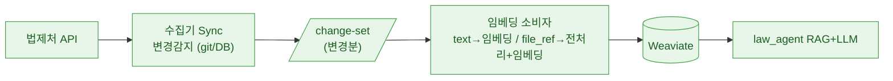
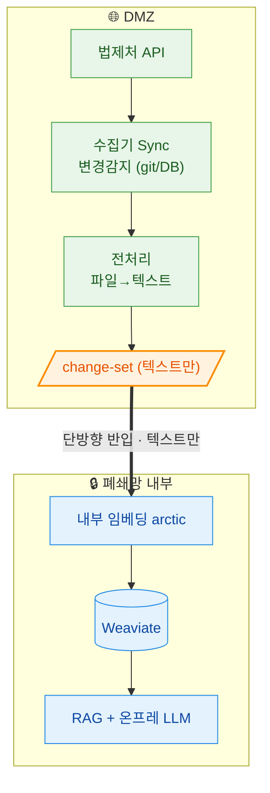
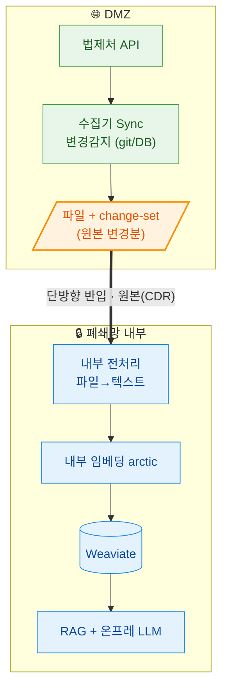

# 외부연동 → 벡터DB 아키텍처 (법-only)

## 핵심: 경계 계약 = change-set (JSONL)

- **수집기가 변경분(change-set)을 만든다.** 로컬·폐쇄망 공통. (수집기는 catalog/manifest로 뭐 바뀌었는지 이미 앎)
- **소비자(임베딩기)는 하나**: 항목이 `text`면 바로 임베딩 / `file_ref`면 파일 열어 전처리→임베딩.
- upsert/delete는 **law_id 단위 삭제 후 재적재** (개정 시 version_uid 변경 → 옛 청크 orphan 방지).

```json
{"op":"upsert","doc_id":"<law_id>","unit_id":"<provision_id>",
 "unit_type":"ARTICLE|ADDENDUM|APPENDIX|ATTACHMENT",
 "text":"…",                       // 있으면 바로 임베딩
 "file_ref":"<로컬경로|minio://>",  // text 없고 원본 필요 시 → 소비자가 열어 전처리
 "metadata":{…}}
{"op":"delete","doc_id":"<law_id>"}
```

## 축 2개 (나머지는 다 이 위에 얇게)

- **상태추적**: `git` | `db` — 변경감지 방식만 다름(git diff / DB 조회). change-set은 동일.
- **원본 파일 필요 여부** → 폐쇄망 케이스 2/3을 가름.

## 3 케이스

### 케이스 1 — 로컬 · 공개망 (경계 없음, change-set 직접 소비)


### 케이스 2 — 폐쇄망 · 원본 불필요 (전처리해서 텍스트만 반입)


### 케이스 3 — 폐쇄망 · 원본 필요 (파일 반입, 내부 전처리) ← 지금 이 방식
로컬도 소비자가 파일을 직접 읽어 전처리하므로 케이스3와 같은 구조.


## 구현 (law_embedding)

**흐름(케이스3)**: `git diff <watermark>..HEAD` → 바뀐 law_id → change-set(조문/부칙/별표=text, 첨부=file_ref, 사라짐=delete) → 소비자가 law_id 단위 삭제+재적재(text 임베딩 / file_ref 전처리→임베딩) → watermark 갱신.

- **재사용**: JSON 매핑(`mapper`), 첨부 전처리(`preprocess` 목업), Weaviate upsert.
- **신규**: `changeset.py`(git diff→JSONL) · `weaviate_store.delete_by_law_id()` · `index_changeset()`(text/file_ref 분기) · watermark(`.index_state.json`) · (컨테이너면 이미지에 `git`).
- **케이스2 전환**: 생산자에서 file→text 전처리를 앞당기면 됨. **소비자 무변경.**
